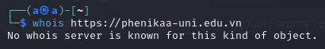
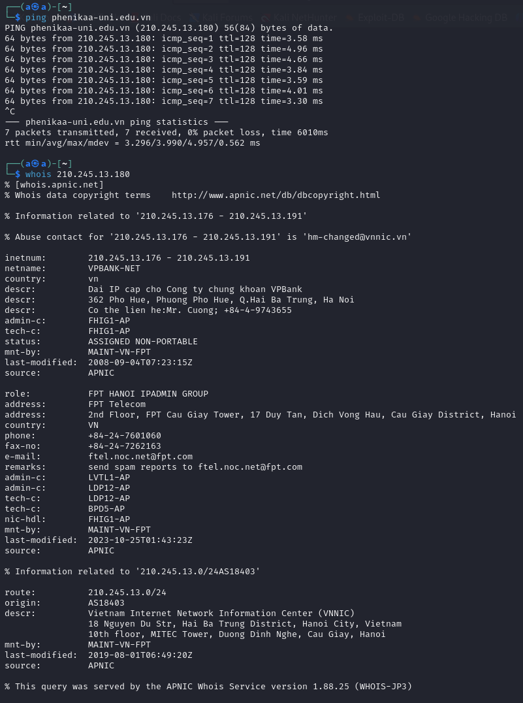
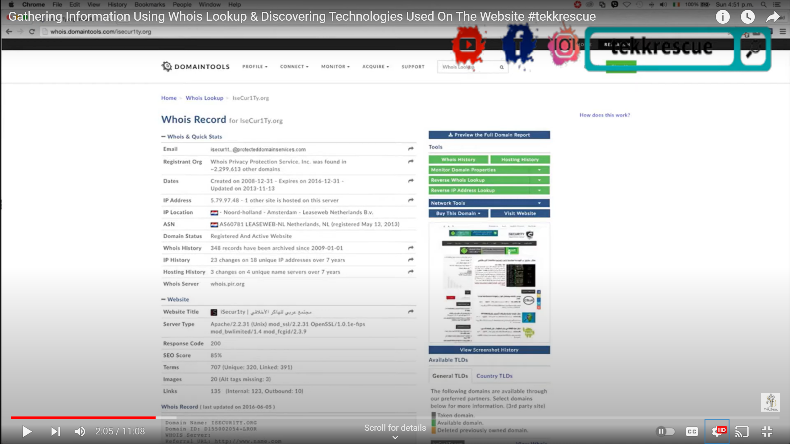
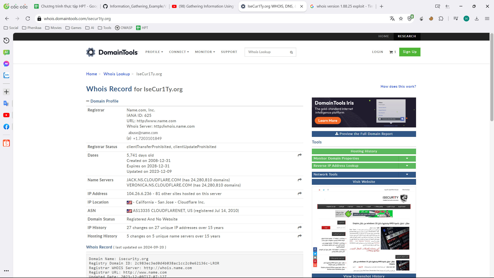

# Testing web

Kiểm thử được thực hiện trên `https://phenikaa-uni.edu.vn`. Đây là trang web chính thức của trường đại học Phenikaa, người thực hiện đã được cho phép để thực hiện các kiểm thử.

# Kiểm thử

## Whois command toward domain name

Lệnh whois trả về kết quả không có nội dung trên cơ sở dữ liệu có liên quan.

## Whois command toward IP address

- Sau khi thực hiện ping ta nhận được IP của server
- Sử dụng lệnh whois lên IP này ta nhận được một số thông tin từ whois.apnic.net:
    - Được biết IP này thuộc dải IP được cấp cho Công ty chứng khoán VPBank
    - IP này được cấp cho FPT HANOI IPADMIN GROUP
    - Có 2 admin được ghi nhận là LVTL1-AP và LDP12-AP
    - Những thông tin này được quản trị bởi MAINT-VN-FPT
    - Có 1 số thông tin liên hệ của FPT Telecom được cung cấp như số điện thoại, số fax và email (có thể thực hiện tấn công phishing hoặc social engineering)
    - Những thông tin thu thập được này được chỉnh sửa lần cuối từ 25/10/2023 tức một số thông tin có thể đã lỗi thời hoặc không thể sử dụng được nữa

## Whois lookup by web service online

- Các thông tin trả về từ các công cụ hỗ trợ miễn phí tương tự như kết quả được trả về từ lệnh whois được thực hiện trên Kali Terminal
- Một số công cụ yêu cầu trả phí có thể trả về thêm 1 số thông tin quan trọng khác (ví dụ được áp dụng trên `isecur1ty.org`):
    - Trả phí (nguồn: youtube.com):
    
    - Miễn phí:
    
    
    => Công cụ trả phí trả về thêm thông tin về loại server (Apache) và phiên bản (2.2.31 - được phát hành từ 4/1/2017). Từ đây có thể tìm kiếm các bản vá lỗi của phiên bản này và thực hiện các cuộc tấn công dựa trên chúng.