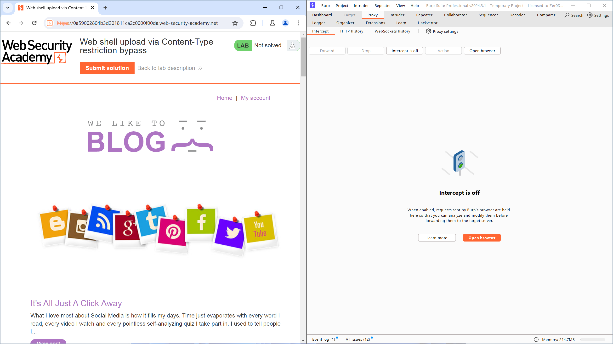

# Lab: Remote code execution via web shell upload
## Mô tả bài lab
Bài lab này chứa một chức năng tải lên hình ảnh có lỗ hổng. Nó không thực hiện bất kỳ xác thực nào đối với các tệp mà người dùng tải lên trước khi lưu trữ chúng trên hệ thống tệp của máy chủ.

Để hoàn thành bài lab, hãy tải lên một tập lệnh web shell PHP cơ bản và sử dụng nó để trích xuất nội dung của tệp `/home/carlos/secret`. Nộp bí mật này bằng cách sử dụng nút được cung cấp trong giao diện của bài lab.

Bạn có thể đăng nhập vào tài khoản của mình bằng thông tin đăng nhập sau: `wiener:peter`.

## Các bước thực hiện
1. Mở **BurpSuite**, chọn tab **Proxy**.
2. Chọn **Open browser**, truy cập vào URL của bài lab và điều chỉnh kích thước cửa sổ để quan sát cả 2 ứng dụng.


3. Chọn **My account**và sử dụng thông tin đăng nhập được bài lab cung cấp để truy cập với quyền user: `wiener:peter`.
4. Tạo tệp `file_upload_portswigger.php` có nội dung như sau:

```php
<?php echo file_get_contents('/home/carlos/secret'); ?>
```

5. Sử dụng chức năng upload file hình ảnh của trang web để thực hiện tải tệp .php lên hệ thống, khi thực hiện thành công ứng dụng sẽ trả về giao diện như dưới đây.


6. Sau khi trở lại giao diện `My account`, ứng dụng web sẽ tự động truy cập và thực hiện file .php khi muốn biểu diễn thông tin avatar của người dùng wiener.
7. Trên Burp Suite, chọn mục **Proxy > HTTP history**, phần mềm sẽ thể hiện các gói tin đã được trao đổi giữa thiết bị và ứng dụng web.


8. Ta có thể thấy có một gói tin `GET` được sử dụng để lấy thông tin từ `/files/avatars/file_upload_portswigger.php`. Xem phản hồi từ gói tin này, ta sẽ nhận được chuỗi ký tự `NpI0Jbeq5tmC1H58h6wSHCrQcofxWty2` từ tệp `/home/carlos/secret` trên hệ thống.


9. Chọn **Submit solution** trên giao diện bài lab, sau đó điền thông tin vừa lấy được. Trang web sẽ trả về thông báo hoàn thành bài lab.

# Lab: Web shell upload via Content-Type restriction bypass
## Mô tả bài lab
Bài lab này chứa một chức năng tải lên hình ảnh có lỗ hổng bảo mật. Nó cố gắng ngăn người dùng tải lên các loại tệp không mong muốn, nhưng lại dựa vào việc kiểm tra dữ liệu do người dùng kiểm soát để xác minh điều này.

Để giải quyết bài lab, hãy tải lên một web shell PHP cơ bản và sử dụng nó để truy xuất nội dung của tệp `/home/carlos/secret`. Gửi mã bí mật này bằng cách nhấn vào nút được cung cấp trong biểu ngữ của bài lab.

Bạn có thể đăng nhập vào tài khoản của mình bằng thông tin đăng nhập sau: `wiener:peter`.

## Các bước thực hiện
1. Mở **BurpSuite**, chọn tab **Proxy**.
2. Chọn **Open browser**, truy cập vào URL của bài lab và điều chỉnh kích thước cửa sổ để quan sát cả 2 ứng dụng.



3. Chọn **My account**và sử dụng thông tin đăng nhập được bài lab cung cấp để truy cập với quyền user: `wiener:peter`.
4. Tạo tệp `file_upload_portswigger.php` có nội dung như sau:

```php
<?php echo file_get_contents('/home/carlos/secret'); ?>
```

5. Bật tính năng **Intercept** trên Burp Suite và sử dụng chức năng upload file hình ảnh của trang web để thực hiện tải tệp .php lên hệ thống.
6. Do ứng dụng web dựa vào máy người dùng để xác định loại tệp được tải lên, ta có thể can thiệp vào kết quả trên gói tin thiết bị đang gửi đi thông qua Burp Suite. Ở đây, ta có thể thay đổi loại tệp từ `application/octet-stream` thành `image/jpeg`.


7. Ứng dụng trả về thông báo đã upload tệp .php thành công.


8. Tắt **Intercept**, trở lại giao diện upload file và kiểm tra **HTTP history** trên Burp Suite. Ta có thể thấy ứng dụng web có gửi một gói tin `GET` để lấy thông tin về avatar, điều này sẽ thực hiện dòng lệnh trong tệp .php và trả về nội dung của `/home/carlos/secret`.


9. Chọn **Submit solution** và điền thông tin vừa nhận được, sau đó chọn **OK** và ứng dụng sẽ trả về thông báo hoàn thành bài lab.

# Lab: Web shell upload via path traversal
## Mô tả bài lab
Bài lab này chứa một chức năng tải lên hình ảnh dễ bị tấn công. Máy chủ được cấu hình để ngăn chặn việc thực thi các tệp do người dùng cung cấp, nhưng hạn chế này có thể bị vượt qua bằng cách khai thác một lỗ hổng thứ cấp.

Để giải quyết bài lab, hãy tải lên một shell web PHP cơ bản và sử dụng nó để trích xuất nội dung của tệp `/home/carlos/secret`. Nộp bí mật này bằng nút được cung cấp trong biểu ngữ của bài lab.

Bạn có thể đăng nhập vào tài khoản của mình bằng các thông tin sau: `wiener:peter`.

## Các bước thực hiện
1. Mở **BurpSuite**, chọn tab **Proxy**.
2. Chọn **Open browser**, truy cập vào URL của bài lab và điều chỉnh kích thước cửa sổ để quan sát cả 2 ứng dụng.


3. Chọn **My account**và sử dụng thông tin đăng nhập được bài lab cung cấp để truy cập với quyền user: `wiener:peter`.
4. Tạo tệp `file_upload_portswigger.php` có nội dung như sau:

```php
<?php echo file_get_contents('/home/carlos/secret'); ?>
```

5. Tải tệp này lên bằng phím chức năng của ứng dụng, có thể thấy ứng dụng không ngăn cản việc người dùng tải lên một tệp .php và ứng dụng trả về kết quả tải lên thành công.


6. Trở về giao diện **My account**, sau đó mở **HTTP history** trên Burp Suite để đọc gói tin mà trang web thực hiện để lấy thông tin về avatar. Ở đây trang web trả về nội dung của gói tin .php chứ không thực hiện dòng lệnh.


7. Gửi gói tin sử dụng phương thức `POST` có URL là `/my-account/avatar` để **Repeater** để dễ dàng thao tác hơn.
8. Ở phần `Content-Disposition`, thêm `../` vào trước tên của file đã tải lên. Có thể thấy phản hồi đã hoàn toàn bỏ qua phần được thêm vào.
9. Lần này thử sử dụng mã hoá với phần thêm vào, thay `../` thành `..%2f`. Ứng dụng web sẽ phản hồi với thông báo tệp `avatars/../file_upload_portswigger.php` đã được tải lên thành công.


10. Trở về **Proxy > HTTP history**, sau đó tải lại giao diện trang web, ta sẽ thấy một gói tin `GET` được trỏ đến `/files/avatars/..%2ffile_upload_portswigger.php`. Qua thông báo tải lên file thành công, ta biết được file đã được upload lên bậc cao hơn do `..%2f` được giải mã thành `../`, ta có thể chặn gói tin `GET` này trong lần tới và thay đổi thông tin để thực hiện tìm kiếm đến `/files/file_upload_portswigger.php`.


11. Sau khi thực hiện, xem lại **HTTP history** để nhận thông tin chứa trong `/home/carlos/secret`. Nộp kết quả và trang web sẽ trả về thông báo hoàn thành bài lab.