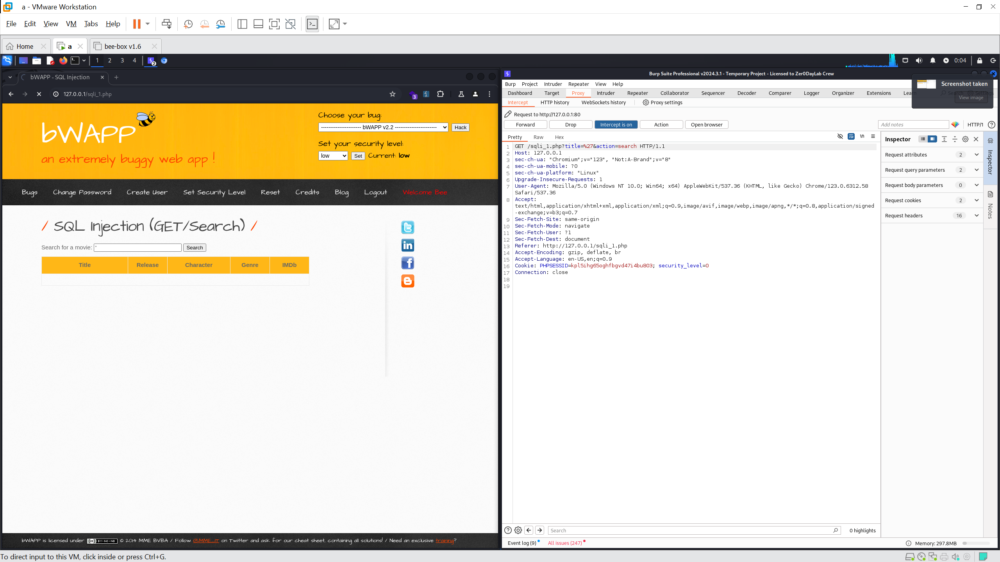
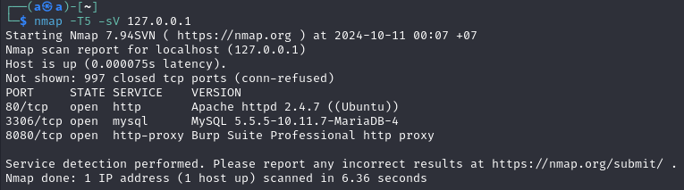
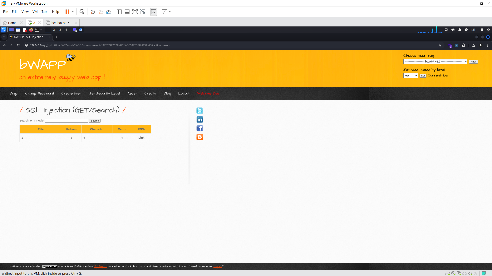
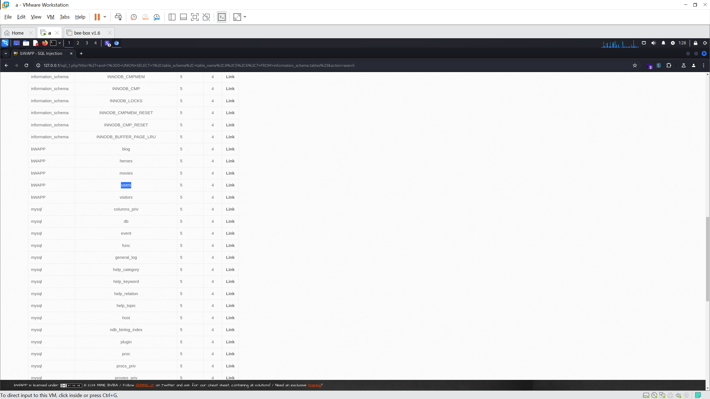
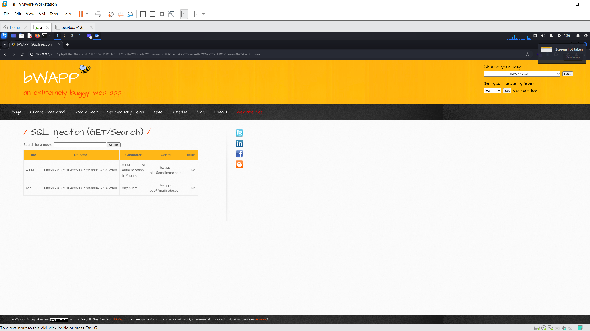

# bWAPP
bWAPP là một ứng dụng web miễn phí và mã nguồn mở, được cố tình tạo ra với các lỗ hổng bảo mật. Nó giúp những người đam mê bảo mật, nhà phát triển và sinh viên khám phá và phòng ngừa các lỗ hổng web.

bWAPP chuẩn bị cho người dùng thực hiện các dự án kiểm thử xâm nhập và hack có đạo đức một cách thành công.

Điều gì khiến bWAPP trở nên độc đáo? Nó có hơn 100 lỗ hổng web! bWAPP bao gồm tất cả các lỗi web chính được biết đến, bao gồm mọi rủi ro từ dự án OWASP Top 10.

bWAPP là một ứng dụng PHP sử dụng cơ sở dữ liệu MySQL. Nó có thể được lưu trữ trên Linux/Windows với Apache/IIS và MySQL. Nó cũng có thể được cài đặt bằng WAMP hoặc XAMPP.

# Information Gathering
Dù được công bố sẵn những thông tin quan trọng về cơ sở dữ liệu (MySQL), web server (Apache) và hệ điều hành máy chủ (localhost - Kali Linux), chúng ta vẫn có thể tự xác nhận lại một số thông tin khi sử dụng BurpSuite để can thiệp vào các gói tin được gửi đi.



Ví dụ ta có thể xác định được IP host với `Host: 127.0.0.1`. Từ đây có thể sử dụng nmap với câu lệnh dạng như `nmap -sV 127.0.0.1`. Sau khi quét ta có thể biết được host đang sử dụng MySQL và Apache.



Việc xác định loại cơ sở dữ liệu rất quan trọng vì mỗi loại cơ sở dữ liệu sẽ có syntax riêng trên query, ví dụ như MySQL sẽ sử dụng `#` để đánh dấu phần bình luận trên query nhưng các loại cơ sở dữ liệu khác không thể làm điều này.

# SQL Injection (GET/Search) - security level: low
## Một số thông tin bổ sung
Khi thực hiện một tìm kiếm thử với từ khoá `re`, ta có thể thấy một số parameter sẽ xuất hiện trên url, trong đó `title` sẽ lấy thông tin đầu vào do người dùng nhập và `action` sẽ chọn thao tác thực hiện. Sau khi thực hiện tìm kiếm, trang web sẽ trả về một bảng chứa thông tin về các bộ phim có `Title` chứa thông tin người dùng truyền vào. Nếu từ khoá tìm kiếm là `'`, trang web sẽ trả về thông báo lỗi liên quan đến SQL syntax.

Từ đây ta có thể suy đoán được một số thông tin như sau:
- Trang web sử dụng một cơ sở dữ liệu MySQL.
- Trang web sử dụng một số parameter để lọc thông tin được lấy từ CSDL, nếu thông tin được truyền vào `title` là `'` sẽ trả về lỗi. => tồn tại lỗ hổng SQLi.
- Trang web sử dụng Cookie để xác định quyền người dùng. => có thể tồn tại một bảng trong cơ sở dữ liệu chứa các thông tin người dùng.
- Cơ sở dữ liệu của trang web có thể sẽ thực hiện một query như sau mỗi khi người dùng thực hiện tìm kiếm:
```sql
SELECT * FROM <table of database> WHERE Title LIKE '<title>';
```

## Các bước thực hiện
1. Xác định số cột:
- Thực hiện tìm kiếm với nội dung `' order by 1#`, sau đó tăng dần giá trị. Việc này có thể được thực hiện tự động và nhanh chóng hơn với Burp Intruder.
- Thực hiện đến khi trang web trả về thông báo lỗi, ở đây là 8, tức số cột được lấy ra là 7 (nhỏ hơn 8).
- Tìm kiếm với thông tin `' AND 1=0 UNION SELECT 1,2,3,4,5,6,7#`, ta sẽ biết được phần bảng trang web trả về sẽ hiển thị các cột 2,3,5,4.




2. Xác định tên các bảng trên cơ sở dữ liệu:
- Thực hiện tìm kiếm với thông tin:<br>
```' and 1=0 UNION SELECT 1,table_schema, table_name,4,5,6,7 FROM information_schema.tables#```
    - `and 1=0`: sử dụng điều kiện sai để loại bỏ các thông tin bình thường trang web sẽ trả về (không quan trọng).
    - `UNION SELECT`: nối thông tin với một bảng khác.
    - `1,table_schema, table_name,4,5,6,7 FROM information_schema.tables`: chọn đủ 7 cột (số cột yêu cầu) và lấy thông tin về `table_schema, table_name` từ `information_schema.tables` (hiển thị tên tất cả các bảng).
    - `#`: biến phần còn lại của query gốc thành nội dung bình luận.
- Ta xác định được bảng có khả năng chứa thông tin nhạy cảm là `users`.



3. Xác định tên cột trong bảng `users`:
- Thực hiện tìm kiếm với thông tin:<br>
```' and 1=0 UNION SELECT 1,table_name, column_name,4,5,6,7 FROM information_schema.columns WHERE table_name='users'#```


4. Tìm kiếm các thông tin nhạy cảm:
- Thực hiện tìm kiếm với thông tin:<br>
```' and 1=0 UNION SELECT 1,login, password, email, secret,6,7 FROM users#```



