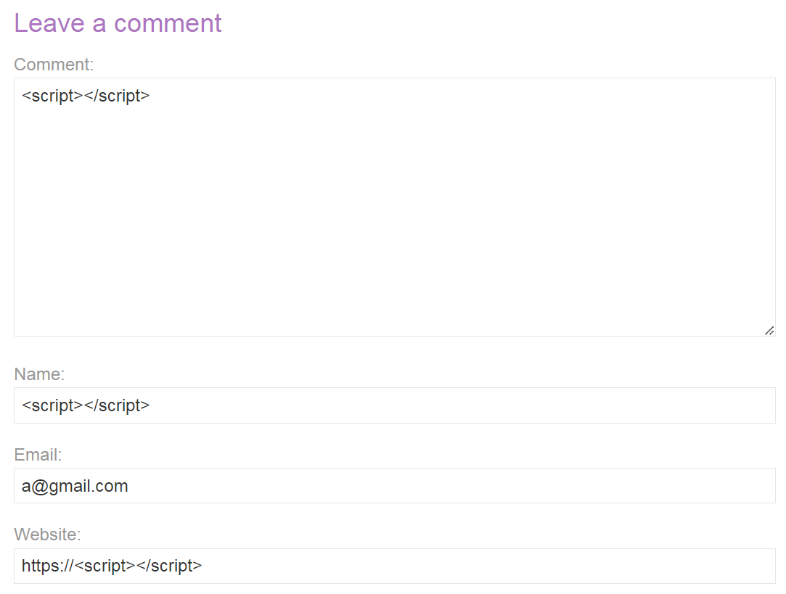

# Lab: Reflected XSS into HTML context with nothing encoded
## Mô tả bài lab

Bài lab này chứa một lỗ hổng cross-site scripting phản hồi đơn giản trong chức năng tìm kiếm.

Để giải quyết bài tập này, hãy thực hiện một cuộc tấn công cross-site scripting và gọi hàm `alert`.

## Các bước thực hiện

1. Truy cập bài lab.
2. Nhập `` vào thanh ghi sau đó thực hiện tìm kiếm, có thể thấy trang web trả về 0 kết quả cho `''`. Điều này chứng tỏ thẻ `script` đã được thực hiện trong lượt tìm kiếm vừa rồi.
3. Lần này nhập vào `` và thực hiện tìm kiếm, trang web sẽ popup một tin nhắn có nội dung `123` kèm với thông báo hoàn thành bài lab.

# Lab: Stored XSS into HTML context with nothing encoded
## Mô tả bài lab
Bài lab này chứa một lỗ hổng cross-site scripting lưu trữ trong chức năng bình luận.

Để giải quyết bài tập này, hãy gửi một bình luận gọi hàm `alert` khi bài viết trên blog được xem.

## Các bước thực hiện
1. Truy cập bài lab.
2. Nhập `` vào tất cả các thanh ghi, điều chỉnh một chút để phù hợp với yêu cầu đầu vào của mỗi thanh ghi, riêng thanh `Email` có thể bỏ qua vì trang web không chấp nhận ký tự đặc biệt như `<` và `>`.

3. Sau khi đăng bình luận, sử dụng tổ hợp phím `Ctrl + U` để xem mã nguồn của trang web. Có thể thấy ngoại trừ nội dung được điền vào thanh `Comment`, mọi nội dung từ các thanh khác đều được mã hoá theo ASCII và không thể thực hiện XSS. 

4. Nhập `` vào mục `Comment`, các mục còn lại có thể điền thông tin ngẫu nhiên, sau đó đăng bình luận. Trang web sẽ trả về thông báo đăng thành công, kèm với thông báo hoàn thành bài lab. Từ giờ mỗi khi quay trở lại bài blog, trang web sẽ popup một thông báo có nội dung `123`.

# Lab: DOM XSS in `document.write` sink using source `location.search`
## Mô tả bài lab
Bài lab này chứa một lỗ hổng cross-site scripting dựa trên DOM trong chức năng theo dõi truy vấn tìm kiếm. Nó sử dụng hàm `document.write` trong JavaScript, hàm này ghi dữ liệu ra trang. Hàm `document.write` được gọi với dữ liệu từ `location.search`, dữ liệu này có thể được bạn kiểm soát thông qua URL của trang web.

Để giải quyết bài tập này, hãy thực hiện một cuộc tấn công cross-site scripting và gọi hàm `alert`.

## Các bước thực hiện
1. Truy cập bài lab.
2. Nhập `` vào thanh ghi sau đó thực hiện tìm kiếm. Sau đó chuột phải vào đối tượng và kiểm tra mã nguồn. Ta có thể thấy trong mã nguồn có một thẻ `img` có `src` tìm tới nội dung khớp với nội dung tìm kiếm và nội dung được truyền vào không bị mã hoá.

3. Thay đổi nội dung nhập vào thành `">`, trong đó phần `">` ở đầu gói tin được thêm vào để thực hiện đóng nội dung tìm kiếm của `src` và đóng thẻ `img`. Sau khi thực hiện tìm kiếm, trang web sẽ xuất hiện popup với nội dung `123` kèm thông báo hoàn thành bài lab.

