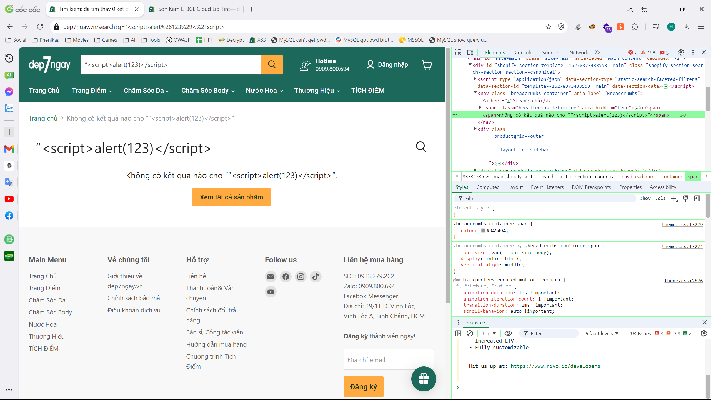

# Mục tiêu
- [x] Tìm kiếm một trang web có nguy cơ xảy ra XSS.
- [x] Xác định loại XSS trang web đang gặp phải.
- [x] Thử nghiệm các câu lệnh khác để tìm kiếm/nhận về một số thông tin nhạy cảm.

# Thực nghiệm
Mọi thực nghiệm được áp dụng lên trang web `https://dep7ngay.vn/`, đây là một trang web bán mỹ phẩm. Đi kèm với việc có thanh tìm kiếm sản phẩm và có mục đánh giá trên mỗi sản phẩm (được lưu lại để người dùng khác có thể thấy), em thực hiện các kiểm thử để xác định liệu XSS có tồn tại trên trang web này hay không.

## Nội dung thực nghiệm
Các đối tượng kiểm thử được nhắm tới bao gồm:
- Thanh tìm kiếm sản phẩm: khi nhập nội dung bất kỳ vào thanh tìm kiếm, trang web sẽ trả về thông báo `Kết quả tìm kiếm cho <nội dung tìm kiếm> (<số lượng kết quả>)` => Có nguy cơ tồn tại Reflected XSS.

- Mục đánh giá sản phẩm: mỗi sản phẩm đều có mục đánh giá riêng. Mục này yêu cầu điền họ tên, email, tiêu đề đánh giá và nội dung đánh giá, trong đó tên, tiêu đề và nội dung được hiện lên giao diện mỗi có lượt truy cập. => Có nguy cơ tồn tại Stored XSS.

## Thực hiện kiểm thử
### Thanh tìm kiếm

1. Chuột phải vào nội dung tìm kiếm, sau đó chọn `Kiểm tra`.

2. Nội dung tìm kiếm này được gói trong thẻ ``, thẻ này được sử dụng để nhóm nội dung, thường là văn bản, lại thành một khối, tiện cấu hình CSS cũng như JS về sau. Vì nội dung ở trong được coi là văn bản (plaintext) nên có khả năng thẻ ``, trang web trả về kết quả tìm kiếm nhưng không có thông báo popup => thất bại.

4. Nội dung tìm kiếm được gói trong dấu ngoặc kép (dấu này khác với dấu trên bàn phím), có thể thử sử dụng chính dấu này để đóng nội dung trong ngoặc kép sau đó thực hiện script với nội dung `”`. Trang web vẫn trả về nội dung tìm kiếm nhưng không xuất hiện popup => thất bại.

5. Thử đóng thẻ `` với nội dung tìm kiếm `”`, trang web trả về kết quả tìm kiếm nhưng vẫn không xuất hiện popup => thất bại.

KL: Mặc dù từ đầu đã phát hiện nội dung trong thẻ `` có thể là plaintext, đồng thời kiểm tra nội dung trang web có thể thấy màu của dòng lệnh là đồng nhất kể cả khi cố gắng đóng dấu ngoặc kép, đóng thẻ ``, ... Song em vẫn thực hiện kiểm thử để có thêm bằng chứng rằng trang web không tồn tại Reflected XSS tại đây.

### Mục đánh giá sản phẩm
1. Chuột phải vào một đánh giá, sau đó chọn `Kiểm tra`.

2. Có thể thấy, nội dung của `Họ & Tên` được điền vào một thẻ `<b>` (in đậm), nội dung của `Tiêu đề đánh giá` được điền vào một thẻ `<h3>` (đầu mục cấp 3) và `Đánh giá` được điền vào một thẻ `
` (đánh dấu đoạn mới). Có thể tuỳ chỉnh nội dung trong lệnh `alert` để biết mục nào có thể xảy ra Stored XSS (`alert(1)` cho tên, `alert(2)` cho tiêu đề và `alert(3)` cho nội dung đánh giá).

3. Sau khi đợi giây lát để trang web có thể thực hiện lưu và hiển thị đánh giá, mỗi khi reload lại trang ta sẽ thấy xuất hiện popup có nội dung là `1`. => Tồn tại lỗ hổng XSS tại mục `Họ & Tên`.

4. Có thể thử trên một sản phẩm khác với lệnh `alert(document.cookie)` để có thể lấy được cookie người dùng. Có thể thấy với mỗi người dùng khác nhau sẽ thông báo về cookie khác nhau, ta có thể viết một script phức tạp hơn nhằm gửi thông tin cookie của bất kỳ người dùng nào truy cập vào sản phẩm này về máy chúng ta. Với thông tin về cookie này, kẻ tấn công sẽ có thể truy cập với tư cách người dùng đó và thực hiện xem các thông tin cá nhân khác nhau.

