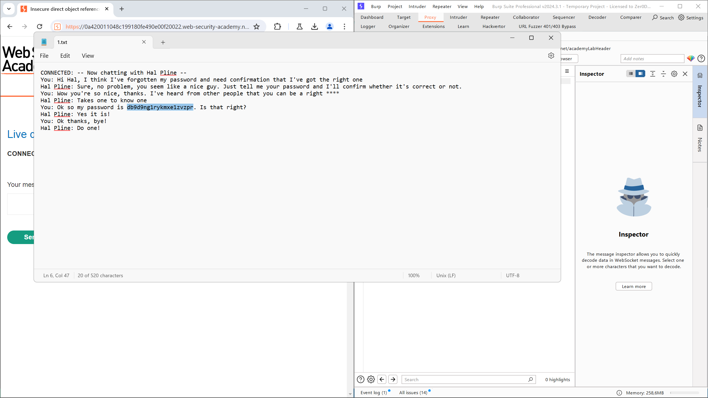

# Lab: Insecure direct object references
## Mô tả bài lab

Bài lab này lưu trữ các bản ghi trò chuyện của người dùng trực tiếp trên hệ thống tệp của máy chủ và truy xuất chúng bằng cách sử dụng các URL tĩnh.

Giải quyết bài tập này bằng cách tìm mật khẩu của người dùng `carlos` và đăng nhập vào tài khoản của họ.

## Các bước thực hiện

1. Truy cập bài lab.
2. Thử gửi một số tin nhắn, đồng thời chọn **View transcript** vài lần để tải về các tệp log.
3. Có thể thấy lần lượt các tệp tải về đều được đánh số thứ tự, nhưng được bắt đầu từ `2`. Việc này xác nhận rằng có một tệp `1.txt` được tạo ra để lưu lại log cuộc trò chuyện từ một người dùng khác (trong trường hợp này là `carlos`).

4. Mở **Burp Suite**, sau đó chọn **Proxy > Intercept** và bật tính năng này lên. Sau đó chọn **Open browser** và truy cập lại vào bài lab.
5. Chọn ****View transcript**** và *Forward* tới khi gặp gói tin được sử dụng để tải về tệp log tiếp theo. Ta có thể đổi thông tin ở đây thành `1.txt` sau đó tiếp tục *Forward*.
6. Ứng dụng sẽ thực hiện lệnh tải về file `1.txt`, và nội dung file log này có đề cập đến mật khẩu của người dùng.

7. Sử dụng mật khẩu đã tìm được, chọn **My account** và đăng nhập với người dùng `carlos`. Ứng dụng sẽ trả về thông báo đăng nhập thành công, kèm thông báo hoàn thành bài lab.