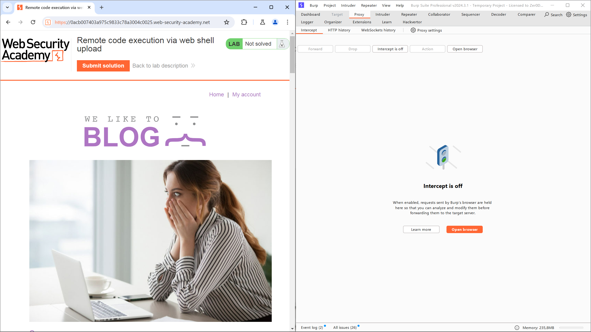
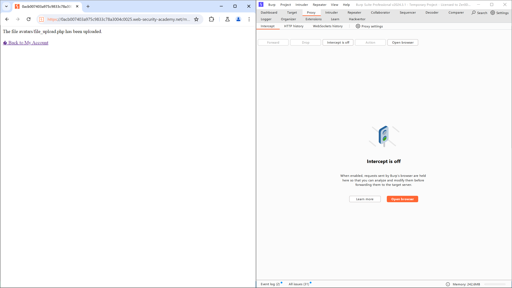
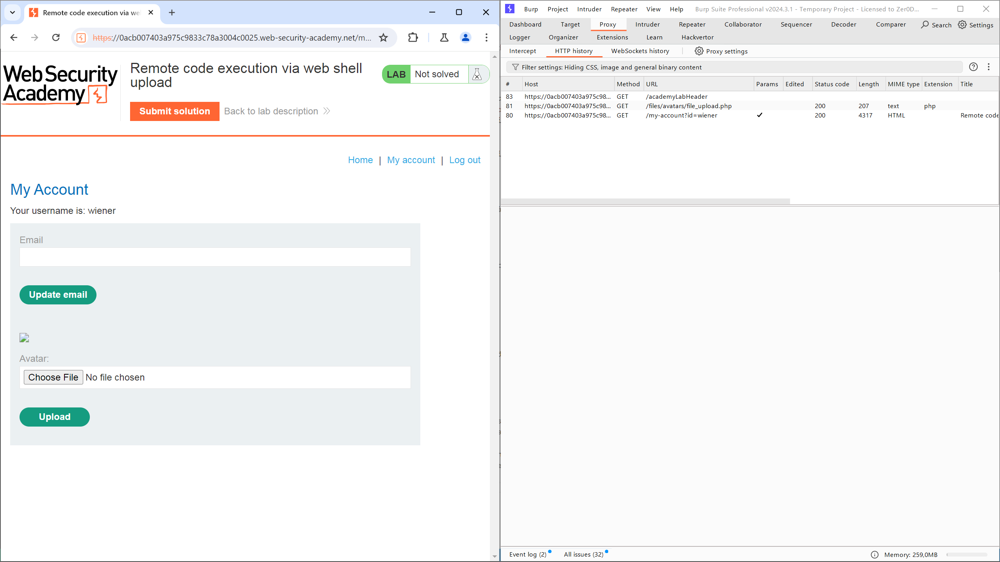
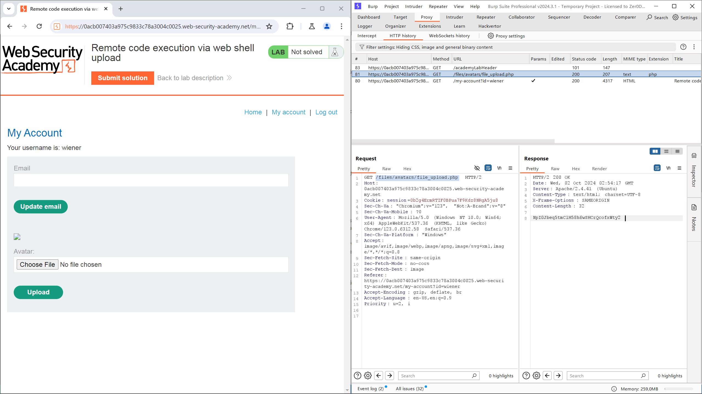

# Lab: Remote code execution via web shell upload
## Mô tả bài lab
Bài thực hành này chứa một chức năng tải lên hình ảnh có lỗ hổng. Nó không thực hiện bất kỳ xác thực nào đối với các tệp mà người dùng tải lên trước khi lưu trữ chúng trên hệ thống tệp của máy chủ.

Để hoàn thành bài thực hành, hãy tải lên một tập lệnh web shell PHP cơ bản và sử dụng nó để trích xuất nội dung của tệp `/home/carlos/secret`. Nộp bí mật này bằng cách sử dụng nút được cung cấp trong giao diện của bài thực hành.

Bạn có thể đăng nhập vào tài khoản của mình bằng thông tin đăng nhập sau: `wiener:peter`.

## Các bước thực hiện
1. Mở **BurpSuite**, chọn tab **Proxy**.
2. Chọn **Open browser**, truy cập vào URL của bài lab và điều chỉnh kích thước cửa sổ để quan sát cả 2 ứng dụng.



3. Chọn **My account**và sử dụng thông tin đăng nhập được bài lab cung cấp để truy cập với quyền user: `wiener:peter`.
4. Tạo tệp `file_upload_portswigger.php` có nội dung như sau:

```php
<?php echo file_get_contents('/home/carlos/secret'); ?>
```

5. Sử dụng chức năng upload file hình ảnh của trang web để thực hiện tải tệp .php lên hệ thống, khi thực hiện thành công ứng dụng sẽ trả về giao diện như dưới đây.



6. Sau khi trở lại giao diện `My account`, ứng dụng web sẽ tự động truy cập và thực hiện file .php khi muốn biểu diễn thông tin avatar của người dùng wiener.
7. Trên Burp Suite, chọn mục **Proxy > HTTP history**, phần mềm sẽ thể hiện các gói tin đã được trao đổi giữa thiết bị và ứng dụng web.



8. Ta có thể thấy có một gói tin `GET` được sử dụng để lấy thông tin từ `/files/avatars/file_upload_portswigger.php`. Xem phản hồi từ gói tin này, ta sẽ nhận được chuỗi ký tự `NpI0Jbeq5tmC1H58h6wSHCrQcofxWty2` từ tệp `/home/carlos/secret` trên hệ thống.



9. Chọn **Submit solution** trên giao diện bài lab, sau đó điền thông tin vừa lấy được. Trang web sẽ trả về thông báo hoàn thành bài lab.