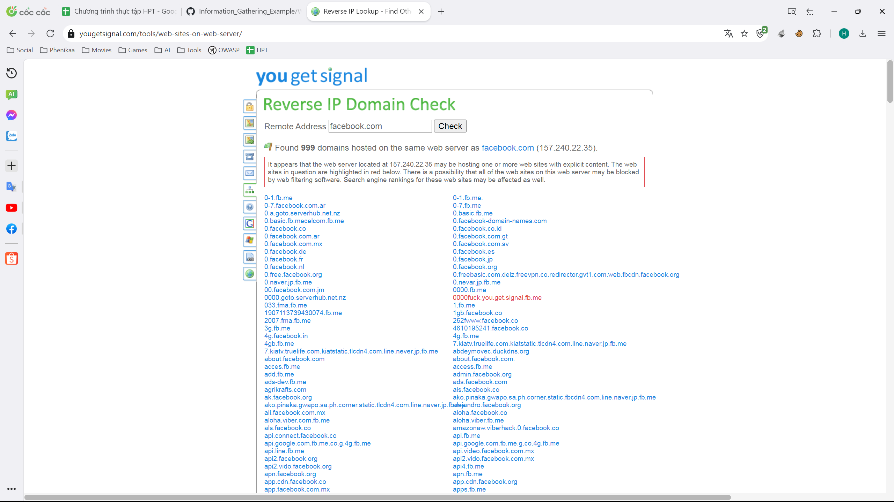
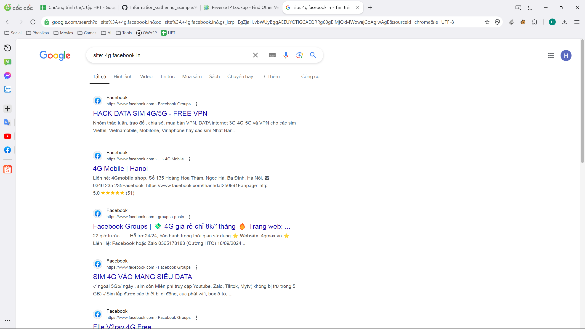
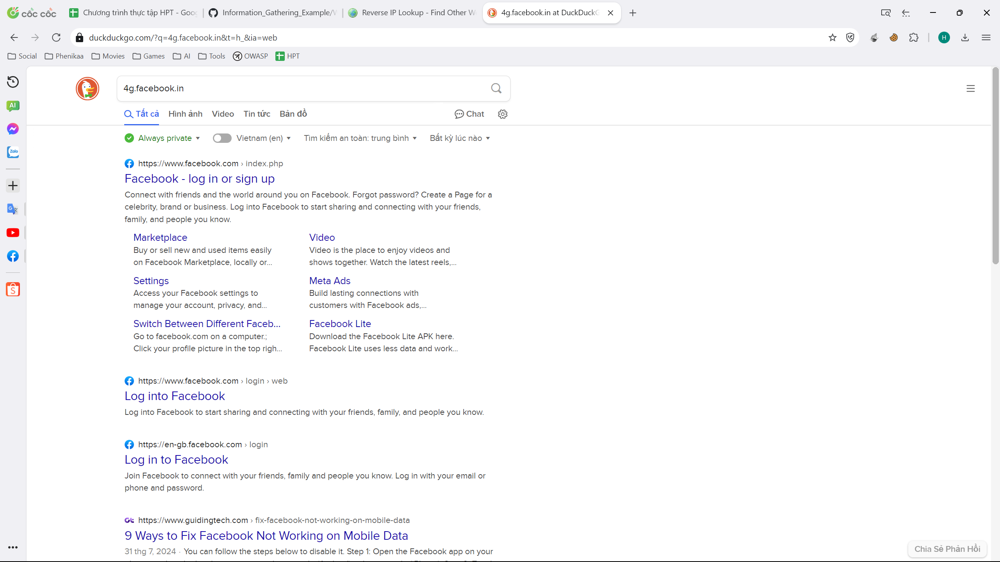

# Testing web

Kiểm thử được thực hiện trên `https://facebook.com`.

# Chú ý

- Khi một trang web được cấu hình tốt và khó có thể gặp rủi ro về bảo mật, kẻ tấn công có thể tìm kiếm các ứng dụng web khác trên cùng server (1 server có thể được sử dụng để làm host cho nhiều trang web). Nếu việc tấn công, nâng quyền và chiếm một trang web thành công trên server đó, kẻ tấn công có thể sẽ có đủ khả năng để tấn công vào trang web mong muốn.

# Kiểm thử

## yougetsignal.com

Công cụ trả về 999 domain được host trên server. Hầu hết các trang này khi người dùng truy cập sẽ tự động được định hướng về facebook.com và hiển thị giao diện đăng nhập của facebook, nhưng đa phần các domain không thể tìm kiếm trên Google.

