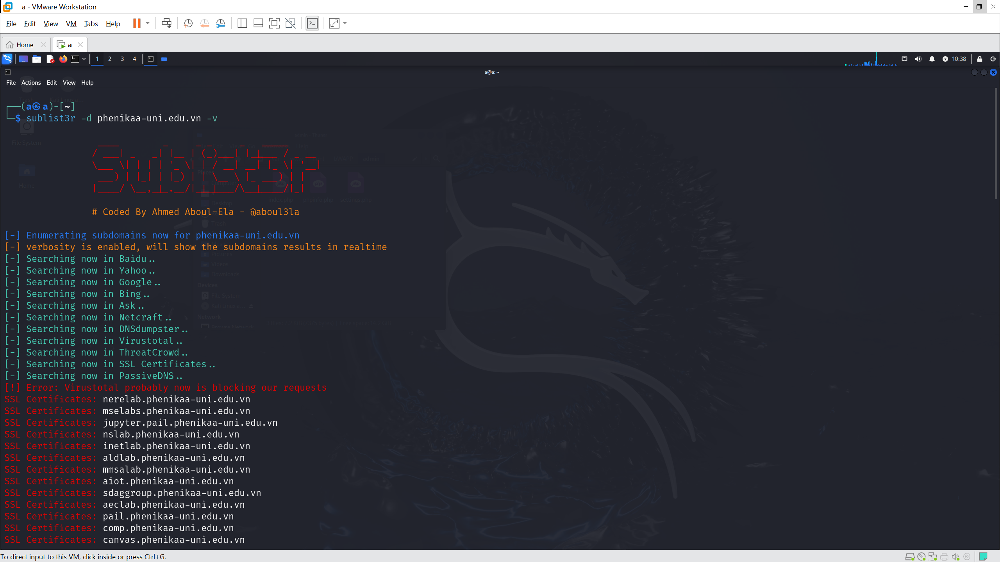
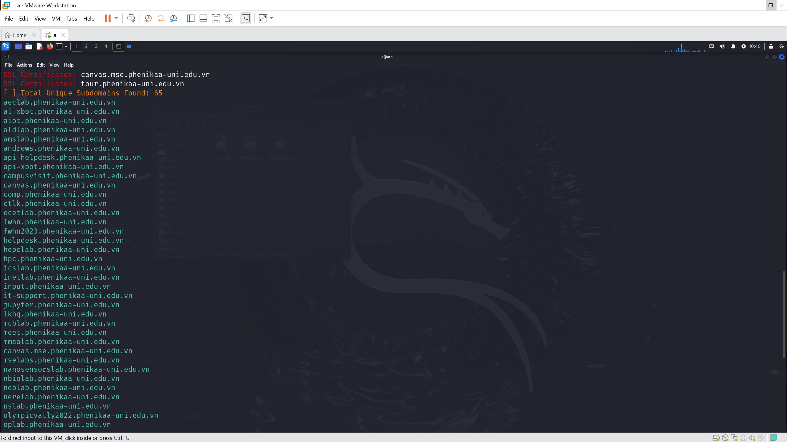

# Testing web

Kiểm thử được thực hiện trên `https://phenikaa-uni.edu.vn`. Đây là trang web chính thức của trường đại học Phenikaa, người thực hiện đã được cho phép để thực hiện các kiểm thử.

# Chú ý

Tương tự như tấn công các trang web trên cùng server, việc một server có nhiều subdomain dẫn tới nhiều hệ thống khác nhau cũng mở ra nhiều cơ hội cho kẻ tấn công hơn. Ví dụ có thể kể đến như tấn công DDoS vào các subdomain sẽ khiến server chịu tải nhiều hơn, việc có nhiều subdomain cũng có thể khiến khối lượng công việc của admin mỗi khi cập nhật, chỉnh sửa, vá lỗi trở nên lớn hơn và dễ gặp sai sót, hay việc có quá nhiều subdomain sẽ gây khó khăn trong việc quản lý, một số subdomain đã hết hạn có thể bị chiếm quyền và vẫn có thể được sử dụng để tấn công.

# Kiểm thử

Ở đây tôi sử dụng `Sublist3r` để tìm các subdomain:

Công cụ sẽ hỗ trợ tìm kiếm tên miền trên nhiều search engine khác nhau sau đó trả về danh sách các subdomain:

Danh sách được trả về gồm 65 subdomain riêng biệt, các subdomain này chủ yếu là đường dẫn đến trang web của các phòng khoa, các phòng thí nghiệm, thư viện điện tử, quản lí sinh viên và một số trang web khác.
