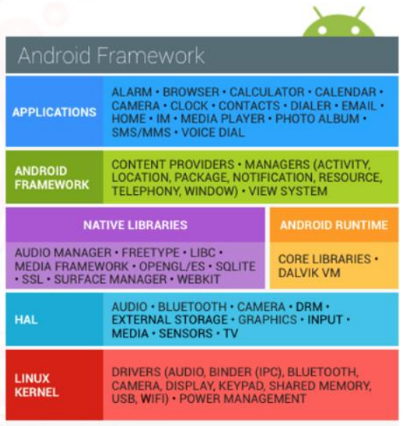
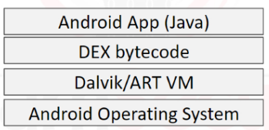
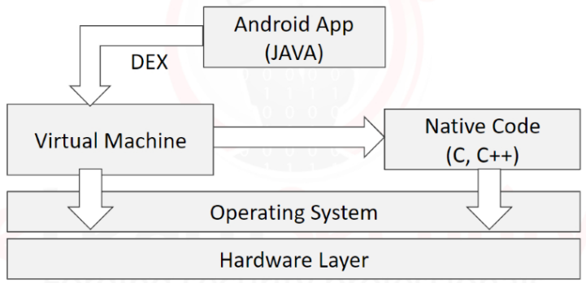
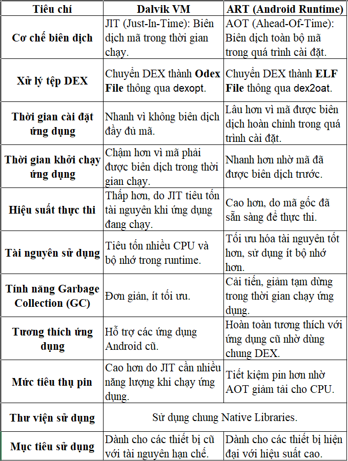
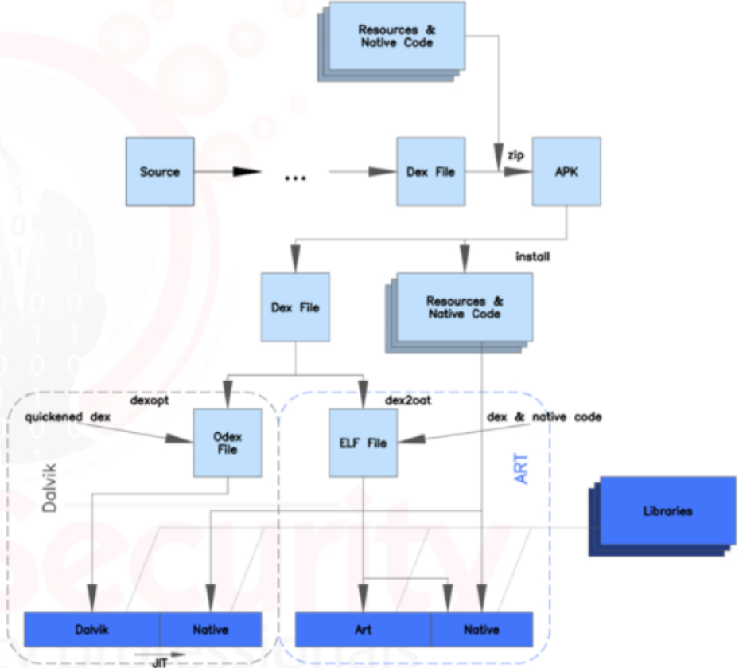

# 1.1. Introduction

Về cơ bản hệ điều hành Android là dựa trên hệ điều hành Linux, nên để hiểu hơn về Android chúng ta cần một chút kiến thức căn bản liên quan đến các nội dung như quyền của các tập tin, di chuyển trong hệ điều hành và các tập tin hệ thống. Bên cạnh đó cũng cần hiểu được sự khác biệt về quyền giữa các cấp user.

Tương tự như Linux, Android là một hệ điều hành mã nguồn mở, vì vậy ta có thể xem được toàn bộ source code. 

Việc hiểu về lập trình Java cũng sẽ giúp ích cho quá trình tìm hiểu về Android.

Hệ điều hành Android được cấu thành từ nhiều tầng, mỗi tầng đảm nhận các chức năng riêng và được xây dựng từ các tầng bên dưới nó, đồng thời phụ thuộc vào tính bảo mật của các tầng đó.

# 1.2. Android Architecture

Tầng **Applications** là tầng mà người dùng tương tác với, gồm các ứng dụng mà người dùng tải về hoặc có sẵn trên máy.

Tầng **Android Framework** là tầng thực hiện các lệnh API cho các chức năng cụ thể phục vụ cho tầng Applications, bao gồm cả chức năng về hiển thị, chia sẻ dữ liệu, truy cập dữ liệu hoặc GPS.

Tầng **Native Libraries** chứa các thư viện được viết bằng C hoặc C++, đảng nhận các xử lý nhỏ hơn, ví dụ như xuất đồ hoạ, mã hoá mạng, chạy đa phương tiện và xử lý ảnh.

Tầng **Android Runtime** là khu vực dành cho các máy ảo chịu trách nhiệm chạy các ứng dụng chạy trên nền.

Thư viện này được cấu thành từ 3 thư viện Java khác:
- Dalvik VM Specific Libraries: trực tiếp tương tác với các đối tượng trên máy ảo Dalvik.
- Java Interoperability Libraries: một phần của Java Core Libraries được cấu hình để hoạt động trên máy ảo Dalvik.
- Android Libraries: thư viện phụ trách các chức năng chính của các ứng dụng.

Tầng **Linux Kernel** là tầng dưới cùng liên kết tất cả các tầng trên lại với nhau, đảm nhận việc liên kết với các thiết bị phần cứng, drivers và cả bộ nhớ cũng như tiêu thụ điện năng của thiết bị. Tầng này được thiết kế dựa trên Linux 2.6.

# 1.3. Android VM

Máy ảo là một lớp trừu tượng nằm giữa ứng dụng và thiết bị Android bên dưới. Các ứng dụng Android được viết bằng Java, nhưng được biên dịch thành mã byte Dalvik Executable (DEX) độc lập với nền tảng.

Máy ảo Android sẽ trực tiếp thực thi mã byte DEX từ đoạn Java gốc. Điều này sẽ tạo ra sự thống nhất về cách xử lý của hệ thống kể cả giữa các phiên bản hệ điều hành khác nhau.

Khái niệm máy ảo, như trong Java, tồn tại nhằm giúp các nhà phát triển không cần lo lắng về việc phải lập trình cho phần cứng thiết bị hay một phiên bản hệ điều hành cụ thể, một đoạn mã có thể được thực thi trên mọi phiên bản khác nhau.

Trước KitKat (phiên bản 4.4), Android chỉ sử dụng Dalvik VM. Với sự ra mắt của KitKat, Android bắt đầu sử dụng một máy ảo mới: Android Runtime (ART). Android đã loại bỏ hoàn toàn Dalvik VM với Lollipop (phiên bản 5.0). Cả hai máy ảo đều hoạt động trên mã byte DEX, nhưng ART có một số tính năng tối ưu hóa mới mà trước đây không có trong Dalvik VM.

Trong Android Studio, các ứng dụng được biên dịch thành mã byte DEX hoặc ODEX (DEX tối ưu hóa). Các ứng dụng bạn tải xuống từ Google Play Store sử dụng định dạng DEX. Định dạng ODEX thường chỉ được các nhà sản xuất thiết bị gốc (OEM) sử dụng để tối ưu hóa các ứng dụng chạy khi khởi động, cho một thiết bị hoặc kiến trúc cụ thể.

Ngoài ODEX, bạn cũng sẽ nghe nói về các tệp OAT. Mặc dù cả hai đều là định dạng tối ưu hóa, nhưng OAT được sử dụng cụ thể với Android Runtime mới hơn và mang lại những cải tiến hiệu suất đáng kể.

Mặc dù hầu hết các ứng dụng Android được xây dựng chủ yếu bằng ngôn ngữ lập trình Java, nhưng cũng có thể sử dụng mã gốc trực tiếp. Cách tiếp cận này thường được sử dụng cho các ứng dụng hiệu suất cao, chẳng hạn như game.

Nói chung, máy ảo Dalvik VM vẫn thực thi tệp .dex, xử lý lần lượt các tương tác với mã gốc.

Bất kỳ máy ảo nào, bao gồm cả các máy được sử dụng trong HĐH Android, đều làm giảm hiệu suất so với việc thực thi trực tiếp trên code (C,C++,...). Đây là cái giá phải trả để có được sự độc lập nền tảng, điều vô cùng quan trọng bởi thị trường mở vô cùng rộng lớn của các thiết bị sử dụng Android. Ngược lại, việc sử dụng máy ảo cũng đem lại lợi ích nhất định về mặt bảo mật, các ứng dụng được viết cho máy ảo thay vì code gốc sẽ không gặp phải các vấn đề về hỏng bộ nhớ, ví dụ như buffer overflows.

# 1.4. Android Security Model

Trong mô hình bảo mật tổng quát của Android, có hai lớp riêng biệt. Lớp thứ nhất được triển khai trong hệ điều hành và đảm bảo các ứng dụng đã cài đặt được cách ly cơ bản với nhau. Lớp thứ 2, cũng chính là tầng bảo mật của bản thân ứng dụng:
- Cho phép nhà phát triển lựa chọn tuỳ ý các chức năng của ứng dụng này để chia sẻ cho các ứng dụng khác.
- Tự cấu hình các giới hạn chức năng của ứng dụng để phù hợp với độ rủi ro và use case khác nhau.

Trong HĐH Android, vì lí do bảo mật, các ứng dụng được cách ly với nhau, có nghĩa là chúng cách ly cả về dữ liệu và môi trường thực thi. Điều này giúp các ứng dụng khác nhau sẽ có thể có mức độ tin cậy khác nhau, từ nhiều nhà phát triển khác nhau, trên cùng một thiết bị Android.

Trong HĐH Android, mỗi ứng dụng được gán cho một UID (tính năng thừa hưởng từ Linux). Việc gán này được thực hiện ngay khi ứng dụng được cài đặt và được sử dụng cho công tác định danh ứng dụng.

Về cơ bản, mỗi ứng dụng sẽ chỉ có thể tương tác với các tệp do chính UID của nó sở hữu, trừ khi còn có các tệp được chia sẻ cho nó bởi các ứng dụng khác hoặc bởi chính hệ điều hành.

Việc sử dụng UID đã tạo nên nền tảng của Android Application Sandbox và ngăn chặn mọi tác nhân bên ngoài tác động đến dữ liệu của ứng dụng, ngoại trừ chính ứng dụng đó, hoặc một số thành phần nhất định của hệ điều hành, hoặc người dùng "root".

Trước Android 4.3, việc phân tách UID là phương pháp duy nhất để cô lập các ứng dụng với nhau và, quan trọng hơn, cô lập hệ điều hành khỏi những người dùng có quyền cao (ví dụ: root). Trong các phiên bản Android trước đó, nếu tài khoản người dùng root bị xâm phạm, toàn bộ hệ điều hành có thể bị tấn công mà không có giới hạn.

Android 4.3 bắt đầu triển khai SELinux, khi lên đến Android 5.0 (L), nó đã thực thi đầy đủ một cách bảo mật hơn. Về cơ bản, SELinux từ chối tất cả các tương tác giữa các tiến trình, sau đó tạo ra các chính sách chỉ cho phép các tương tác mong đợi hoặc "được biết là an toàn" giữa chúng. Điều này là có thể vì SELinux không chỉ dựa vào UID hoặc cấp độ kernel để thực thi.

