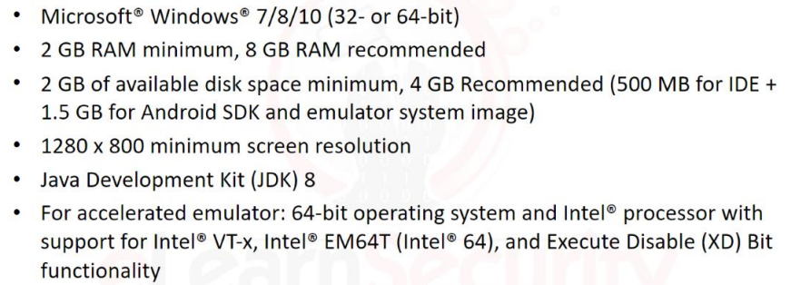
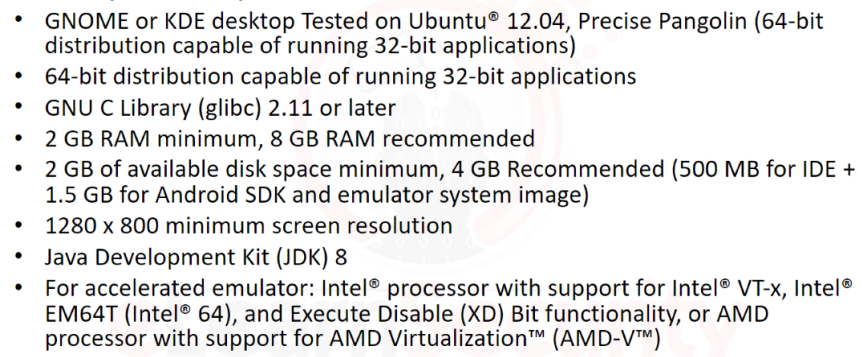
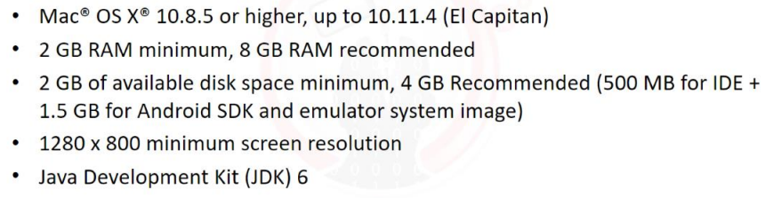
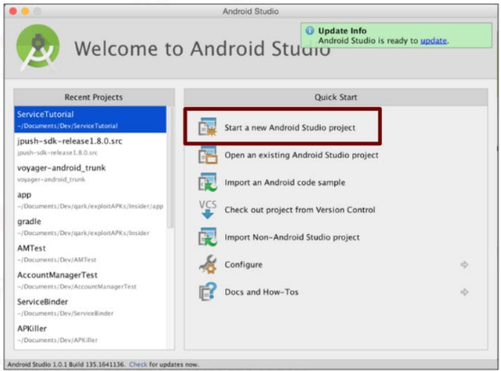
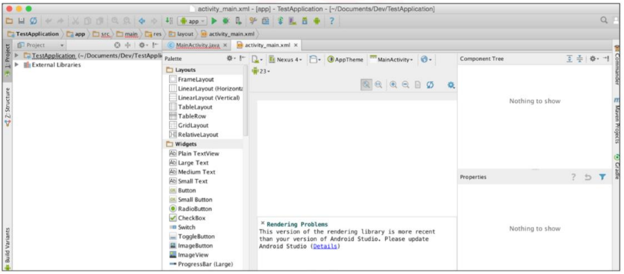

# 2.1. Introduction

Hầu hết các nhà phát triển chuyên nghiệp về ứng dụng Android đều sử dụng Android Studio IDE.

# 2.2. Installing Android Studio

Nếu bạn đang cài đặt Android Studio trong một máy ảo, hãy đảm bảo rằng bạn đã làm quen với việc kết nối USB với máy ảo, và hiệu năng của trình giả lập đủ tốt để bạn có thể kiểm tra ứng dụng một cách hiệu quả. Có thể một số cấu hình máy tính sẽ khiến trình giả lập hoạt động rất chậm.

## 2.2.1. Windows Requirements

## 2.2.2. Linux Requirements

## 2.2.3. Mac OS X Requirements

Để chạy giả lập, các thiết bị sử dụng bộ xử lý Intel cần HAXM để hỗ trợ.

## 2.2.4. Getting started

- **Start a new Android Studio project**
- **Create New Project**
- Điền thông tin vào các mục *Application Name* và *Company Domain*, sau đó chọn **Next**
- Giữ nguyên mặc định ở *Select hte form...* sau đó chọn **Next**

Khi test và debug, có 3 chức năng cơ bản thường dùng:

- Nút bên trái dùng để chạy ứng dụng đã được tải lên.
- Nút giữa dùng để debug.
- Nút bên phải dùng để gắn một debugger và một ứng dụng hiện đang chạy.

# 2.3. Using Emulators

Android studio cung cấp giao diện ảo của nhiều thiết bị Android khác nhau. Điều này cho phép nhà phát triển có thể thử nghiệm trên nhiều phiên bản hệ điều hành khác nhau và nhiều kích cỡ màn hình khác nhau.

Sử dụng giả lập để thực hiện kiểm thử có thể đem lại nhiều lợi ích. Nó cung cấp cho Pentester khả năng kiểm thử nhiều cách tấn công vào nhiều mục tiêu trên nhiều APIs khác nhau. Hay nó loại bỏ việc phải có nhiều thiết bị vật lý để có thể kiểm thử. Và nó sẽ tự động cung cấp quyền root cho người dùng giả lập để truy cập thiết bị mà không cần leo thang đặc quyền.

Việc sử dụng giả lập không phải lúc nào cũng đem lại lợi ích, nhất là khi phần cứng chạy giả lập không đủ khoẻ, hoặc bộ xử lý không hỗ trợ các trình giả lập.

Để tạo một thiết bị ảo trên Android Studio, chọn **AVD Manager** (Android Virtual Device Manager) trên thanh công cụ, sau đó chọn **Create Virtual Device...**.