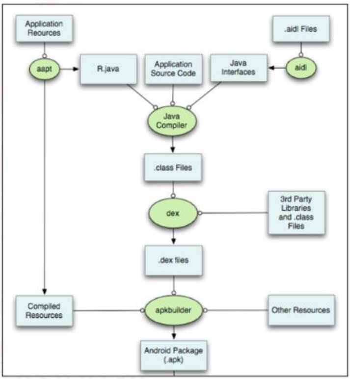

# 3.1. Introduction
Hiểu cách Android Studio biên dịch mã thành 1 ứng dụng giúp hiểu về quá trình hoạt động. Điều này cũng cho biết cách bảo vệ tính xác thực của ứng dụng và những trường hợp khiến nó không có giá trị.​

# 3.2. Compiling Apps
Việc xây dựng ứng dụng Android trải qua hai bước chính là biên dịch và đóng gói, và cuối cùng là ký số. Sự khác biệt chính giữa hai lựa chọn này liên quan đến việc ký số ứng dụng.

Quá trình xây dựng bắt đầu bằng việc sử dụng công cụ Android Asset Packaging Tool (aapt) để biên dịch các tài nguyên của ứng dụng. Kết quả của quá trình này là tạo ra một tệp `R.java`, cho phép mã của bạn tham chiếu đến các tài nguyên đó.

Sau đó, quá trình này sử dụng một trình biên dịch Java để chuyển đổi các tệp `.java` và `.aidl` của bạn thành các tệp `.class`. Các tệp `.class` này sau đó được biên dịch cùng với các thư viện bên thứ ba thành một tệp `classes.dex`.

Tiếp theo, tệp `classes.dex`, các tài nguyên đã được biên dịch và các tài nguyên khác được đưa qua công cụ apkbuilder để tạo ra một gói ứng dụng Android (tệp `.apk`). Bước tiếp theo là ký số, nhưng trước khi đi sâu vào đó, hãy cùng xem xét kỹ hơn về tệp `.apk`.

# 3.3. APK Structure
Khi các ứng dụng Android được biên dịch, đầu ra là một tệp Android Package (APK). Đây là tệp nén chứa mã nguồn và tài nguyên của ứng dụng Android. Để kiểm tra nội dung, người dùng có thể đổi đuôi thành `.zip` và giải nén bằng các công cụ hỗ trợ.