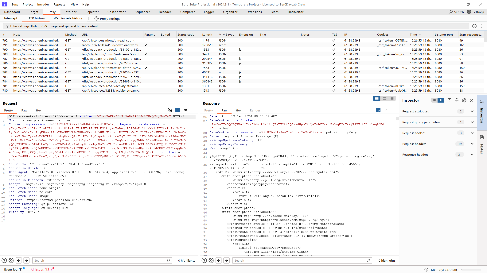

# Tóm tắt  

Fingerprinting máy chủ web là nhiệm vụ xác định loại và phiên bản máy chủ web mà mục tiêu đang chạy. Mặc dù fingerprinting máy chủ web thường được tích hợp trong các công cụ kiểm tra tự động, nhưng việc các nhà nghiên cứu hiểu được các nguyên tắc cơ bản về cách các công cụ này nhận dạng phần mềm và tại sao điều này hữu ích là điều quan trọng.

Việc phát hiện chính xác loại máy chủ web mà ứng dụng đang chạy có thể giúp người kiểm tra bảo mật xác định xem ứng dụng có dễ bị tấn công hay không. Đặc biệt, các máy chủ chạy các phiên bản phần mềm cũ không có các bản vá bảo mật cập nhật có thể dễ bị khai thác các lỗ hổng cụ thể theo phiên bản.

# Mục tiêu kiểm tra  

Xác định phiên bản và loại máy chủ web đang chạy để phát hiện thêm bất kỳ lỗ hổng nào đã biết.

# Cách kiểm tra  

Các kỹ thuật được sử dụng để fingerprinting máy chủ web bao gồm lấy tiêu đề banner (banner grabbing), yêu cầu phản hồi từ các yêu cầu sai định dạng và sử dụng các công cụ tự động để thực hiện các lượt quét mạnh mẽ hơn, sử dụng kết hợp nhiều chiến thuật. Nguyên tắc cơ bản mà tất cả các kỹ thuật này hoạt động đều giống nhau. Chúng đều cố gắng nhận được một phản hồi từ máy chủ web, sau đó so sánh với cơ sở dữ liệu các phản hồi và hành vi đã biết, từ đó khớp với một loại máy chủ đã biết.

## Lấy tiêu đề banner (Banner Grabbing)  

Lấy tiêu đề banner được thực hiện bằng cách gửi yêu cầu HTTP tới máy chủ web và kiểm tra tiêu đề phản hồi của nó. Điều này có thể được thực hiện bằng nhiều công cụ khác nhau, bao gồm telnet cho các yêu cầu HTTP hoặc openssl cho các yêu cầu qua SSL.

Ví dụ, dưới đây là phản hồi từ một máy chủ Apache:

```
HTTP/1.1 200 OK
Date: Thu, 05 Sep 2019 17:42:39 GMT
Server: Apache/2.4.41 (Unix)
Last-Modified: Thu, 05 Sep 2019 17:40:42 GMT
ETag: "75-591d1d21b6167"
Accept-Ranges: bytes
Content-Length: 117
Connection: close
Content-Type: text/html
...
```

Và đây là phản hồi từ nginx:

```
HTTP/1.1 200 OK
Server: nginx/1.17.3
Date: Thu, 05 Sep 2019 17:50:24 GMT
Content-Type: text/html
Content-Length: 117
Last-Modified: Thu, 05 Sep 2019 17:40:42 GMT
Connection: close
ETag: "5d71489a-75"
Accept-Ranges: bytes
...
```

Dưới đây là phản hồi từ lighttpd:

```
HTTP/1.0 200 OK
Content-Type: text/html
Accept-Ranges: bytes
ETag: "4192788355"
Last-Modified: Thu, 05 Sep 2019 17:40:42 GMT
Content-Length: 117
Connection: close
Date: Thu, 05 Sep 2019 17:57:57 GMT
Server: lighttpd/1.4.54
```

Trong những ví dụ này, loại và phiên bản máy chủ được hiển thị rõ ràng. Tuy nhiên, các ứng dụng chú trọng bảo mật có thể làm mờ thông tin máy chủ bằng cách thay đổi tiêu đề. Ví dụ:

```
HTTP/1.1 200 OK
Server: Website.com
Date: Thu, 05 Sep 2019 17:57:06 GMT
Content-Type: text/html; charset=utf-8
Status: 200 OK
...
```

## Gửi yêu cầu sai định dạng

Máy chủ web có thể được nhận dạng bằng cách kiểm tra các phản hồi lỗi của chúng. Một cách để buộc máy chủ hiển thị các trang lỗi mặc định là gửi các yêu cầu sai định dạng.

Ví dụ, dưới đây là phản hồi của máy chủ Apache cho yêu cầu `SANTA CLAUS` không tồn tại:

```
GET / SANTA CLAUS/1.1


HTTP/1.1 400 Bad Request
Date: Fri, 06 Sep 2019 19:21:01 GMT
Server: Apache/2.4.41 (Unix)
Content-Length: 226
Connection: close
Content-Type: text/html; charset=iso-8859-1

<!DOCTYPE HTML PUBLIC "-//IETF//DTD HTML 2.0//EN">
<html><head>
<title>400 Bad Request</title>
</head><body>
<h1>Bad Request</h1>
<p>Your browser sent a request that this server could not understand.<br />
</p>
</body></html>
```

Đây là phản hồi từ nginx:

```
GET / SANTA CLAUS/1.1


<html>
<head><title>404 Not Found</title></head>
<body>
<center><h1>404 Not Found</h1></center>
<hr><center>nginx/1.17.3</center>
</body>
</html>
```

Và đây là phản hồi từ lighttpd:

```
GET / SANTA CLAUS/1.1


HTTP/1.0 400 Bad Request
Content-Type: text/html
Content-Length: 345
Connection: close
Date: Sun, 08 Sep 2019 21:56:17 GMT
Server: lighttpd/1.4.54

<?xml version="1.0" encoding="iso-8859-1"?>
<!DOCTYPE html PUBLIC "-//W3C//DTD XHTML 1.0 Transitional//EN"
         "http://www.w3.org/TR/xhtml1/DTD/xhtml1-transitional.dtd">
<html xmlns="http://www.w3.org/1999/xhtml" xml:lang="en" lang="en">
 <head>
  <title>400 Bad Request</title>
 </head>
 <body>
  <h1>400 Bad Request</h1>
 </body>
</html>
```

Các trang lỗi mặc định có thể cung cấp nhiều yếu tố phân biệt giữa các loại máy chủ web, do đó việc kiểm tra chúng có thể là một phương pháp hiệu quả để fingerprinting ngay cả khi thông tin tiêu đề máy chủ bị ẩn.

## Sử dụng công cụ quét tự động

Fingerprinting máy chủ web thường được bao gồm trong các công cụ quét tự động. Các công cụ này có thể so sánh các phản hồi từ máy chủ web nhanh hơn nhiều so với việc kiểm tra thủ công.

Một số công cụ phổ biến bao gồm:  
- Netcraft  
- Nikto  
- Nmap  

## Biện pháp khắc phục

Trong khi việc hiển thị thông tin máy chủ không nhất thiết là một lỗ hổng, nó có thể giúp kẻ tấn công khai thác các lỗ hổng khác. Vì lý do này, các biện pháp sau nên được thực hiện:  
- Làm mờ thông tin máy chủ trong tiêu đề  
- Sử dụng máy chủ proxy ngược cứng  
- Đảm bảo các máy chủ web được cập nhật thường xuyên.

# Thực nghiệm

Thử nghiệm được áp dụng trên trang web quản lý khoá học sinh viên của trường Đại học Phenikaa (đã được giáo viên cho phép): https://canvas.phenikaa-uni.edu.vn/

## Sử dụng BurpSuite để chặn gói tin

- Mở BurpSuite, chuyển sang tab *Proxy*, truy cập/đăng nhập vào trang web.

- Sau khi mở HTTP history, ta kiểm tra một số gói tin và sẽ thấy được