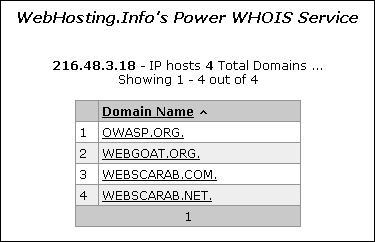

### Tóm tắt

Trước khi tiến hành kiểm thử bảo mật, việc hiểu rõ cấu trúc của ứng dụng là vô cùng quan trọng. Nếu không nắm vững bố cục của ứng dụng, khả năng kiểm thử đầy đủ sẽ khó đạt được.

### Mục tiêu kiểm thử

- Lập bản đồ ứng dụng mục tiêu và hiểu rõ các quy trình công việc chính.

### Cách kiểm thử

Trong kiểm thử hộp đen (black-box testing), rất khó để kiểm thử toàn bộ mã nguồn, vì người kiểm tra không có cái nhìn tổng quan về các đường đi của mã. Ngay cả khi có, việc kiểm thử toàn bộ các đường đi trong mã cũng rất tốn thời gian. Để khắc phục điều này, có thể ghi lại những đoạn mã đã được khám phá và kiểm thử.

Có nhiều cách để tiếp cận việc kiểm thử và đo lường độ bao phủ mã:

- **Đường đi (Path)**: Kiểm thử từng đường đi qua ứng dụng, bao gồm cả việc kiểm thử kết hợp và phân tích giá trị biên cho mỗi nhánh quyết định. Tuy nhiên, số lượng các đường có thể kiểm thử sẽ tăng theo cấp số nhân với mỗi nhánh.
- **Luồng dữ liệu (Data Flow)**: Kiểm thử quá trình gán biến thông qua tương tác bên ngoài (thường là người dùng). Tập trung vào việc lập bản đồ dòng chảy, chuyển đổi và sử dụng dữ liệu trong toàn bộ ứng dụng.
- **Race Conditions**: Kiểm thử nhiều phiên bản ứng dụng đồng thời thao tác trên cùng một dữ liệu.

Việc lựa chọn phương pháp kiểm thử nào và ở mức độ nào nên được thỏa thuận với chủ sở hữu ứng dụng. Các phương pháp đơn giản hơn cũng có thể được áp dụng, bao gồm việc hỏi chủ sở hữu ứng dụng về các chức năng hoặc đoạn mã mà họ lo ngại nhất và cách để tiếp cận chúng.

Để chứng minh độ bao phủ mã với chủ sở hữu ứng dụng, người kiểm tra có thể sử dụng một bảng tính để ghi lại tất cả các liên kết được phát hiện bằng cách quét ứng dụng (thủ công hoặc tự động). Sau đó, người kiểm tra có thể xem xét kỹ hơn các điểm quyết định trong ứng dụng và điều tra xem bao nhiêu đường dẫn mã quan trọng đã được phát hiện. Những đường dẫn này nên được ghi lại trong bảng tính kèm với URL, mô tả và ảnh chụp màn hình.

### Xem xét mã nguồn

Đảm bảo độ bao phủ mã đủ tốt cho chủ sở hữu ứng dụng dễ dàng hơn nhiều khi sử dụng phương pháp kiểm thử hộp xám (gray-box) và hộp trắng (white-box). Thông tin từ chủ sở hữu sẽ đảm bảo đáp ứng các yêu cầu tối thiểu về độ bao phủ mã.

Nhiều công cụ kiểm thử bảo mật ứng dụng động (DAST) hiện đại cung cấp tính năng sử dụng tác nhân máy chủ web hoặc kết hợp với tác nhân của bên thứ ba để giám sát các chi tiết về độ bao phủ của ứng dụng web.

### Tự động quét

Công cụ quét tự động (Spider) là một công cụ tự động khám phá các tài nguyên mới (URL) trên một trang web. Nó bắt đầu với danh sách các URL gọi là hạt giống. Ví dụ về công cụ Zed Attack Proxy (ZAP):

- **Spider**: Tự động quét.
- **AJAX Spider**: Quét dựa trên AJAX.
- **OpenAPI Support**: Hỗ trợ OpenAPI.

### Công cụ

- Zed Attack Proxy (ZAP)
- Phần mềm bảng tính
- Phần mềm lập sơ đồ