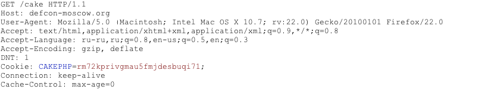
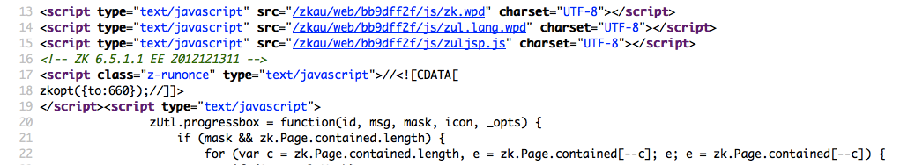
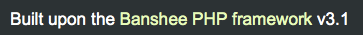
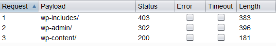
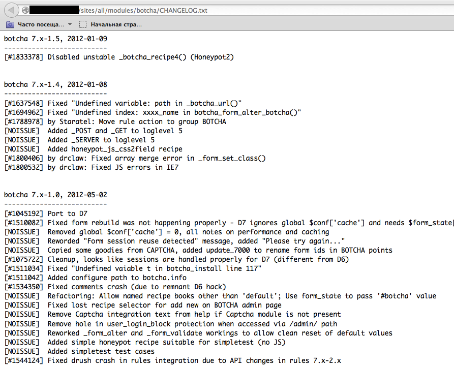
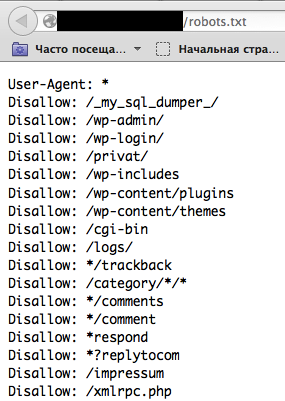
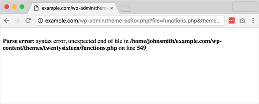
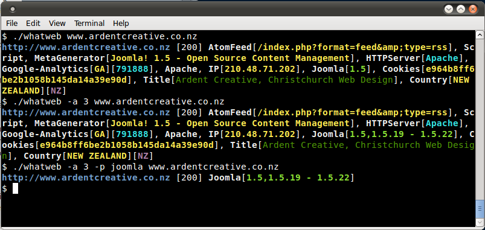
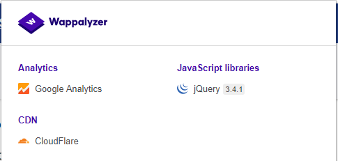

# Tóm tắt

Hầu hết các ứng dụng web hiện nay đã được phát triển sẵn hoặc dựa trên các nền tảng mã nguồn mở và miễn phí. Điều này có nghĩa là khi thực hiện kiểm thử bảo mật, ứng dụng mục tiêu có thể phụ thuộc vào các framework và phần mềm phổ biến như WordPress, phpBB, MediaWiki, v.v. Nhận biết được các thành phần của ứng dụng web sẽ giúp quá trình kiểm thử dễ dàng và hiệu quả hơn.

# Mục tiêu kiểm thử

- **Nhận dạng các thành phần** được sử dụng trong ứng dụng web.

# Cách kiểm thử

## Kiểm thử hộp đen (Black-Box Testing)
Để nhận dạng các framework hoặc thành phần ứng dụng, cần xem xét một số vị trí phổ biến sau:

### HTTP Headers
Cách cơ bản nhất để nhận diện framework của một ứng dụng web là kiểm tra trường `X-Powered-By` trong tiêu đề phản hồi HTTP. Nhiều công cụ có thể được sử dụng để nhận diện ứng dụng, đơn giản nhất là sử dụng netcat.

Xem xét ví dụ yêu cầu-phản hồi HTTP sau:

```
$ nc 127.0.0.1 80
HEAD / HTTP/1.0

HTTP/1.1 200 OK
Server: nginx/1.0.14
[...]
X-Powered-By: Mono
```

Từ trường `X-Powered-By`, ta có thể hiểu rằng framework của ứng dụng web có khả năng là Mono. Tuy nhiên, dù phương pháp này đơn giản và nhanh chóng, nó không phải lúc nào cũng hiệu quả 100%. Trường `X-Powered-By` có thể dễ dàng bị vô hiệu hóa bằng cách cấu hình hợp lý. Ngoài ra, có nhiều kỹ thuật cho phép một trang web làm mờ thông tin trong tiêu đề HTTP (xem ví dụ trong phần Khắc phục). Trong ví dụ trên, ta cũng có thể thấy rằng một phiên bản cụ thể của nginx đang được sử dụng để phục vụ nội dung.

Trong cùng ví dụ đó, người kiểm thử có thể không thấy trường `X-Powered-By` hoặc nhận được phản hồi như sau:

```
HTTP/1.1 200 OK
Server: nginx/1.0.14
Date: Sat, 07 Sep 2013 08:19:15 GMT
Content-Type: text/html;charset=ISO-8859-1
Connection: close
Vary: Accept-Encoding
X-Powered-By: Blood, sweat and tears
```

Đôi khi, có nhiều tiêu đề HTTP khác có thể chỉ ra một framework cụ thể. Trong ví dụ sau, theo thông tin từ yêu cầu HTTP, ta thấy rằng trường `X-Powered-By` chứa phiên bản PHP. Tuy nhiên, trường `X-Generator` lại cho biết framework được sử dụng thực sự là Swiftlet, điều này giúp người kiểm thử bảo mật mở rộng các phương án tấn công. Khi thực hiện nhận diện ứng dụng, cần cẩn thận kiểm tra từng tiêu đề HTTP để tìm các dấu hiệu như vậy.

```
HTTP/1.1 200 OK
Server: nginx/1.4.1
Date: Sat, 07 Sep 2013 09:22:52 GMT
Content-Type: text/html
Connection: keep-alive
Vary: Accept-Encoding
X-Powered-By: PHP/5.4.16-1~dotdeb.1
Expires: Thu, 19 Nov 1981 08:52:00 GMT
Cache-Control: no-store, no-cache, must-revalidate, post-check=0, pre-check=0
Pragma: no-cache
X-Generator: Swiftlet
```

### Cookies

Một cách tương tự và có phần đáng tin cậy hơn để xác định framework web hiện tại là thông qua các cookie đặc thù của framework.

Xem xét yêu cầu HTTP sau:



Cookie `CAKEPHP` đã được tự động thiết lập, điều này cho biết thông tin về framework đang được sử dụng. Một danh sách các tên cookie phổ biến được trình bày trong phần Cookies. Tuy nhiên, vẫn tồn tại những hạn chế khi dựa vào cơ chế nhận dạng này - tên của cookie có thể được thay đổi. Ví dụ, đối với framework CakePHP, điều này có thể được thực hiện qua cấu hình sau (trích đoạn từ file core.php):

```php
/**
 * Tên của session cookie trong CakePHP.
 *
 * Lưu ý các hướng dẫn về tên Session: "Tên session tham chiếu đến ID của session trong cookies và URLs. 
 * Nó chỉ nên chứa các ký tự chữ và số."
 * @link http://php.net/session_name
 */
Configure::write('Session.cookie', 'CAKEPHP');
```

Tuy nhiên, những thay đổi này ít có khả năng xảy ra hơn so với việc thay đổi tiêu đề `X-Powered-By`, vì vậy phương pháp xác định này được coi là đáng tin cậy hơn.

### Mã Nguồn HTML

Kỹ thuật này dựa trên việc tìm các mẫu nhất định trong mã nguồn trang HTML. Thường thì người kiểm tra có thể tìm thấy rất nhiều thông tin giúp nhận dạng các thành phần cụ thể của ứng dụng. Một trong những dấu hiệu phổ biến là các chú thích HTML trực tiếp tiết lộ framework. Thường xuyên hơn, các đường dẫn đặc trưng của framework cũng có thể được tìm thấy, ví dụ như liên kết đến các thư mục CSS hoặc JS của framework. Cuối cùng, các biến script cụ thể cũng có thể chỉ ra framework đang được sử dụng.

Từ ảnh chụp màn hình bên dưới, người ta có thể dễ dàng xác định framework đang sử dụng và phiên bản của nó nhờ các dấu hiệu đã đề cập. Các chú thích, đường dẫn đặc trưng và biến script đều có thể giúp kẻ tấn công nhanh chóng xác định phiên bản của framework ZK.



Thông tin này thường nằm trong phần `<head>` của phản hồi HTTP, trong các thẻ `<meta>`, hoặc ở cuối trang. Tuy nhiên, cần phải phân tích toàn bộ phản hồi, vì điều này có thể hữu ích cho các mục đích khác, chẳng hạn như kiểm tra các chú thích và trường ẩn hữu ích khác. Đôi khi, các nhà phát triển web không quá chú ý đến việc ẩn thông tin về framework hoặc các thành phần được sử dụng. Do đó, vẫn có thể bắt gặp thông tin như vậy ở cuối trang:



### Tệp và Thư mục Cụ Thể

Có một phương pháp khác giúp kẻ tấn công hoặc người kiểm tra xác định các ứng dụng hoặc thành phần với độ chính xác cao. Mỗi thành phần web đều có cấu trúc tệp và thư mục riêng biệt trên máy chủ. Đôi khi các đường dẫn cụ thể này có thể được nhìn thấy từ mã nguồn HTML, nhưng cũng có khi chúng không được hiển thị rõ ràng mà vẫn tồn tại trên máy chủ.

Để phát hiện chúng, một kỹ thuật được gọi là **duyệt cưỡng bức** (forced browsing) hoặc **dirbusting** được sử dụng. Dirbusting là quá trình tấn công brute force (thử mọi khả năng) vào mục tiêu bằng cách sử dụng các danh sách tệp và thư mục đã biết, sau đó theo dõi phản hồi HTTP để liệt kê nội dung máy chủ. Thông tin này có thể được sử dụng cả để tìm tệp mặc định để tấn công chúng và để nhận dạng ứng dụng web. Dirbusting có thể thực hiện theo nhiều cách; ví dụ dưới đây cho thấy một cuộc tấn công dirbusting thành công vào một mục tiêu sử dụng WordPress với sự hỗ trợ của danh sách được định nghĩa sẵn và chức năng intruder của **Burp Suite**.



Chúng ta có thể thấy rằng đối với một số thư mục đặc trưng của WordPress (ví dụ, `/wp-includes/`, `/wp-admin/`, và `/wp-content/`), phản hồi HTTP lần lượt là 403 (Cấm truy cập), 302 (Tìm thấy, chuyển hướng đến wp-login.php), và 200 (OK). Đây là dấu hiệu cho thấy mục tiêu đang sử dụng WordPress. Bằng cách tương tự, có thể thực hiện dirbust các thư mục plugin của ứng dụng và các phiên bản của chúng. Trong ảnh chụp dưới đây, ta có thể thấy tệp **CHANGELOG** điển hình của một plugin Drupal, cung cấp thông tin về ứng dụng đang được sử dụng và tiết lộ một phiên bản plugin có lỗ hổng.



**Mẹo**: Trước khi bắt đầu dirbusting, hãy kiểm tra tệp **robots.txt** trước. Đôi khi, các thư mục cụ thể của ứng dụng và thông tin nhạy cảm khác cũng có thể được tìm thấy ở đó. Một ví dụ về tệp robots.txt được trình bày trong ảnh chụp màn hình dưới đây.



Tệp và thư mục cụ thể khác nhau tùy theo từng ứng dụng. Nếu ứng dụng hoặc thành phần đã được xác định là mã nguồn mở, việc cài đặt tạm thời trong quá trình kiểm thử thâm nhập có thể có giá trị để hiểu rõ hơn về cơ sở hạ tầng hoặc tính năng nào được trình bày và những tệp nào có thể còn lại trên máy chủ. Tuy nhiên, đã có sẵn nhiều danh sách tệp tốt, một ví dụ hay là danh sách từ **FuzzDB** của các tệp/thư mục có thể dự đoán được.

Phần mở rộng tệp (File Extensions)  
Các URL có thể bao gồm phần mở rộng tệp, điều này cũng có thể giúp xác định nền tảng hoặc công nghệ web được sử dụng.

Ví dụ: wiki của OWASP sử dụng PHP:

https://wiki.owasp.org/index.php?title=Fingerprint_Web_Application_Framework&action=edit&section=4  
Dưới đây là một số phần mở rộng tệp web phổ biến và các công nghệ liên quan:

- **.php** – PHP
- **.aspx** – Microsoft ASP.NET
- **.jsp** – Java Server Pages

### Thông báo lỗi (Error Messages)  
Như có thể thấy trong ảnh chụp màn hình sau, đường dẫn hệ thống tệp được liệt kê chỉ ra việc sử dụng WordPress (wp-content). Người kiểm thử cũng cần lưu ý rằng WordPress dựa trên PHP (functions.php).



# Các định danh phổ biến

## Cookies  

| **Khung công tác**     | **Tên Cookie**                         |
|------------------------|----------------------------------------|
| Zope                   | zope3                                  |
| CakePHP                | cakephp                                |
| Kohana                 | kohanasession                          |
| Laravel                | laravel_session                        |
| phpBB                  | phpbb3_                                |
| WordPress              | wp-settings                            |
| 1C-Bitrix              | BITRIX_                                |
| AMPcms                 | AMP                                    |
| Django CMS             | django                                 |
| DotNetNuke             | DotNetNukeAnonymous                    |
| e107                   | e107_tz                                |
| EPiServer              | EPiTrace, EPiServer                    |
| Graffiti CMS           | graffitibot                            |
| Hotaru CMS             | hotaru_mobile                          |
| ImpressCMS             | ICMSession                             |
| Indico                 | MAKACSESSION                           |
| InstantCMS             | InstantCMS[logdate]                    |
| Kentico CMS            | CMSPreferredCulture                    |
| MODx                   | SN4[12symb]                            |
| TYPO3                  | fe_typo_user                           |
| Dynamicweb             | Dynamicweb                             |
| LEPTON                 | lep[some_numeric_value]+sessionid      |
| Wix                    | Domain=.wix.com                        |
| VIVVO                  | VivvoSessionId                         |

## Mã nguồn HTML

| **Ứng dụng**           | **Từ khóa**                                          |
|------------------------|------------------------------------------------------|
| WordPress              | `<meta name="generator" content="WordPress 3.9.2" />` |
| phpBB                  | `<body id="phpbb">`                                  |
| Mediawiki              | `<meta name="generator" content="MediaWiki 1.21.9" />`|
| Joomla                 | `<meta name="generator" content="Joomla! - Open Source Content Management" />` |
| Drupal                 | `<meta name="Generator" content="Drupal 7 (http://drupal.org)" />` |
| DotNetNuke             | DNN Platform - [http://www.dnnsoftware.com](http://www.dnnsoftware.com) |

## Dấu hiệu chung
- %framework_name%
- powered by
- built upon
- running

## Dấu hiệu riêng
| **Khung công tác**       | **Từ khóa**                                         |
|-------------------------|-----------------------------------------------------|
| Adobe ColdFusion         | `<!-- START headerTags.cfm -->`                     |
| Microsoft ASP.NET        | `__VIEWSTATE`                                       |
| ZK                       | `<!-- ZK -->`                                       |
| Business Catalyst        | `<!-- BC_OBNW -->`                                  |
| Indexhibit               | `ndxz-studio`                                       |

# Khắc phục

Mặc dù có thể thực hiện các nỗ lực như sử dụng các tên cookie khác nhau (bằng cách thay đổi cấu hình), ẩn hoặc thay đổi đường dẫn tệp/thư mục (bằng cách viết lại hoặc thay đổi mã nguồn), xóa các tiêu đề đã biết, v.v., nhưng những nỗ lực này chỉ là “bảo mật thông qua sự che giấu”. Chủ sở hữu/hệ thống quản trị nên nhận thức rằng những nỗ lực này chỉ làm chậm các đối thủ cơ bản nhất. Thời gian và công sức có thể được sử dụng hiệu quả hơn vào việc nâng cao nhận thức của các bên liên quan và bảo trì giải pháp.

# Công cụ

Dưới đây là danh sách các công cụ chung và nổi tiếng. Ngoài ra, còn có rất nhiều tiện ích khác, cũng như các công cụ nhận diện dấu vết dựa trên khung công tác.

**WhatWeb**  
Website: [https://github.com/urbanadventurer/WhatWeb](https://github.com/urbanadventurer/WhatWeb)

Hiện tại là một trong những công cụ nhận diện dấu vết (fingerprinting) tốt nhất trên thị trường. Được tích hợp trong bản dựng mặc định của Kali Linux. Ngôn ngữ: Ruby. Việc nhận diện dấu vết được thực hiện dựa trên:

- Chuỗi văn bản (phân biệt chữ hoa chữ thường)
- Biểu thức chính quy
- Các truy vấn từ cơ sở dữ liệu hack Google (tập từ khóa hạn chế)
- Các hàm băm MD5
- Nhận diện URL
- Các mẫu thẻ HTML
- Mã Ruby tùy chỉnh cho các hoạt động thụ động và tấn công

Mẫu kết quả đầu ra được hiển thị trong ảnh chụp màn hình dưới đây:



**Wappalyzer**  
Website: [https://www.wappalyzer.com/](https://www.wappalyzer.com/)

Wappalyzer có sẵn dưới nhiều mô hình sử dụng, phổ biến nhất có lẽ là các tiện ích mở rộng của Firefox/Chrome. Chúng hoạt động dựa trên việc khớp biểu thức chính quy và không cần gì ngoài việc tải trang trong trình duyệt. Công cụ này hoạt động hoàn toàn ở mức trình duyệt và hiển thị kết quả dưới dạng các biểu tượng. Mặc dù đôi khi có các kết quả dương tính giả, nhưng công cụ này rất hữu ích để nhanh chóng biết được các công nghệ được sử dụng để xây dựng trang web ngay sau khi duyệt một trang.

Mẫu kết quả đầu ra của plug-in được hiển thị trong ảnh chụp màn hình dưới đây.

